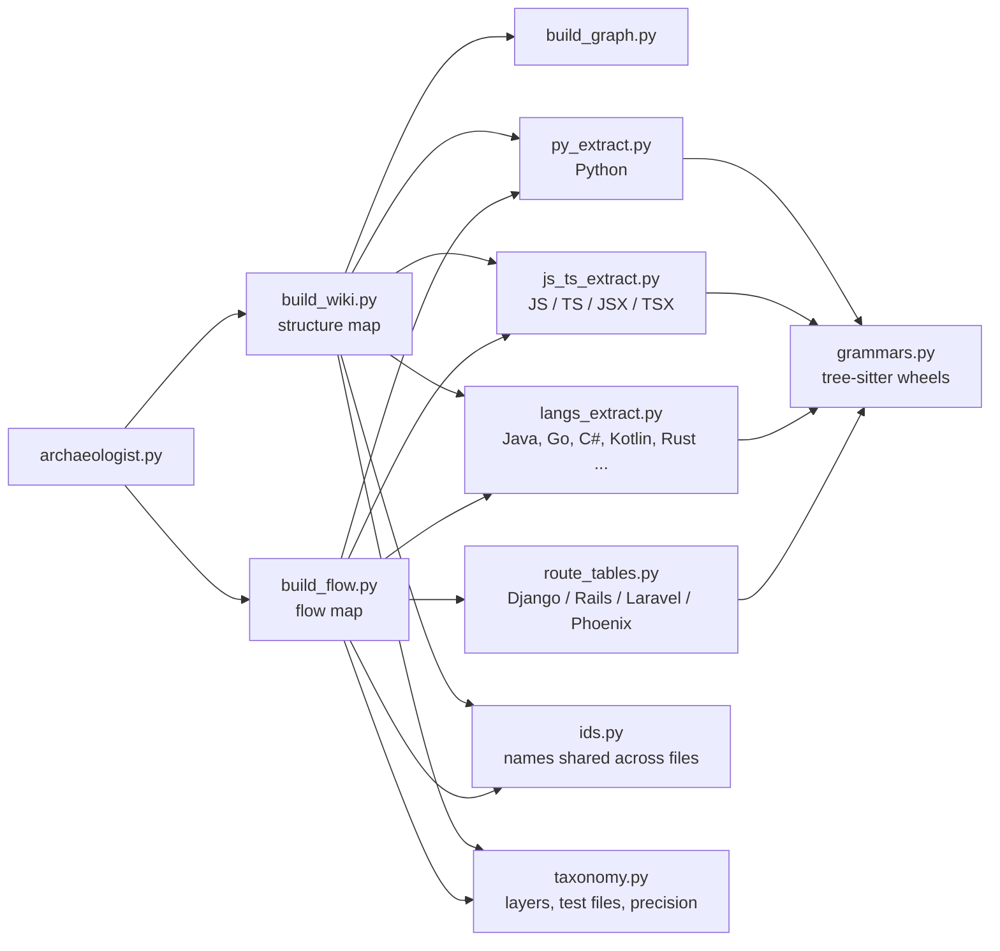

<p align="center">
  
</p>

<h1 align="center">Code Archaeologist</h1>

<p align="center">
  <strong>Deterministic, zero-RAG codebase navigation and architecture mapping for AI agents.</strong>
</p>

<p align="center">
  <a href="LICENSE"></a>
  <a href="https://www.python.org/downloads/"></a>
  <a href="https://tree-sitter.github.io/"></a>
  <a href="#the-two-maps"></a>
  <a href="#the-explorer"></a>
  <a href="#installation"></a>
</p>

<p align="center">
  <a href="#-quick-start">Quick Start</a> •
  <a href="#-requirements">Requirements</a> •
  <a href="#-installation">Installation</a> •
  <a href="#-what-it-can-tell-you">What It Can Tell You</a> •
  <a href="#️-the-two-maps">The Two Maps</a> •
  <a href="#-the-interactive-explorer">Interactive Explorer</a> •
  <a href="#-language-support">Language Support</a> •
  <a href="#-why-not-rag">Why Not RAG?</a> •
  <a href="docs/USAGE.md">Usage Guide</a>
</p>

---

Code Archaeologist scans your codebase once, builds **two precise dependency graphs** (structure & execution flow) plus a Markdown note per class and method, and answers architectural questions by walking those graphs—**not by grepping source or guessing with embeddings**.

Everything is **100% deterministic**: real tree-sitter AST parsers + graph traversal algorithms. No vector database, no embedding drift, and zero hallucinations. Every language (Python included) uses a pinned parser wheel; missing grammars are **explicitly named and skipped**, never silently ignored.

```text
"How does a request reach the database?"

  📍 Trace  ➜  submitOrder > createOrder > OrderController.create_order
               > OrderService.place_order > OrderRepository.save
  📖 Read   ➜  5 notes (~1,500 tokens) instead of reading the whole repo
```

The same question explored visually: select `OrderRepository.save` in the **Flowchart** view to see all execution paths reaching it, its call ordering, and its blast radius:

<p align="center">
  
  <br>
  <em>Interactive Flowchart: Call-order sequence badges (1, 2) on paths leading to <code>OrderRepository.save</code>, with impact analysis in the inspector.</em>
</p>

---

## ⚡ Quick Start

```bash
# 1. Install the skill into your project (no clone, no npm account required)
npx github:non-nattawut/Code-Archaeologist-LLM-Agent-Skill --harness claude

# 2. Build both maps (Structure + Flow)
python .claude/skills/code-archaeologist/scripts/archaeologist.py both --src ./src

# 3. Generate the review report & interactive explorer
python .claude/skills/code-archaeologist/scripts/archaeologist.py report --src ./src
```

Open `data/explorer.html` in any browser — a single, self-contained file with both maps that works **completely offline** from `file://`.

> [!TIP]
> **Automatic Grammar Setup**:
> When your AI agent activates this skill, it automatically installs the pinned `tree-sitter` parser wheels for your repository into `<skill>/vendor`.
> If running manually via the CLI, you can pre-fetch them anytime with:
> ```bash
> python .claude/skills/code-archaeologist/scripts/core/grammars.py --install
> # or specify languages:
> python .claude/skills/code-archaeologist/scripts/core/grammars.py --install python typescript
> ```
> If a language grammar is ever missing, its files are safely skipped and the wheel is loudly announced.

---

## 📋 Requirements

| Requirement | Details |
| :--- | :--- |
| **Python 3.10+** | Required on your machine to run the extraction and analysis pipeline. |
| **Git** | *Optional* — only needed for churn, authorship ownership, and hotspot analysis. |
| **Modern Browser** | For opening `data/explorer.html` (runs 100% offline from `file://`). |

> [!NOTE]
> **Zero Parser Setup Required**: You don't need to manually configure parsers beforehand. Your AI agent automatically manages pinned binary `tree-sitter` wheels inside the skill's isolated `<skill>/vendor` directory (`scripts/core/grammars.py --install`). No compiler is needed and nothing touches your global Python environment.

---

## 📦 Installation

Install directly with `npx` into your preferred agent environment:

```bash
npx github:non-nattawut/Code-Archaeologist-LLM-Agent-Skill                    # Interactive prompt to pick harness
npx github:non-nattawut/Code-Archaeologist-LLM-Agent-Skill --harness claude   # Direct installation
npx github:non-nattawut/Code-Archaeologist-LLM-Agent-Skill --self-test        # Install, fetch demo grammars, and build
```

### Supported Harnesses

| Harness | Flag | Installation Target |
| :--- | :--- | :--- |
| **Agents** *(default)* | `--harness agents` | `.agents/skills/code-archaeologist` |
| **Claude** | `--harness claude` | `.claude/skills/code-archaeologist` |
| **Cursor** | `--harness cursor` | `.cursor/skills/code-archaeologist` |
| **Windsurf** | `--harness windsurf` | `.windsurf/skills/code-archaeologist` |
| **Zed** | `--harness zed` | `.zed/skills/code-archaeologist` |

Use `--dir <path>` for custom directories. Additional options: `--target <dir>`, `--force`, `--help`.

The installer checks for Python 3.10+, copies the skill in, and creates an empty `data/` workspace with no external npm dependencies.

> [!NOTE]
> **Companion Explorer Skill**:
> The installer also deploys `code-archaeologist-explorer` (e.g. `.claude/skills/code-archaeologist-explorer`).
> Invoke **`/code-archaeologist-explorer`** when you want an agent to regenerate the maps and review report in one step:
> ```bash
> /code-archaeologist-explorer ./backend ./frontend
> ```
> It has no scripts of its own; it runs the main skill's pipeline to produce `data/explorer.html`.

---

## 🧭 What It Can Tell You

Every answer is deterministically computed from AST graphs—**never guessed by an LLM**. Full command reference is available in **[USAGE.md](docs/USAGE.md)**.

### 🔍 Navigate & Trace

| Question | Command |
| :--- | :--- |
| **Where is X handled?** | `search.py --name X` *(also `--calls`, `--called-by`, `--orphans`)* |
| **How do A and B connect?** | `trace_path.py --from A --to B` |
| **What breaks if I change X?** | `trace_path.py --impact-of X` |
| **What does my current PR affect?** | `trace_path.py --impact-of-diff` |
| **Everything about one node, in one call** | `context.py --node X` |
| **Orient me on this repo (~35 lines)** | `archaeologist.py brief` |

### 🛡️ Review & Audit

| Question | Command |
| :--- | :--- |
| **Is this codebase healthy? (0–100, A–F)** | `analyze.py` |
| **Any secrets / SQL injection / XSS sinks?** | `scan_security.py` |
| **What's rotting? (TODOs, dead code)** | `debt.py` |
| **What's tested — and what isn't?** | `tests_map.py` |
| **What's been copy-pasted?** | `duplicates.py` *(exact & block duplication across functions)* |
| **Where is the churn and who owns it?** | `git_insights.py` |
| **How big / complex is each piece?** | `metrics.py` |
| **Generate full audit report** | `archaeologist.py report` |

### 🔄 Trust & Freshness

| Question | Command |
| :--- | :--- |
| **Are the maps still current?** | `archaeologist.py check` |

> [!IMPORTANT]
> The maps drift the moment code changes. `archaeologist.py check` hashes every source file against the manifest and reports moved or modified files, allowing agents to rebuild *before* answering rather than citing stale graphs. It requires no arguments—reusing previously scanned roots recorded during build.

---

## 🗺️ The Two Maps

Both maps are extracted from the same scan to answer complementary architectural questions:

| Dimension | 🏛️ Structure Map | ⚡ Flow Map |
| :--- | :--- | :--- |
| **Node** | Class, React component, or module | Method or function |
| **Edge** | References, imports, inheritance | Direct calls, passes, renders, routes |
| **Answers** | *"How is this codebase organized? Who uses X?"* | *"How does a request execute? What calls what?"* |
| **Output Directory** | `data/structure/` | `data/flow/` |

Both maps cover backend and frontend: a `.tsx` React component is a structure node alongside a Python service class, and a function returning JSX is typed `component` rather than lumped into its file's module page.

### Cross-Stack & Framework Bridging

- **End-to-End Tracing**: Frontend `fetch` and `axios` calls link directly to backend route handlers via HTTP method and normalized path matching. **One trace spans from a button click to the database**.
- **Supported Frameworks**: Route endpoints are extracted across 7 backend frameworks:
  - **Python**: FastAPI, Flask, Django `urlpatterns` *(including `include()` and class-based views)*
  - **JavaScript / TypeScript**: Express, NestJS, Next.js API routes & pages
  - **Java / Kotlin**: Spring Web (`@GetMapping`, `@PostMapping`, `@Scheduled`, etc.)
  - **C#**: ASP.NET Core controllers
  - **Go**: `net/http`, Gin, Chi, Mux
  - **Ruby / PHP / Elixir**: Rails `routes.rb`, Laravel `routes/*.php`, Phoenix routers
- **Smart Path & Instance Resolution**: Handles prefix mounts (e.g. `/api`), client `baseURL` configurations, and exported axios instances across files. Where paths do not match exactly, unique suffixes still link while ambiguous ones are left alone.

---

## 🔍 The Interactive Explorer

A self-contained, offline-first visualization dashboard (`data/explorer.html`). **Zero server dependencies, zero external network requests**—the graph engine (`force-graph.min.js`) is vendored and inlined, allowing it to open from `file://` with Wi-Fi off.

- 🎛️ **Header Bar**: Quick map switcher (Structure / Flow), overall health letter grade (A–F), and an interactive **`?` Visual Legend** detailing every node shape, color, badge, and edge style with live link counts.
- 📂 **Left Sidebar**:
  - **Health & Metrics**: Overall health ring (A–F), stat tiles, and language composition breakdown.
  - **Color Overlays**: Switch color-coding by Architectural Layer, Folder, Git Churn, or Risk Level.
  - **File Tree Filter**: Expand/collapse folders to filter canvas nodes in real time.
- 🕸️ **Center Canvas**: 7 distinct layout perspectives:
  - **Flowchart**: Primary execution view with **call-order badges** (numbered in authoring sequence), branch callouts (`3a`/`3b`), conditional diamonds, and loop rings.
  - **Graph, Treemap, Matrix, Tree, Cluster, Bundle**: Specialized structural views for coupling, clustering, and hierarchy.
  - **Canvas Controls**: Folder bounding hulls, **Blast Radius** toggle, **Freeze** layout lock, and `⋯` export menu (Zoom, Fit, High-Res PNG).
- 📋 **Right Inspector Panel**:
  - **FILE / NODE**: Full node context, incoming/outgoing connections, blast radius list, git ownership, and active code risks.
  - **PATTERNS**: Architectural cycles, layer violations, hub nodes, wrong-direction dependencies, god objects, and unreferenced dead code.
  - **SECURITY**: Findings categorized by severity (Critical, High, Medium, Low).

Side panels drag to resize from their inner borders. Folder headings in the tree expand with `+`/`-`, while clicking the folder name filters the canvas. Dragging a node pins it in place; the **Reset** button restores the original layout, selection, and filter.

---

## 🤖 How An Agent Uses It

The bundled `SKILL.md` instructs your agent to follow a zero-hallucination workflow:

1. **Verify Freshness First**: Run `archaeologist.py check`. If files changed, rebuild maps and orient using `archaeologist.py brief`.
2. **Never Grep Raw Source**: Avoid reading raw files for architectural queries.
3. **Traverse the Graph**: Locate nodes via `search.py`, trace call paths with `trace_path.py`, and inspect node details via `context.py`.
4. **Targeted Reading**: Read specific markdown notes only when detailed logic is needed.
5. **Navigable Answers**: Preserve `[[wikilinks]]` in answers so references remain linkable.
6. **Code Reviews**: Cite findings directly from the generated review report (`report.py`).

---

## 🌐 Language Support

| Feature | Supported Languages |
| :--- | :--- |
| **Dependency Graphs**<br>*(Nodes, call edges, structure, metrics, test mapping)* | **17 Languages**: Python, JavaScript, TypeScript, JSX, TSX, Java, Go, C#, Kotlin, Rust, Swift, Scala, Groovy, Dart, C, C++, Ruby, PHP, Elixir *(all parsed via tree-sitter)* |
| **Review & Security**<br>*(LOC, risk scan, debt markers, test detection)* | All 17 supported languages |
| **Route Extraction** | **On Handlers**: FastAPI, Flask, Express, NestJS, Spring (Java/Kotlin), ASP.NET, Go `net/http`, Actix-web, Rocket<br>**From Route Tables**: Django (`urlpatterns`), Rails (`routes.rb`), Laravel (`routes/*.php`), Phoenix |

### Extraction Architecture

Seventeen languages, one engine. A language is a pinned grammar wheel plus a row of node types, never a new parser. (The full diagram is available in the [Architecture Guide](docs/ARCHITECTURE_GUIDE.md#2-exact-inter-script-call-graph--invocation-hierarchy)):



### Edge Semantics & Integrity Guarantees

- **Deterministic Typed Calls**: Edges are drawn only when receiver types exist in source (fields, params, `new Foo()`, annotations). Untyped receivers (common in Ruby, PHP, Elixir, JS/TS) fall back to explicit `name-matched` tags.
- **Unresolved Calls Dropped, Never Guessed**: Interface calls link to the interface definition; implementations carry `implements` edges. Ambiguous overloads are explicitly flagged as `overloads` rather than hallucinated.
- **Framework Entry Points Protected**: Spring `@Scheduled` / `@Bean` / `@EventListener`, Next.js pages/routes, CLI entrypoints, module-level executions, and Go package vars are classified as `entry` points, protecting them from false dead-code flags.
- **Modern UI & Framework Constructs**: React components, hooks (`useApi()`), `<Child />` `renders` edges, and higher-order wrappers (`memo`, `forwardRef`) are first-class nodes.
- **Precise Orphan Detection**: Dead code indicates "no code references it" (matching IDE *unused* inspections). Unreferenced config beans or reflection-based calls are reported as orphans for intentional human review.
- **Proven on Real Repositories**: Validated against production Python, JS/TS (Next.js included), and Java codebases; remaining languages pass comprehensive test fixtures.

---

## ⚙️ How It Works

```text
   Source Code                         Two Graphs                    One Page
  ┌───────────┐                     ┌──────────────┐   Analysis   ┌──────────────┐
  │ .py .ts   │  tree-sitter        │ Structure    │ ───────────▶ │ explorer.html│
  │ .jsx .tsx │                     │ Flow         │   + Report   │ (both maps)  │
  │ .java .go │ ─────────────────▶  └──────────────┘              └──────────────┘
  │ .cs       │      extract               │
  └───────────┘                            ▼  One Markdown note per node
                                     [[wikilinked]] vault
```

1. **Deterministic AST Extraction**: Single engine for all languages using tree-sitter. Identical input guarantees identical graph output every run. Uninstalled parsers are explicitly reported.
2. **Lightweight Type Resolution**: Infers receiver types through constructor parameters, typed variable declarations, and return signatures without the overhead of a full compiler.
3. **Zero Token Waste**: Node descriptions resolve docstrings first, cached summaries second, and heuristic fallbacks third. Only undocumented, changed code ever uses LLM tokens.
4. **Node-Attached Findings**: Security vulnerabilities, technical debt, and git churn attach directly to the corresponding graph node, enabling immediate blast-radius inspection.

---

## ⚡ Why Not RAG?

Standard vector RAG splits files into arbitrary ~500-token chunks, destroying the two fundamental aspects of software architecture: **lexical scope** and **call hierarchies**.

| Aspect | Standard Vector RAG | Code Archaeologist |
| :--- | :--- | :--- |
| **Unit of Code** | Arbitrary ~500-token text slice | Whole class or method Markdown note |
| **Relationships** | Lost in vector similarity space | Explicit, traversable graph edges |
| **Retrieval** | Approximate nearest-neighbor search | Deterministic graph traversal (BFS / DFS) |
| **Token Cost** | Large context windows re-read per query | Only nodes on the exact execution path (~1.5k tokens) |
| **Infrastructure** | Vector database + embedding model API | Local JSON graphs + Markdown notes |

---

## 📁 Project Structure

```text
.agents/skills/code-archaeologist/
├── SKILL.md              Agent instruction manual
├── scripts/
│   ├── archaeologist.py  Main CLI: project | flow | both | check | report | brief
│   ├── paths.py          Path resolver for skill data and scripts
│   │
│   ├── core/             Shared vocabulary and runtime utilities
│   │   ├── taxonomy.py     Source of truth for kind and layer classifications
│   │   ├── manifest.py     File scanner and SHA-256 freshness tracking
│   │   ├── grammars.py     Tree-sitter grammar wheel manager and parsers
│   │   ├── ids.py          Disambiguated node identifier generator
│   │   ├── doc_text.py     Docstring extractor and comment cleaner
│   │   ├── call_ctx.py     Call site context extractor (loops, branches, line numbers)
│   │   └── console.py      Cross-platform Unicode-safe console logger
│   │
│   ├── extract/          Source code -> Graphs + Notes
│   │   ├── build_wiki.py   Builds the Structure map and Markdown notes
│   │   ├── build_graph.py  Graph builder and adjacency indexer
│   │   ├── build_flow.py   Builds the Flow map and call hierarchy
│   │   ├── py_extract.py   Python tree-sitter AST extractor
│   │   ├── js_ts_extract.py JS / TS / JSX / TSX extractor
│   │   ├── langs_extract.py Java, Go, C#, Rust, and 12 other language extractors
│   │   ├── route_tables.py Framework route table parsers (Django, Rails, Laravel, Phoenix)
│   │   └── apply_descriptions.py Docstring and summary synchronizer
│   │
│   ├── review/           Graphs -> Findings & Reports
│   │   ├── analyze.py      Architecture health scoring and smell analysis
│   │   ├── scan_security.py Static security sink and secret detector
│   │   ├── git_insights.py Churn, hotspot, and author ownership analyzer
│   │   ├── metrics.py      Cyclomatic complexity and LOC calculator
│   │   ├── debt.py         Technical debt and TODO tracker
│   │   ├── tests_map.py    Test mapping and coverage correlation
│   │   ├── duplicates.py   Exact and block code clone detector
│   │   ├── brief.py        Compact repository overview generator (~35 lines)
│   │   └── report.py       Consolidated markdown audit report generator
│   │
│   └── query/            Graph query tools and HTML renderer
│       ├── trace_path.py   Path tracing, impact analysis, and blast radius
│       ├── context.py      Single-node comprehensive context extractor
│       ├── search.py       Node and call hierarchy search
│       └── build_html.py   Generates the standalone data/explorer.html
├── templates/            viewer.html · wiki_page_template.md · TAXONOMY.md
│   └── vendor/           force-graph.min.js (inlined for offline browser access)
└── data/
    ├── explorer.html     Standalone interactive architecture explorer
    ├── structure/        Structure map notes and graph.json
    ├── flow/             Flow map notes and graph.json
    ├── report/           Audit reports and security findings
    └── cache/            Source hash caches for incremental builds

.agents/skills/code-archaeologist-explorer/
└── SKILL.md              Slash command: /code-archaeologist-explorer
```

### Development & Verification Tools

```text
tests/fixtures/langs/      Test fixtures per graphed language + expected.json
tests/fixtures/ts_imports/ Next.js app fixture: aliases, bindings, and conventions
tools/                     check_docs.py · check_langs.py · check_py_oracle.py
                           check_graph.py · check_regressions.py · time_build.py
```

---

## 📄 License

Distributed under the [MIT License](LICENSE).
