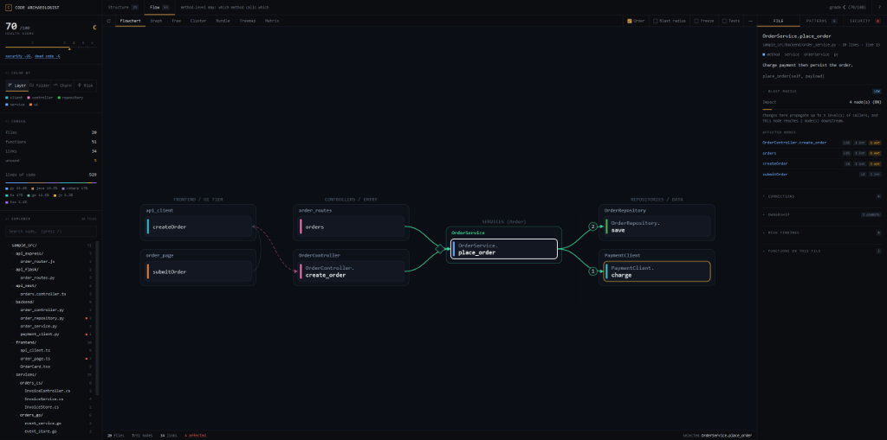
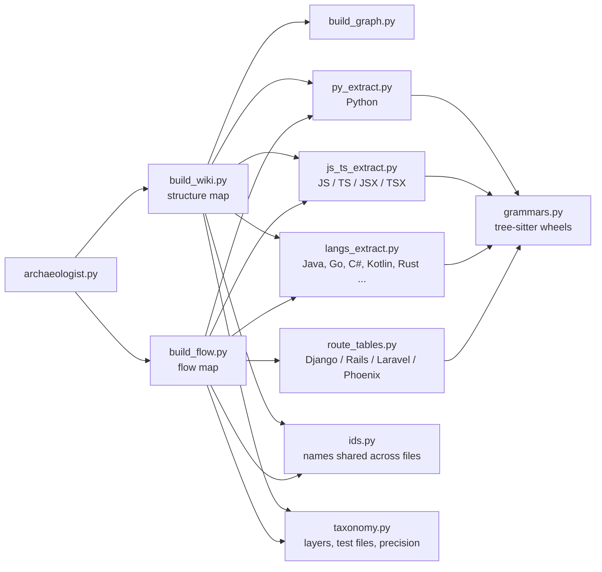

<p align="center">
  
</p>

# Code Archaeologist

**A codebase map your AI agent can query instead of reading your whole repo.**

It scans your code once, builds two graphs plus one note per class/method, and answers
architecture questions by walking those graphs — not by grepping source. Everything is
deterministic — real parsers plus graph traversal, no embeddings, no vector DB. Every language,
Python included, needs one parser wheel installed into the skill folder, and any that is missing
is **named and skipped**, never silently dropped.

```
"How does a request reach the database?"

  trace  ->  submitOrder > createOrder > OrderController.create_order
             > OrderService.place_order > OrderRepository.save
  read   ->  5 notes (~1,500 tokens)     instead of the whole repo
```

The same question in the explorer: pick `OrderRepository.save` in the **Flowchart** view and it
shows every path that reaches it, plus its blast radius (built from the bundled `sample_src/`):



---

## Quick start

```bash
# 1. install the skill into your project (no clone, no npm account)
npx github:non-nattawut/Code-Archaeologist-LLM-Agent-Skill --harness claude

# 2. build both maps
python .claude/skills/code-archaeologist/scripts/archaeologist.py both --src ./src

# 3. review them
python .claude/skills/code-archaeologist/scripts/archaeologist.py report --src ./src
```

Then open `data/explorer.html` — one self-contained page, both maps, works offline from `file://`.

> Install each language's grammar first — **Python included** — into the skill rather than your
> Python, at pinned versions: `python .claude/skills/code-archaeologist/scripts/core/grammars.py
> --install` (or name languages: `--install python typescript`).
> Skip one and those files are left out — the build says so loudly, and names the wheel.

---

## Requirements

| | |
| --- | --- |
| **Python 3.10+** | required — it runs the pipeline |
| **`tree-sitter` + a grammar wheel per language** | for **every** language including Python — `python scripts/core/grammars.py --install [langs]`, which runs `pip install --only-binary :all: --no-cache-dir --target vendor` at the pinned versions. Wheels, no compiler; install only the languages you have. Lands in `<skill>/vendor`, **not** in your Python — delete the skill folder and it is gone |
| **git** | optional — only for churn / ownership / hotspots |
| **A browser** | to open the explorer — no network needed |

---

## Installation

```bash
npx github:non-nattawut/Code-Archaeologist-LLM-Agent-Skill                    # pick a harness
npx github:non-nattawut/Code-Archaeologist-LLM-Agent-Skill --harness claude   # or name it
npx github:non-nattawut/Code-Archaeologist-LLM-Agent-Skill --self-test        # install, fetch the demo's grammars, build it
```

| Harness | Installs to |
| --- | --- |
| `agents` (default) | `.agents/skills/code-archaeologist` |
| `claude` | `.claude/skills/code-archaeologist` |
| `cursor` | `.cursor/skills/code-archaeologist` |
| `windsurf` | `.windsurf/skills/code-archaeologist` |
| `zed` | `.zed/skills/code-archaeologist` |

Use `--dir <path>` for anywhere else. Other flags: `--target <dir>`, `--force`, `--help`.

The installer checks for Python 3.10+, copies the skill in, and creates an empty `data/` workspace.
It has no npm dependencies of its own.

It also installs a second, single-purpose skill beside the first, `code-archaeologist-explorer`
(e.g. `.claude/skills/code-archaeologist-explorer`). Ask for **`/code-archaeologist-explorer`**
when all you want is the page: it builds both maps and the review report, then creates or replaces
`data/explorer.html`. Pass folders to map a different root:
`/code-archaeologist-explorer ./backend ./frontend`. It has no scripts of its own; it runs the main
skill's.

---

## What it can tell you

Every item below is a command, and every answer is computed from the graphs — never from an LLM
guessing. Full syntax lives in **[USAGE.md](docs/USAGE.md)**.

### Navigate

| Question | Command |
| --- | --- |
| Where is X handled? | `search.py --name X` (also `--calls`, `--called-by`, `--orphans`) |
| How do A and B connect? | `trace_path.py --from A --to B` |
| What breaks if I change X? | `trace_path.py --impact-of X` |
| What does my current PR affect? | `trace_path.py --impact-of-diff` |
| Everything about one node, in one call | `context.py --node X` |
| Orient me on this repo (~35 lines) | `archaeologist.py brief` |

### Review

| Question | Command |
| --- | --- |
| Is this codebase healthy? (0–100, A–F) | `analyze.py` |
| Any secrets / SQL injection / XSS sinks? | `scan_security.py` |
| What's rotting? (TODOs, dead code) | `debt.py` |
| What's tested — and what isn't? | `tests_map.py` |
| What's been copy-pasted? (whole functions, and blocks pasted into different ones) | `duplicates.py` |
| Where's the churn and who owns it? | `git_insights.py` |
| How big / complex is each piece? | `metrics.py` |
| All of it, as one report | `archaeologist.py report` |

### Trust

| Question | Command |
| --- | --- |
| Are the maps still current? | `archaeologist.py check` |

The maps drift the moment code changes. `check` hashes every source file and reports exactly what
moved, so an agent rebuilds *before* answering rather than confidently citing a stale graph. It
needs no arguments — a build records the roots it scanned, and `check` and `brief` re-use them.

---

## The two maps

Both are built from the same scan and answer different questions.

| | **Structure map** | **Flow map** |
| --- | --- | --- |
| **Node** | a class, React component or module | a method / function |
| **Edge** | references, imports | calls |
| **Answers** | "how is this organized?", "who uses X?" | "how does a request travel?", "what calls what?" |
| **Output** | `data/structure/` | `data/flow/` |

Both cover backend and frontend: a `.tsx` React component is a structure node next to a Python
service class, and a function that returns JSX is typed `component` rather than lumped into its
file's module page.

They cross the stack. Frontend `fetch`/`axios` calls are matched to backend route handlers by HTTP
method + normalized path, so **one trace runs from a button click to the database**. Routes are
read from seven framework shapes — FastAPI, Flask, Express, Nest, Spring, ASP.NET and the Go
routers (gin/chi/mux) — so a React click can be traced into Java or Go, not just Python. Where the
path does not match exactly, a unique suffix still links (so an `/api` mount prefix works) and an
ambiguous one is left alone — in both directions, so a prefix held in the client's axios
`baseURL` works as well as one mounted on the server. An axios instance created once and imported
everywhere (`services/api.ts` exporting `axios.create(...)`, directly or from a factory) is
followed across files, and a same-file `const API_BASE_URL = "/orders"` is read as its value
inside `${API_BASE_URL}/list`. A call whose URL is otherwise a variable (`get(ENDPOINT[section])`)
links nowhere, because it says nothing about where it goes.

---

## The explorer

One self-contained HTML file with both maps embedded. No server, no repo access, and **no network
— the graph library is vendored and inlined**, so it opens from `file://` with the wifi off. Commit
it or email it.

- **Left** — health ring (A–F), color-by (layer / folder / churn / risk), stat tiles, language
  mix, and a file tree that filters the canvas.
- **Center** — seven views of the same graph: Graph, Treemap, Matrix, Tree, Flowchart, Cluster, Bundle. Nodes are labelled by name (the path is in the side panel); clicking a file or folder hides every node it does not link to directly, and the Flowchart narrows to a selected node's chain.
  Plus folder hulls, a blast-radius toggle, a **Freeze** toggle that holds the current view while
  you click through its nodes, and an overflow menu (`⋯`) holding zoom, fit and PNG export.
- **Right** — **FILE** (what it does, blast radius, connections, git ownership, risks),
  **PATTERNS** (cycles, layer violations, hubs, god objects, dead code), **SECURITY** (findings by
  severity). All click through into each other.

Both side panels drag to resize from their inner border. In the tree, `+`/`–` expands a folder and
clicking its name filters the canvas — two separate controls. The explorer fills whatever the
panels above it leave, so fold one from its heading to give the tree more room. Dragging a node
pins it where you drop it, so the **reset** button in the toolbar throws the layout away and
re-runs it from scratch — along with the current selection and filter. Clicking empty canvas
does not clear a selection; reset does.

---

## How an agent uses it

`SKILL.md` tells the agent to:

1. **Check freshness first** — rebuild if the source moved, then orient with `brief`.
2. **Never read raw source** for architecture questions.
3. **Find** nodes with `search.py`, **trace** with `trace_path.py`, **load** them with `context.py`.
4. Read individual notes only when it needs more.
5. Keep `[[wikilinks]]` in answers so replies stay navigable.
6. For "is this healthy?", answer from the generated report.

---

## Language support

| Capability | Languages |
| --- | --- |
| **Graphs** — nodes, call edges, structure, per-node metrics, tests | Python, JavaScript/TypeScript/JSX/TSX, Java, Go, C#, Kotlin, Rust, Swift, Scala, Groovy, Dart, C, C++, Ruby, PHP, Elixir — all tree-sitter, each with its own fixture |
| **Lines, risk scan, debt markers, test detection** | all of the above |
| **Routes read** | *on the handler:* FastAPI, Flask, Express, NestJS, Spring (Java and Kotlin), ASP.NET, Go `net/http`, actix-web / Rocket — *from a route table:* Django `urlpatterns` (with `include()` and class-based views), Rails `routes.rb`, Laravel `routes/*.php`, Phoenix routers |

Seventeen languages, one engine. A language is a pinned grammar wheel plus a row of node types,
never a new parser. This is which file calls which on the way from source to graph (the full
diagram is in the [architecture guide](docs/ARCHITECTURE_GUIDE.md#2-exact-inter-script-call-graph--invocation-hierarchy)):



What that means for the edges:

- **A call is drawn only when the receiver's type is in the source** — a field, a parameter,
  `new Foo()`, an annotation — so every call graph is a lower bound. Typed languages resolve like
  Java; a node that drops a call through an untyped receiver — common in Ruby, PHP, Elixir, Groovy
  and JS/TS — is `name-matched`.
- **What cannot be resolved is dropped, never guessed.** An interface call stops at the interface
  (`OrderWorkflow.place → PricingRule.price`), and each implementation carries an `implements` link
  to it, so traces reach every implementation without claiming which one runs — unless the source settles
  which Spring bean is injected, and then the call links to that bean; each overload is its own node, and a call that still
  fits two is dropped (`overloads`); a name defined in several files is qualified by its file. The
  node names its loss, and the explorer shows it as a chip.
- **A missing grammar is named, not silent**: its files are skipped with the exact `pip install`.
- **Test files are recognized in every language** and tagged `layer: test`, so test code is never
  dead code and its calls never count as coupling.
- **The object model is in the graph**: classes are `interface`, `abstract` or `class`; a class
  `implements` an interface or `extends` a class; a method `implements` a declaration or
  `overrides` a body; and a default body every subclass replaces is reported as **overridden**
  (never runs today), not as dead code. A class name two applications share is settled by package
  and imports, an inherited helper called with no receiver reaches its base class, and a local's
  declared type (`Dto d = read()`) types its calls.
- **Code a framework calls is never dead code**: Spring `@Scheduled` / `@Bean` / `@EventListener` /
  aspect methods, `@Override` / `override` methods, `main`, and Next.js pages, layouts and route
  handlers carry a named `entry`, and so does a function a module calls as it loads or a field
  initializer, initializer block, constructor or Go package var calls. Java method
  references (`this::clearBin`) are calls, a call on another call's result is typed from declared
  return types (Lombok getters included), a call through a global resolves (a Python module-level
  or imported instance, a Kotlin top-level `val`, a Go package `var`, `Registry.STORE.save()`),
  `api.x()` resolves through an imported instance, a
  barrel re-export, an object of functions (imported under any name, chosen by a `const`, or
  returned by a hook: `const api = useApi()`), a typed hook field (`const { api } = useVariant()`
  where the return type or `createContext<T>` says `api: typeof service`), and `<Child />` is a
  `renders` edge in the flow map; `forwardRef` / `memo` components are components. A Java or C#
  pattern variable (`x instanceof UserSecurity us`) types its calls.
  A `const save = id ? update : create` call links to both, and a function handed over
  (`onClick={fn}`, `rows.map(fn)`) gets a `passes` link. One reached through a prop still has no
  caller.
- **A class is referenced by every type its users name**: field, parameter and return types, each
  generic argument inside them (`GlobalResponse<PaginationResponse<UserResponse>>` is three
  references), local declarations, `X.class`, the class a static constant is read from, and a name
  the same file defines (a component calling a helper beside it). A base
  class is used by whatever extends it, and a class a framework builds and calls into
  (`@SpringBootApplication`, `@Configuration`, `@Aspect`, or one with a `@Scheduled` method) is
  never dead — but `@Component` / `@Service` alone does not spare one.
- **Dead code means "no code references it"**, the standard an IDE's *unused* hint uses — not "it
  never runs". A function a framework finds by a name held in data (a next-intl `t.rich` tag named
  inside a translation JSON, a string-keyed bean, reflection) is listed as an orphan on purpose;
  so is a member of an object passed whole (`t.rich(key, { ...TAGS })`), which hands over the
  object, not its members. Check message and config files before deleting one.
- **Proven on real repositories:** Python, JS/TS (Next.js included) and Java. The other languages and the four route
  tables pass hand-written fixtures only.

---

## How it works

```
   your source                         two graphs                    one page
  ┌───────────┐                     ┌──────────────┐   analysis   ┌──────────────┐
  │ .py .ts   │  tree-sitter        │ structure    │ ───────────▶ │ explorer.html│
  │ .jsx .tsx │                     │ flow         │   + report   │ (both maps)  │
  │ .java .go │ ─────────────────▶  └──────────────┘              └──────────────┘
  │ .cs       │      extract              │
  └───────────┘                           ▼  one Markdown note per node
                                    [[wikilinked]] vault
```

The pieces that make it cheap and repeatable:

- **Deterministic extraction.** One real parser for every language: tree-sitter, Python included.
  It is deterministic — the same input always yields the same graph. A parser that is not installed is named in the output
  and its files are skipped, so a smaller graph never passes for a smaller codebase (see [Language
  support](#language-support)).
- **Call resolution without a type checker.** `self.<dep>.method()` is resolved through `__init__`
  type hints and assignments, typed params/locals, and same-class `self.method()` calls.
  Unresolvable external calls are dropped rather than guessed.
- **AI writes prose, never structure.** Descriptions come cheapest-first: docstring → cached AI
  summary → deterministic fallback. Summaries are keyed by the method's source hash, so only
  *new or changed and undocumented* methods ever cost a token.
- **Findings attach to nodes.** A security hit, a TODO, a churn number and a complexity score all
  land on the graph node that owns that line — so any of them can be traced and blast-radiused
  like anything else.

---

## Why not RAG?

RAG chops code into ~500-token chunks and retrieves by similarity. That destroys the two things
architecture questions are *about*: scope and call hierarchy.

| | Standard RAG | Code Archaeologist |
| --- | --- | --- |
| **Unit** | arbitrary ~500-token chunk | one whole class / method per note |
| **Relationships** | lost | explicit graph edges |
| **Retrieval** | similarity search, non-deterministic | BFS traversal, same answer every time |
| **Cost per query** | re-reads large context | only the nodes on the path |
| **Infra** | embeddings + vector DB | a JSON file |

---

## Project structure

```
.agents/skills/code-archaeologist/
├── SKILL.md              agent instructions
├── scripts/
│   ├── archaeologist.py  entrypoint: project | flow | both | check | report | brief
│   ├── paths.py          one definition of where the skill's files live
│   │
│   ├── core/             vocabulary every other script shares
│   │   ├── taxonomy.py     the one source of truth for kind/layer values
│   │   ├── manifest.py     what counts as a source file + freshness hashes
│   │   ├── grammars.py     which tree-sitter grammars are installed, and a parser for each
│   │   ├── ids.py          node ids: bare, or file-qualified where two files share a name
│   │   └── console.py      stdout that survives a non-UTF-8 console
│   │
│   ├── extract/          source -> graphs + notes
│   │   ├── build_wiki.py
│   │   ├── build_graph.py
│   │   ├── build_flow.py
│   │   ├── py_extract.py   Python, parsed with tree-sitter (ast is kept as the oracle)
│   │   ├── js_ts_extract.py JS/JSX/TS/TSX, parsed with tree-sitter
│   │   ├── langs_extract.py   Java/Go/C# and eleven more languages, parsed with tree-sitter
│   │   ├── route_tables.py Django / Rails / Laravel / Phoenix route tables, read into routes
│   │   └── apply_descriptions.py
│   │
│   ├── review/           graphs -> findings
│   │   ├── analyze.py
│   │   ├── scan_security.py
│   │   ├── git_insights.py
│   │   ├── metrics.py
│   │   ├── debt.py
│   │   ├── tests_map.py
│   │   ├── duplicates.py
│   │   ├── brief.py
│   │   └── report.py
│   │
│   └── query/            ask questions, render the page
│       ├── trace_path.py
│       ├── context.py
│       ├── search.py
│       └── build_html.py  -> data/explorer.html
├── templates/            viewer.html · wiki_page_template.md · TAXONOMY.md
│   └── vendor/           force-graph.min.js, inlined so the explorer needs no network
└── data/
    ├── explorer.html     both maps, one page
    ├── structure/  flow/  report/  cache/

.agents/skills/code-archaeologist-explorer/
└── SKILL.md              /code-archaeologist-explorer: build, report, render explorer.html
```

Alongside the skill, in the repo but never installed:

```
tests/fixtures/langs/      one small fixture per graphed language + expected.json
tests/fixtures/ts_imports/ a minimal Next.js app: tsconfig aliases, import bindings, file conventions
tools/                     check_docs.py · check_langs.py · check_py_oracle.py
                           check_graph.py (the graph's invariants) · check_regressions.py
                           time_build.py (wall time per stage, corpora read-only)
```

---

## License

See [LICENSE](LICENSE).
