# Code Archaeologist — Complete Architecture & Workflow Guide

A deterministic, Zero-RAG codebase documentation engine that builds two queryable maps of a target codebase (Structure & Flow), audits them with graph algorithms, and renders a self-contained offline viewer.

---

## 1. Visual Pipeline Architecture & Data Flow

```
archaeologist.py  project | flow | both | check | report | brief   (Entrypoint)
  project  -> build_wiki -> build_graph ------------------\
  flow     -> build_flow ---------------------------------+--> render_explorer()
      both extract through: py_extract.py     (Python,        tree-sitter)
                            js_ts_extract.py  (JS/TS/JSX/TSX, tree-sitter)
                            langs_extract.py  (15 languages,  tree-sitter)
            flow also reads: route_tables.py   (Django/Rails/Laravel/Phoenix tables -> handlers)
  report   -> report.py (scan_security + git_insights + analyze + metrics + debt + tests_map
                         + duplicates)
                                                                    -> data/report/<map>/
  brief    -> brief.py (reads computed JSON artifacts, zero computation)
  check    -> manifest.py (source hashes vs last build; detects staleness)
                                                            \-> build_html.py -> data/explorer.html
```

---

## 2. Exact Inter-Script Call Graph & Invocation Hierarchy

### 2.1 Complete Inter-Script Invocation Diagram

```mermaid
flowchart TD
    CLI["scripts/archaeologist.py<br>(CLI Dispatcher)"]

    %% Core Subsystems
    PATHS["scripts/paths.py<br>(Root & sys.path bootstrap)"]
    CONSOLE["scripts/core/console.py<br>(Safe encoding output)"]
    IDS["scripts/core/ids.py<br>(SharedNames case-insensitive)"]
    TAXONOMY["scripts/core/taxonomy.py<br>(Layers, Kinds, Precision)"]
    GRAMMARS["scripts/core/grammars.py<br>(Tree-sitter runtime & wheels)"]
    MANIFEST["scripts/core/manifest.py<br>(Source freshness SHA-256)"]

    %% Extractors
    BW["scripts/extract/build_wiki.py"]
    BG["scripts/extract/build_graph.py"]
    BF["scripts/extract/build_flow.py"]
    PX["scripts/extract/py_extract.py"]
    JS["scripts/extract/js_ts_extract.py"]
    LANGS["scripts/extract/langs_extract.py"]
    ROUTES["scripts/extract/route_tables.py"]
    DESC["scripts/extract/apply_descriptions.py"]

    %% Review Suite
    REP["scripts/review/report.py"]
    SEC["scripts/review/scan_security.py"]
    GIT["scripts/review/git_insights.py"]
    ANA["scripts/review/analyze.py"]
    MET["scripts/review/metrics.py"]
    DEBT["scripts/review/debt.py"]
    TESTS["scripts/review/tests_map.py"]
    DUP["scripts/review/duplicates.py"]
    BRIEF["scripts/review/brief.py"]

    %% Query & Presentation
    HTML["scripts/query/build_html.py"]
    TRACE["scripts/query/trace_path.py"]
    CTX["scripts/query/context.py"]
    SEARCH["scripts/query/search.py"]

    %% Archaeologist Dispatch
    CLI -->|"run_project() -> build()"| BW
    CLI -->|"run_project() -> build()"| BG
    CLI -->|"run_flow() -> build()"| BF
    CLI -->|"run_report() -> build()"| REP
    CLI -->|"main() -> main()"| BRIEF
    CLI -->|"main() -> compare() / write()"| MANIFEST
    CLI -->|"render_explorer() -> build()"| HTML

    %% Structure Pipeline
    BW -->|"px.parse(), px.field()"| PX
    BW -->|"find_js_files(), extract_js_files()"| JS
    BW -->|"find_lang_files(), extract_lang_files()"| LANGS
    BW -->|"SharedNames((name, source))"| IDS
    BW -->|"infer_layer(), is_test_path()"| TAXONOMY
    BG -->|"Reads Markdown vault"| BG

    %% Flow Pipeline
    BF -->|"px.parse(), px.read_source()"| PX
    BF -->|"find_js_files(), extract_js_files()"| JS
    BF -->|"find_lang_files(), extract_lang_files()"| LANGS
    BF -->|"_pick_overload()"| LANGS
    BF -->|"read(roots)"| ROUTES
    BF -->|"SharedNames, bare()"| IDS
    BF -->|"infer_layer(), precision_of()"| TAXONOMY

    %% Grammar usages
    PX -->|"grammars.parser_for('python')"| GRAMMARS
    JS -->|"grammars.parser_for('javascript'|'typescript'|'tsx')"| GRAMMARS
    LANGS -->|"grammars.parser_for(lang)"| GRAMMARS
    ROUTES -->|"grammars.parser_for(lang)"| GRAMMARS

    %% Review Suite Calls
    REP -->|"scan(src, graph_path)"| SEC
    REP -->|"build(src, graph_path)"| GIT
    REP -->|"report(graph_path, sec_summary)"| ANA
    REP -->|"build(src, graph_path, out_file)"| MET
    REP -->|"build(src, graph_path, out_file)"| DEBT
    REP -->|"build(src, graph_path, out_file)"| TESTS
    REP -->|"build(src, graph_path, out_file)"| DUP

    %% Review Internal Interconnections
    MET -->|"iter_source_files(src)"| SEC
    MET -->|"grammars.parser_for(lang)"| GRAMMARS
    MET -->|"px tree walking"| PX
    DEBT -->|"find_orphans(nodes, edges)"| ANA
    DEBT -->|"iter_source_files(), owner_of()"| SEC
    TESTS -->|"iter_source_files()"| SEC
    TESTS -->|"bare(id)"| IDS
    DUP -->|"iter_source_files()"| SEC
    BRIEF -->|"compare(src)"| MANIFEST

    %% Query Interconnections
    CTX -->|"_changed_files(), _nodes_for_files()"| TRACE
    CTX -->|"PRECISION_NOTES"| TAXONOMY
```



---

### 2.2 Caller-to-Callee Cross-Reference Matrix

| Caller Script | Callee Script | Function / Symbol Invoked | Arguments / Data Passed | Returned Result / Side Effect |
| :--- | :--- | :--- | :--- | :--- |
| `scripts/archaeologist.py` | `scripts/extract/build_wiki.py` | `build(src, vault_dir)` | `src` roots list, output vault path | Scans source files, emits Markdown notes to `vault/*.md` |
| `scripts/archaeologist.py` | `scripts/extract/build_graph.py` | `build(vault_dir, out_dir)` | Vault directory, structure directory | Parses wikilinks & metadata, writes `graph.json` & `registry.json` |
| `scripts/archaeologist.py` | `scripts/extract/build_flow.py` | `build(src, notes_dir, graph_path)` | `src` roots list, notes dir, graph JSON path | Resolves two-pass calls, writes `notes/*.md` & `flow_graph.json` |
| `scripts/archaeologist.py` | `scripts/review/report.py` | `build(src, graph_path, out_dir)` | `src` roots, map's graph JSON, output dir | Runs 7 review passes, generates `architecture_report.md` & `.json` |
| `scripts/archaeologist.py` | `scripts/review/brief.py` | `main(argv)` | CLI args (`--src ...`) | Formats and prints fixed-size token digest of repo state |
| `scripts/archaeologist.py` | `scripts/core/manifest.py` | `compare(src)` | `src` roots list | Dict of modified/added/deleted files & grammar drift |
| `scripts/archaeologist.py` | `scripts/core/manifest.py` | `write(src)` | `src` roots list | Computes and saves SHA-256 hashes into `manifest.json` |
| `scripts/archaeologist.py` | `scripts/query/build_html.py` | `build(sources, out_path)` | Map dict: `{name: (graph, report)}`, output HTML path | Bundles graphs + reports + vendored D3 script into `explorer.html` |
| `scripts/extract/build_wiki.py` | `scripts/extract/py_extract.py` | `parse()`, `read_source()`, `field()`, `text()`, `walk()` | Python file path / source bytes | Python CST tree nodes, docstrings, classes, functions |
| `scripts/extract/build_wiki.py` | `scripts/extract/js_ts_extract.py` | `find_js_files()`, `extract_js_files()`, `frontend_degraded()` | Source roots | List of class and component definitions with types |
| `scripts/extract/build_wiki.py` | `scripts/extract/langs_extract.py` | `find_lang_files()`, `extract_lang_files()` | Source roots | List of class/struct/interface and method definitions for 15 langs |
| `scripts/extract/build_wiki.py` | `scripts/core/ids.py` | `SharedNames((name, source))` | Name/file pairs | Disambiguates duplicate names case-insensitively (`stem/path`) |
| `scripts/extract/build_wiki.py` | `scripts/core/taxonomy.py` | `infer_layer()`, `is_test_path()`, `SKIP_DIRS` | File path, kind, name | Architectural layer assignment (`controller`, `model`, `test`, etc.) |
| `scripts/extract/build_wiki.py` | `scripts/paths.py` | `long_path()`, `DATA_DIR`, `TEMPLATES_DIR` | File path strings | Prepends `\\?\` past Windows 260-character limit |
| `scripts/extract/build_flow.py` | `scripts/extract/py_extract.py` | `parse()`, `read_source()`, `field()`, `text()`, `defs_in()` | Python file path / source bytes | Method definitions, AST statements, call expressions |
| `scripts/extract/build_flow.py` | `scripts/extract/js_ts_extract.py` | `find_js_files()`, `extract_js_files()` | Source roots | Frontend methods, route endpoints, Axios/fetch API calls |
| `scripts/extract/build_flow.py` | `scripts/extract/langs_extract.py` | `find_lang_files()`, `extract_lang_files()`, `_pick_overload()` | Source roots, candidate methods, caller arg count | Methods, call sites, and exact overload resolution |
| `scripts/extract/build_flow.py` | `scripts/extract/route_tables.py` | `read(roots)` | Source roots, table file paths | Routes from Django `urlpatterns`, Rails `routes.rb`, Laravel, Phoenix |
| `scripts/extract/build_flow.py` | `scripts/core/ids.py` | `SharedNames`, `bare(id)` | Method name/file pairs, qualified node ID | Disambiguates method IDs; strips path qualifier for matching |
| `scripts/extract/build_flow.py` | `scripts/core/taxonomy.py` | `infer_layer()`, `precision_of()`, `ROUTE_DECORATOR_RE` | Method properties, resolved call dict | Computes named precision loss (`interface-dispatch`, `unresolved`, etc.) |
| `scripts/extract/apply_descriptions.py` | `scripts/paths.py` | `DATA_DIR` | Path resolution | Merges agent summaries into `data/cache/descriptions.json` |
| `scripts/extract/py_extract.py` | `scripts/core/grammars.py` | `parser_for("python")` | Grammar identifier | Tree-sitter `Language` instance for Python |
| `scripts/extract/js_ts_extract.py` | `scripts/core/grammars.py` | `parser_for("javascript" \| "typescript" \| "tsx")` | Grammar identifier | Tree-sitter `Language` instances for frontend |
| `scripts/extract/langs_extract.py` | `scripts/core/grammars.py` | `parser_for(lang)` | Language identifier | Tree-sitter `Language` instances for Java, Go, Rust, C#, etc. |
| `scripts/extract/route_tables.py` | `scripts/core/grammars.py` | `parser_for(lang)` | Language identifier | Tree-sitter `Language` instances for backend table parsing |
| `scripts/review/report.py` | `scripts/review/scan_security.py` | `scan(src, graph_path)` | Source roots, graph path | Security findings mapped to owning AST nodes (`security.json`) |
| `scripts/review/report.py` | `scripts/review/git_insights.py` | `build(src, graph_path)` | Source roots, graph path | Git churn, author ownership, hotspot risk scores (`insights.json`) |
| `scripts/review/report.py` | `scripts/review/analyze.py` | `report(graph_path, sec_summary)` | Graph path, security severity counts | Tarjan's SCC cycles, backwards layer calls, god objects, health grade |
| `scripts/review/report.py` | `scripts/review/metrics.py` | `build(src, graph_path, out_file, top_k)` | Source roots, graph path, output JSON | Cyclomatic complexity (McCabe), nesting depth, LOC census |
| `scripts/review/report.py` | `scripts/review/debt.py` | `build(src, graph_path, out_file)` | Source roots, graph path, output JSON | Comment markers (TODO/FIXME/HACK) and orphan file inventory |
| `scripts/review/report.py` | `scripts/review/tests_map.py` | `build(src, graph_path, out_file)` | Source roots, graph path, output JSON | Production nodes referenced by test files (`tests.json`) |
| `scripts/review/report.py` | `scripts/review/duplicates.py` | `build(src, graph_path, out_file)` | Source roots, graph path, output JSON | Cloned bodies (token normalization) and blocks (Winnowing $K=10, W=21$) |
| `scripts/review/debt.py` | `scripts/review/analyze.py` | `find_orphans(nodes, edges)` | Graph nodes dict, edge list | Identifies uncalled nodes and dead files |
| `scripts/review/debt.py` | `scripts/review/scan_security.py` | `iter_source_files()`, `owner_of()` | Source roots, line interval ranges | Finds source files and attributes comment markers to AST nodes |
| `scripts/review/metrics.py` | `scripts/review/scan_security.py` | `iter_source_files(src)` | Source roots | Single shared definition of source file iteration |
| `scripts/review/metrics.py` | `scripts/core/grammars.py` | `parser_for(lang)` | Language string | Loads Tree-sitter grammar to count decision points |
| `scripts/review/tests_map.py` | `scripts/review/scan_security.py` | `iter_source_files(src)` | Source roots | Shared source file discovery |
| `scripts/review/tests_map.py` | `scripts/core/ids.py` | `bare(id)` | Method identifier | Strips path qualification for test name matching |
| `scripts/review/duplicates.py` | `scripts/review/scan_security.py` | `iter_source_files(src)` | Source roots | Shared source file discovery |
| `scripts/review/brief.py` | `scripts/core/manifest.py` | `compare(src)` | Recorded source roots | Checks if working tree has diverged from last build |
| `scripts/query/context.py` | `scripts/query/trace_path.py` | `_changed_files()`, `_nodes_for_files()` | Git diff flags, node sources dict | Maps modified git files back to graph node IDs |
| `scripts/query/build_html.py` | `scripts/paths.py` | `DATA_DIR`, `TEMPLATES_DIR` | Template file locations | Reads `viewer.html` and `force-graph.min.js` |

---

### 2.3 Step-by-Step Execution Sequences

#### Flow 1: Build Structure Map (`archaeologist.py project --src <roots>`)
1. **Entrypoint Dispatch:** `scripts/archaeologist.py:run_project()` is invoked with source directories.
2. **Extraction (`scripts/extract/build_wiki.py:build()`):**
   - Discovers source files across all supported languages via `px.iter_py_files()`, `js_ts_extract.find_js_files()`, and `langs_extract.find_lang_files()`.
   - Parses AST/CST trees using pinned Tree-sitter grammars via `scripts/core/grammars.py`.
   - Disambiguates duplicate class/component names case-insensitively using `scripts/core/ids.py:SharedNames`.
   - Infers architectural layers (`controller`, `service`, `ui`, `model`) via `scripts/core/taxonomy.py:infer_layer()`.
   - Emits Markdown notes with Obsidian wikilinks `[[Target]]` into `data/structure/vault/<id>.md`.
3. **Graph Assembly (`scripts/extract/build_graph.py:build()`):**
   - Scans all notes in `data/structure/vault/*.md`.
   - Extracts wikilinks, references, and front-matter metadata.
   - Deterministically writes `data/structure/graph.json` and `data/structure/registry.json`.
4. **Explorer Bundling (`scripts/query/build_html.py:build()`):**
   - Reads `templates/viewer.html` and `templates/vendor/force-graph.min.js`.
   - Inlines graph JSONs and review reports directly into `data/explorer.html`.
5. **Manifest Snapshot (`scripts/core/manifest.py:write()`):**
   - Hashes all source files (SHA-256) and records installed grammar versions into `data/cache/manifest.json`.

#### Flow 2: Build Flow Map (`archaeologist.py flow --src <roots>`)
1. **Entrypoint Dispatch:** `scripts/archaeologist.py:run_flow()` is invoked.
2. **Behavior Extraction & Resolution (`scripts/extract/build_flow.py:build()`):**
   - **Pass 1 (Registration):** Collects all function/method signatures, classes, and receivers across Python, JS/TS, and 15 Tree-sitter languages into `scripts/core/ids.py:SharedNames`.
   - **External Route Tables:** Reads Django `urls.py`, Rails `routes.rb`, Laravel, and Phoenix route definitions via `scripts/extract/route_tables.py` and attaches them to target handler nodes.
   - **Pass 2 (Call Resolution):**
     - Python: Resolves `self.attr.m()`, `param.m()`, and `local.m()` using local AST assignment scopes.
     - JS/TS: Resolves typed receivers (`new X()`, `this.<field>`, typed parameters).
     - 15 Languages: Resolves declared receiver types and picks overloaded methods using `scripts/extract/langs_extract.py:_pick_overload()`.
     - Cross-Stack Linking: Binds frontend HTTP calls (`fetch`, `axios.get/post`) to backend route definitions.
     - Precision & Dropped Tracking: Computes named precision losses via `scripts/core/taxonomy.py:precision_of()`. Unresolved calls matching entities that exist in the graph are preserved in `unresolved` (never guessed as edges).
     - Docstring & AI Waterfall: Loads docstrings or hash-cached summaries from `data/cache/descriptions.json` (unsummarized nodes written to `data/cache/pending_descriptions.json`).
   - Writes Markdown notes into `data/flow/notes/<id>.md` and adjacency graph into `data/flow/flow_graph.json`.
3. **Explorer Bundling & Manifest Snapshot:** Invokes `build_html.build()` and `manifest.write()`.

#### Flow 3: Build Both Maps (`archaeologist.py both --src <roots>`)
1. Sequentially executes **Flow 1 (`run_project`)** then **Flow 2 (`run_flow`)**.
2. Renders unified `data/explorer.html` containing both maps selectable via header toggle.
3. Records all file hashes via `scripts/core/manifest.py:write()`.

#### Flow 4: Architecture Review & Health Audit (`archaeologist.py report --src <roots>`)
1. **Entrypoint Dispatch:** `scripts/archaeologist.py:run_report()` iterates over all existing graphs (`structure`, `flow`) and calls `scripts/review/report.py:build()`.
2. **Parallel Sub-Pass Execution:**
   - `scripts/review/scan_security.py:scan()`: Line-oriented regex scanning for secrets, SQL injections, and dangerous evals; maps lines to owning nodes via AST interval ranges (`owner_of()`).
   - `scripts/review/git_insights.py:build()`: Streams `git log --numstat` in a single subprocess to compute commit churn, file ownership, and hotspot risk ($\text{risk} = \text{commits} \times (1 + \text{fan\_in} + \text{fan\_out})$).
   - `scripts/review/analyze.py:report()`: Computes circular dependencies via iterative Tarjan's SCC, backwards layer dependencies, hub degree coupling on `app_edges()`, and capped health score ($0-100 \to \text{A-F}$).
   - `scripts/review/metrics.py:build()`: Computes McCabe cyclomatic complexity and max nesting depth per node using Tree-sitter CST branch-point tables.
   - `scripts/review/debt.py:build()`: Scans TODO/FIXME markers and combines with `analyze.find_orphans()` to identify dead nodes and dead files.
   - `scripts/review/tests_map.py:build()`: Identifies test files via `taxonomy.is_test_path()` and maps test references to production nodes.
   - `scripts/review/duplicates.py:build()`: Performs token normalization (whole-body clones) and Winnowing ($K=10, W=21$ rolling polynomial hash) to find copied blocks.
3. **Synthesis & Storage:** Writes `data/report/<map>/architecture_report.md` and `.json`.
4. **Viewer Refresh:** Calls `build_html.build()` to embed the new review reports into `data/explorer.html`.

#### Flow 5: Staleness Check (`archaeologist.py check [--src <roots>]`)
1. `scripts/archaeologist.py:main()` calls `scripts/core/manifest.py:compare()`.
2. Re-scans recorded roots, hashes every source file via SHA-256, and checks Tree-sitter grammar versions via `scripts/core/grammars.py:drift()`.
3. Emits JSON listing added, modified, deleted files, and grammar drift. Zero graph parsing required.

#### Flow 6: Orientation Brief (`archaeologist.py brief`)
1. `scripts/archaeologist.py:main()` calls `scripts/review/brief.py:main()`.
2. Reads pre-computed artifacts (`manifest.json`, `graph.json`, `architecture_report.json`).
3. Formats and prints a fixed-size token digest (census, health grade, top hotspots, entry points). Zero computation.

#### Flow 7: Agent Zero-RAG Retrieval & Query Flows
- **Path Tracing & Blast Radius (`scripts/query/trace_path.py`):**
  - Loads graph JSON into forward adjacency `adj` and reverse adjacency `radj`.
  - Forward BFS (`bfs_path`): Computes shortest execution sequence from `--from <A>` to `--to <B>`.
  - Reverse BFS (`blast_radius`): Traverses incoming caller edges to calculate upstream blast radius for `--impact-of <node>` or `--impact-of-diff` (via `git diff`).
- **Context Packing (`scripts/query/context.py`):**
  - Gathers node signature, callers, callees, metrics, security findings, and precision loss notes.
  - Automatically contracts neighbor lists using `NEIGHBOR_CAPS = (12, 6, 3, 1)` to fit strictly within the `--max-chars` token budget.
- **Node Search (`scripts/query/search.py`):**
  - Performs multi-parameter conjunctive filtering over `graph.json` without regex-grepping source files.
- **AI Summary Enrichment (`scripts/extract/apply_descriptions.py`):**
  - Takes pending method descriptions generated by the LLM and merges them into `data/cache/descriptions.json` indexed by node ID and code SHA-1 hash.

---

## 3. Practical Operational Scenarios

### Scenario 1: Codebase Ingestion & Graph Building
Scans target source roots, parses every file via Tree-sitter, resolves calls against declared receiver types, and writes deterministic graph JSONs and Markdown notes.

```bash
# Build both structure and flow maps
python .agents/skills/code-archaeologist/scripts/archaeologist.py both --src ./sample_src
```

**Key Artifacts:**
- `data/structure/graph.json` & `vault/*.md` — Classes, React components, and module groups.
- `data/flow/flow_graph.json` & `notes/*.md` — Methods, functions, and cross-stack HTTP call edges.
- `data/explorer.html` — Standalone offline viewer.

### Scenario 2: Zero-RAG Architecture Query & Blast Radius
AI agents answer architecture and impact questions by querying the graph using BFS and reading only the returned notes, avoiding multi-hundred-thousand token source dumps.

```bash
# Trace execution path between components
python .agents/skills/code-archaeologist/scripts/query/trace_path.py \
  --graph .agents/skills/code-archaeologist/data/flow/flow_graph.json \
  --from submitOrder --to OrderRepository.save

# Blast radius: all upstream callers affected by modifying a node
python .agents/skills/code-archaeologist/scripts/query/trace_path.py \
  --graph .agents/skills/code-archaeologist/data/flow/flow_graph.json \
  --impact-of OrderRepository.save
```

### Scenario 3: Code Health & Risk Audit
Runs 7 analysis passes to compute an A–F health grade, detect circular dependencies, locate copy-pasted blocks, and rank git churn hotspots.

```bash
# Generate architecture reports
python .agents/skills/code-archaeologist/scripts/archaeologist.py report --src ./sample_src

# Orientation brief (fixed token size digest)
python .agents/skills/code-archaeologist/scripts/archaeologist.py brief
```

---

## 4. Directory of All 28 Scripts: Mechanics & Algorithms

### Core & Bootstrapping

| Script | Role | Technique / Algorithm | Key Invariant |
| :--- | :--- | :--- | :--- |
| `scripts/archaeologist.py` | CLI Dispatcher | Subcommand routing (`project`, `flow`, `both`, `check`, `report`, `brief`). | Single entrypoint at `scripts/` root. |
| `scripts/paths.py` | System Paths | MAX_PATH normalization (`\\?\` prefix) and `sys.path` bootstrap. | Sits below categories; imports nothing from skill. |
| `scripts/core/ids.py` | ID Generation | **SharedNames:** Groups by `name.lower()` to prevent case collisions on Windows/macOS. Qualifies by stem/path. | Node IDs stay bare unless defined in 2+ files. |
| `scripts/core/taxonomy.py` | Taxonomy Rules | Defines kinds, layers, skip directories, and `is_test_file()` detection. Computes `precision_of()`. | Single source of truth; never re-implemented inline. |
| `scripts/core/grammars.py` | Grammar Wheels | Manages pinned Tree-sitter wheels, lazy loading, and `drift()` detection. | Wheels installed on demand into `<skill>/vendor/`. |
| `scripts/core/manifest.py` | Staleness Check | Computes SHA-256 source and grammar version hashes into `manifest.json`. | Deterministic: no wall-clock timestamps. |
| `scripts/core/console.py` | Output Encoding | Safe stdout/stderr wrapper protecting non-UTF-8 terminals (e.g. Windows cp874). | Must be called before echoing external repo strings. |

### Extraction Engine (Why 3 Extractor Files?)

The extractors are kept in **three separate files** rather than one monolithic module because the file boundary is the **graceful degradation boundary** required by Constraint 1:
- `py_extract.py` (Python CST + newline normalization) — degrades via `python skipped`.
- `js_ts_extract.py` (JS/TS/JSX/TSX) — degrades via `frontend skipped` (needs both `javascript` and `typescript` grammars).
- `langs_extract.py` (15 languages: Java, Go, C#, Rust, Kotlin, etc.) — degrades on a per-language basis.

| Script | Role | Technique / Algorithm | Key Invariant |
| :--- | :--- | :--- | :--- |
| `scripts/extract/build_wiki.py` | Structure Wiki | Extracts classes, JSX components, and module-level functions into Markdown notes. | JSX functions become `kind: component` / `layer: ui`. |
| `scripts/extract/build_graph.py` | Structure Graph | Assembles `graph.json` from vault notes and type references. | Edges are references; carry no precision. |
| `scripts/extract/build_flow.py` | Flow Graph | Two-pass caller resolution, overload picking (`_pick_overload`), cross-stack linking, and **`unresolved` dropped-call tracking** (`_record_dropped`, `_split_dropped`). | Lower bound: calls resolved only through declared types. Interface calls stop at `declaration: true`. Dropped calls matching known graph nodes are tracked in `unresolved` (never guessed as edges). |
| `scripts/extract/py_extract.py` | Python CST | Tree-sitter CST queries + newline normalization (`read_source()`). | Validated against stdlib `ast` via `check_py_oracle.py`. |
| `scripts/extract/js_ts_extract.py` | JS/TS CST | Multi-grammar parsing (`javascript`, `typescript`, `tsx`), routes, axios/fetch calls. | Emits `{type, name}` calls for typed receivers (`new X()`, `this.<field>`, typed params). |
| `scripts/extract/langs_extract.py` | 15 Lang Extractor | Table-driven CST extraction via `SPEC` and `SHAPES` tables; handles `OVERLOADING`. | Range starts at first annotation/decorator (`source..end`). |
| `scripts/extract/route_tables.py` | Route Tables | Parses external routing tables (Django `urlpatterns`, Rails `routes.rb`, Laravel, Phoenix). | Dropped if route matches 0 or >1 target handler. |
| `scripts/extract/apply_descriptions.py` | Descriptions | Waterfall: 1. Docstring, 2. Hash-cached AI summary (`descriptions.json`), 3. Fallback. | Sole entrypoint for AI text; deterministic at runtime. |

### Review & Code Health

| Script | Role | Technique / Algorithm | Key Invariant |
| :--- | :--- | :--- | :--- |
| `scripts/review/analyze.py` | Health & Smells | **Iterative Tarjan's SCC** for cycles, degree coupling, god objects, capped health score. | Coupling runs on `app_edges()` (excludes `layer: test`). |
| `scripts/review/duplicates.py` | Code Clones | **1. Token Normalization** (ID/LIT) for whole bodies.<br>**2. Winnowing ($K=10, W=21$)** with rolling polynomial hash for blocks. | Deterministic rolling hash mod $(2^{61}-1)$. Skips declarations. |
| `scripts/review/scan_security.py` | Vulnerability Scan | Line-oriented regex scanning mapped to innermost node range via `owner_of()`. | Module-level findings attributed to file, never preceding function. |
| `scripts/review/git_insights.py` | Churn & Risk | Streaming `git log --numstat` parser. Computes $\text{risk} = \text{commits} \times (1 + \text{fan\_in} + \text{fan\_out})$. | Single git subprocess call; degrades gracefully if not git repo. |
| `scripts/review/metrics.py` | Complexity | CST decision-point counter per language table (McCabe cyclomatic complexity & depth). | Keyed by graph node ID by construction across all languages. |
| `scripts/review/debt.py` | Debt Markers | Heuristic comment scanner for TODO/FIXME/HACK + orphan file detection. | Review prompt only; does not penalize health score. |
| `scripts/review/tests_map.py` | Test Mapping | Scans test files to map tests to production node names. | Coverage indicator; test nodes tagged `layer: test`. |
| `scripts/review/report.py` | Report Generator | Aggregates all review passes into markdown and JSON architecture reports. | One report per map; node IDs are never mixed. |
| `scripts/review/brief.py` | Orientation Brief | Zero-computation digest reading existing JSON artifacts. | Fixed-size output; identical token cost on small and large repos. |

### Query & Visualization

| Script | Role | Technique / Algorithm | Key Invariant |
| :--- | :--- | :--- | :--- |
| `scripts/query/trace_path.py` | Path Tracing | **Forward BFS** for shortest path (`--from/--to`), **Reverse BFS** for blast radius (`--impact-of`). | Pure stdlib (no NetworkX); deterministic ordering. |
| `scripts/query/search.py` | Node Search | Indexed multi-filter query (`--name`, `--doc`, `--layer`, `--calls`, etc.). | Replaces grepping source files to find node IDs. |
| `scripts/query/context.py` | Context Pack | Packs node facts, callers, callees, metrics, and security into a strict `--max-chars` budget. | Trims under budget; includes precision caveats. |
| `scripts/query/build_html.py` | HTML Bundler | Inlines graph JSONs, CSS, and vendored `force-graph.js` into single `data/explorer.html`. | Zero network calls; opens directly via `file://`. |
| `templates/viewer.html` | Frontend UI | Responsive 3-pane desktop app; 7 visualization views; D3 force-graph physics. | Quiet chrome (`#08090b`), test nodes green (`#57ab5a`), no emojis. |

---

## 5. Key Architectural Invariants

1. **Deterministic Byte-for-Byte Output:** Given the same source files, every generated graph, note, and report produces identical bytes across runs. No wall-clock timestamps or process-salted hashes.
2. **Lower-Bound Call Precision:** Call edges are drawn only when the receiver's type is declared in the source. Ambiguous or dynamic dispatch is dropped rather than guessed, and named in `precision`.
3. **Standalone Offline Explorer:** The HTML viewer inlines all data and JavaScript libraries, ensuring full functionality with network access completely disabled.
4. **Windows & CP874 Console Safety:** Standard output is guarded by encoding-safe wrappers, preventing crashes from unprintable characters or non-UTF-8 Windows consoles.
5. **Dropped Calls Keep Their Names (`unresolved`):** Dropped calls are split into true external calls (`ext`) vs calls naming entities that exist in the graph (`unresolved`). The system records them as investigation clues without guessing or inventing false edges (guarded by `check_graph.py` rule `c19` and regression test `r35`).
