# Code Archaeologist — คู่มืออธิบายสถาปัตยกรรม อัลกอริทึม และทฤษฎีเชิงลึกฉบับสมบูรณ์ (ภาษาไทย)

> [!NOTE]
> 🇬🇧 **English Edition:** For the English version of this document, please see [**ARCHITECTURE_GUIDE.md**](ARCHITECTURE_GUIDE.md) or open the interactive offline dashboard at [**ARCHITECTURE_GUIDE.html**](ARCHITECTURE_GUIDE.html).

---

เอกสารฉบับนี้จัดทำขึ้นเพื่ออธิบายการทำงานเชิงลึกของ **Code Archaeologist** ซึ่งเป็น deterministic, Zero-RAG codebase documentation engine ที่เปลี่ยนซอร์สโค้ดของโปรเจกต์ให้กลายเป็นโมเดล Dependency Graph 2 ชุดที่สืบค้นได้ด้วยคณิตศาสตร์ทฤษฎีกราฟ ได้แก่ **Structure Map** (แผนผังโครงสร้างระดับ Class, Component และ Module) และ **Flow Map** (แผนผังเส้นทางการประมวลผลระดับ Method, Function และ REST Routes) พร้อมการตรวจวิเคราะห์กลิ่นโค้ด (Code Smells), การวัดความเสถียร (Instability), การหาโค้ดซ้ำซ้อน (Code Clones) และการเรนเดอร์แดชบอร์ด HTML ออฟไลน์แบบ Standalone

---

## 1. แผนภาพ Pipeline สถาปัตยกรรมระดับภาพรวม (Visual Pipeline Architecture & Data Flow)

การทำงานของระบบถูกแบ่งออกเป็น 2 ขั้นตอนหลักอย่างเคร่งครัด: **Build Phase** (อ่านซอร์สโค้ด, พาร์ส Abstract/Concrete Syntax Tree, แก้ไขประเภทตัวแปร และบันทึกผลลัพธ์เป็น JSON และ Markdown) และ **Query/Review Phase** (ท่องไปตามกราฟ, คำนวณ Metric ทางทอพอโลยี และจัดเตรียมบริบทให้ AI โดยไม่ต้องสแกนไฟล์ซอร์สโค้ดซ้ำ)

```
archaeologist.py  project | flow | both | check | report | brief   (Entrypoint หลัก)
  project  -> build_wiki -> build_graph ------------------\
  flow     -> build_flow ---------------------------------+--> render_explorer()
       ทั้งคู่ประมวลผลผ่าน: py_extract.py     (Python,        tree-sitter)
                          js_ts_extract.py  (JS/TS/JSX/TSX, tree-sitter)
                          langs_extract.py  (14 languages,  tree-sitter)
             flow อ่านเพิ่ม: route_tables.py   (Django/Rails/Laravel/Phoenix tables -> handlers)
  report   -> report.py (scan_security + git_insights + analyze + metrics + debt + tests_map
                         + duplicates)
                                                                    -> data/report/<map>/
  brief    -> brief.py (อ่าน JSON artifacts ที่คำนวณไว้แล้ว, Zero computation)
  check    -> manifest.py (ตรวจ Content Hash เทียบกับการบิลด์ครั้งล่าสุด)
                                                            \-> build_html.py -> data/explorer.html
```

---

## 2. แผนภาพลำดับการเรียกใช้งานระหว่างสคริปต์ (Inter-Script Invocation Graph)

```mermaid
flowchart TD
    CLI["scripts/archaeologist.py<br>(CLI Dispatcher)"]

    %% Core Subsystems
    PATHS["scripts/paths.py<br>(Path Resolver & Bootstrap)"]
    CONSOLE["scripts/core/console.py<br>(Unicode/CP874 Safe Stream)"]
    IDS["scripts/core/ids.py<br>(SharedNames Disambiguation)"]
    TAXONOMY["scripts/core/taxonomy.py<br>(Taxonomy, Layers & Precision)"]
    GRAMMARS["scripts/core/grammars.py<br>(Tree-Sitter GLR Wheels)"]
    MANIFEST["scripts/core/manifest.py<br>(Merkle SHA-1 Freshness)"]
    DOCTEXT["scripts/core/doc_text.py<br>(Universal Docstring Cleaner)"]
    CALLCTX["scripts/core/call_ctx.py<br>(CFG Call-Site Lattice)"]

    %% Extractors
    BW["scripts/extract/build_wiki.py"]
    BG["scripts/extract/build_graph.py"]
    BF["scripts/extract/build_flow.py"]
    PX["scripts/extract/py_extract.py"]
    JS["scripts/extract/js_ts_extract.py"]
    LANGS["scripts/extract/langs_extract.py"]
    ROUTES["scripts/extract/route_tables.py"]
    DESC["scripts/extract/apply_descriptions.py"]

    %% Review Suite
    REP["scripts/review/report.py"]
    SEC["scripts/review/scan_security.py"]
    GIT["scripts/review/git_insights.py"]
    ANA["scripts/review/analyze.py"]
    MET["scripts/review/metrics.py"]
    DEBT["scripts/review/debt.py"]
    TESTS["scripts/review/tests_map.py"]
    DUP["scripts/review/duplicates.py"]
    BRIEF["scripts/review/brief.py"]

    %% Query & Presentation
    HTML["scripts/query/build_html.py"]
    TRACE["scripts/query/trace_path.py"]
    CTX["scripts/query/context.py"]
    SEARCH["scripts/query/search.py"]

    %% Dispatch
    CLI -->|"run_project() -> build()"| BW
    CLI -->|"run_project() -> build()"| BG
    CLI -->|"run_flow() -> build()"| BF
    CLI -->|"run_report() -> build()"| REP
    CLI -->|"main() -> main()"| BRIEF
    CLI -->|"main() -> compare() / write()"| MANIFEST
    CLI -->|"render_explorer() -> build()"| HTML

    %% Structure Pipeline
    BW -->|"find_py_files(), extract_py_files()"| PX
    PX & JS & LANGS -->|"clean(), join()"| DOCTEXT
    PX & JS & LANGS -->|"site(), merge()"| CALLCTX
    BF -->|"merge(), facts()"| CALLCTX
    BW -->|"find_js_files(), extract_js_files()"| JS
    BW -->|"find_lang_files(), extract_lang_files()"| LANGS
    BW -->|"SharedNames((name, source))"| IDS
    BW -->|"infer_layer(), is_test_path()"| TAXONOMY

    %% Flow Pipeline
    BF -->|"find_py_files(), extract_py_files()"| PX
    BF -->|"find_js_files(), extract_js_files()"| JS
    BF -->|"find_lang_files(), extract_lang_files()"| LANGS
    BF -->|"read(roots)"| ROUTES
    BF -->|"SharedNames, bare()"| IDS
    BF -->|"infer_layer(), precision_of()"| TAXONOMY

    %% Grammars
    PX & JS & LANGS & ROUTES -->|"parser_for(lang)"| GRAMMARS

    %% Review Suite Calls
    REP -->|"scan(src, graph_path)"| SEC
    REP -->|"build(src, graph_path)"| GIT
    REP -->|"report(graph_path, sec_summary)"| ANA
    REP -->|"build(src, graph_path, out_file)"| MET
    REP -->|"build(src, graph_path, out_file)"| DEBT
    REP -->|"build(src, graph_path, out_file)"| TESTS
    REP -->|"build(src, graph_path, out_file)"| DUP

    %% Review Internal Interconnections
    MET -->|"iter_source_files(src)"| SEC
    MET -->|"grammars.parser_for(lang)"| GRAMMARS
    MET -->|"px tree walking"| PX
    DEBT -->|"find_orphans(nodes, edges)"| ANA
    DEBT -->|"iter_source_files(), owner_of()"| SEC
    TESTS -->|"iter_source_files()"| SEC
    TESTS -->|"bare(id)"| IDS
    DUP -->|"iter_source_files()"| SEC
    BRIEF -->|"compare(src)"| MANIFEST

    %% Query Interconnections
    CTX -->|"_changed_files(), _nodes_for_files()"| TRACE
    CTX -->|"PRECISION_NOTES"| TAXONOMY
```



---

## 3. เจาะลึกรายไฟล์ทั้ง 32 ไฟล์: เทคนิค, อัลกอริทึม, สูตรคณิตศาสตร์ และประวัติผู้คิดค้น

หมวดหมู่นี้อธิบายการทำงานของทุกไฟล์ในระบบอย่างละเอียด ครอบคลุมไลบรารีที่ใช้, โครงสร้างข้อมูล, สูตรคณิตศาสตร์ (LaTeX), หลักการทำงานทีละสเต็ป และประวัติผู้คิดค้นตามหลักวิชาการวิทยาการคอมพิวเตอร์

---

### กลุ่มที่ 1: Entrypoint & Runtime Bootstrap

#### 1. `scripts/archaeologist.py`
- **บทบาทและหน้าที่ใน Pipeline**: ตัวกระจายคำสั่ง (CLI Dispatcher) เพียงจุดเดียวสำหรับทั้งมนุษย์และ AI Agent โดยทำหน้าที่รับคำสั่งหลัก (`project`, `flow`, `both`, `check`, `report`, `brief`) แล้วส่งต่อไปยังฟังก์ชันภายในโมดูลโดยตรงแบบ in-process execution โดยไม่ spawn subprocess เพิ่มเติม ช่วยลด overhead และควบคุม exit code ได้อย่างแม่นยำ
- **เทคนิคและไลบรารีที่ใช้**:
  - Command Pattern และ Front Controller Pattern
  - การพาร์ส Command-line Argument ด้วยไลบรารีมาตรฐาน `argparse` ของ Python
- **อัลกอริทึมและสูตรคณิตศาสตร์**:
  - **Finite State Command Mapping**:
    กำหนดให้ $\mathcal{C}$ คือเซตของคำสั่งที่รองรับ และ $\mathcal{A}$ คือเซตของ Argument:
    $$\text{Dispatch}: \mathcal{C} \times \mathcal{A} \to \mathbb{Z}, \quad \text{โดยที่ } \mathcal{C} = \{\texttt{project}, \texttt{flow}, \texttt{both}, \texttt{check}, \texttt{report}, \texttt{brief}\}$$
    เมื่อได้รับคำสั่ง $\text{Cmd} \in \mathcal{C}$ ระบบจะทำการแมปไปยังฟังก์ชันเป้าหมาย $f_{\text{Cmd}} \in \mathcal{F}$ ผ่าน Associative Dispatch Table $\mathcal{T}$:
    $$f_{\text{Cmd}} = \mathcal{T}[\text{Cmd}], \quad \text{ExitCode} = f_{\text{Cmd}}(A)$$
- **การทำงานอย่างละเอียด**:
  อ่านค่า `sys.argv[1]` เพื่อระบุคำสั่ง สำหรับคำสั่ง `project` หรือ `flow` จะทำการ Normalize path ของ Root โฟลเดอร์ต้นทาง เรียกใช้งาน `build_wiki.build()` หรือ `build_flow.build()`, สั่งสร้างไฟล์ HTML ผ่าน `build_html.build()` และบันทึก Content Hash ผ่าน `manifest.write()`
- **ผู้คิดค้นและประวัติทางวิชาการ**:
  - **Command Pattern & Front Controller**: บัญญัติขึ้นอย่างเป็นทางการโดย Erich Gamma, Richard Helm, Ralph Johnson, และ John Vlissides (**Gang of Four / GoF**, 1994, *Design Patterns: Elements of Reusable Object-Oriented Software*)
  - **POSIX CLI Conventions**: มาตรฐาน IEEE Std 1003.1 (POSIX.1) ที่กำหนดรูปแบบ flag (`--src`, `--graph`) และสถานะรหัสคืนค่า (Exit Codes: $0 = \text{สำเร็จ}, \ne 0 = \text{ข้อผิดพลาด}$)

---

#### 2. `scripts/paths.py`
- **บทบาทและหน้าที่ใน Pipeline**: รากฐานการจัดการ Path ของระบบ กำหนดค่าคงที่ `SKILL_ROOT`, `DATA_DIR`, และ `TEMPLATES_DIR` และทำหน้าที่ Bootstrap `sys.path` เพื่อให้ทุกสคริปต์ในโฟลเดอร์ย่อยสามารถเรียกใช้สคริปต์ข้างเคียงแบบ Bare Import ได้ และจัดการปัญหา Path ยาวเกินขีดจำกัดบน Windows
- **เทคนิคและไลบรารีที่ใช้**:
  - Extended-Length Path Prefixing (`\\?\`) บนระบบปฏิบัติการ Windows Win32
  - Python `sys.path` Dynamic Injection
- **อัลกอริทึมและสูตรคณิตศาสตร์**:
  - **ฟังก์ชันการแปลง Windows Extended-Length Path**:
    ระบบ Win32 API ดั้งเดิมมีข้อจำกัดความยาวของ Path ไม่เกิน $\text{MAX\_PATH} = 260$ ตัวอักษร ซึ่งในโปรเจกต์ขนาดใหญ่ที่ต้องเก็บ Note รายละเอียดเมธอดใน `data/structure/vault/<long_id>.md` จะมีความยาวเกินกำหนด ฟังก์ชัน $\phi(p)$ ทำหน้าที่แปลง Path ดังนี้:
    $$\phi(p) = \begin{cases} 
    \texttt{"\textbackslash\textbackslash?\textbackslash"} + \text{abspath}(p) & \text{ถ้า } \text{os.name} = \texttt{"nt"} \land |\text{abspath}(p)| \ge 260 \land \neg \text{abspath}(p).\text{startswith}(\texttt{"\textbackslash\textbackslash"}) \\
    p & \text{กรณีอื่น ๆ}
    \end{cases}$$
  - **การคำนวณ Path ข้ามไดรฟ์ (`skill_rel`)**:
    กำหนดให้ $p_s$ คือ Path ต้นทางบนไดรฟ์ $D(p_s)$ และ $p_t$ คือ Path ปลายทางบนไดรฟ์ $D(p_t)$:
    $$\text{skill\_rel}(p_s, p_t) = \begin{cases}
    \text{relpath}(p_s, p_t) & \text{ถ้า } D(p_s) = D(p_t) \\
    \text{abspath}(p_s) & \text{ถ้า } D(p_s) \ne D(p_t)
    \end{cases}$$
- **การทำงานอย่างละเอียด**:
  หาที่ตั้งของตัวเองผ่าน `__file__` แล้ว Inject โฟลเดอร์ `scripts/`, `scripts/core/`, `scripts/extract/`, `scripts/review/`, `scripts/query/` และ `vendor/` เข้าสู่ `sys.path` ทำให้การอิมพอร์ต `tree-sitter` จะดึงไฟล์จากโฟลเดอร์ `vendor/` ของ Skill ก่อน Library ในระบบเสมอ
- **ผู้คิดค้นและประวัติทางวิชาการ**:
  - **Win32 MAX_PATH Limitation**: มีที่มาจากระบบ MS-DOS 2.0 (1983) และสถาปัตยกรรม Windows NT ยุคแรก ออกแบบโดย **David Cutler** (1993) โดยการเติม Prefix `\\?\` จะสั่งให้ระบบข้ามตัวแบ่ง Path ของ Win32 แล้วส่ง String Buffer ตรงไปยัง NT Object Manager ซึ่งรองรับ Path ยาวสูงสุดถึง 32,767 ตัวอักษร

---

### กลุ่มที่ 2: โครงสร้างพื้นฐานส่วน Core (`scripts/core/`)

#### 3. `scripts/core/taxonomy.py`
- **บทบาทและหน้าที่ใน Pipeline**: แหล่งนิยามความจริงหนึ่งเดียว (Single Source of Truth) สำหรับการจำแนกสถาปัตยกรรม: กำหนดเลเยอร์ (`layer`), ชนิดของโหนด (`kind`), โฟลเดอร์ที่ต้องข้าม (`SKIP_DIRS`), ทิศทางการท่องกราฟกลับด้าน (`REVERSED_LINKS`), การตรวจจับไฟล์ทดสอบ และการคำนวณ Precision Loss
- **เทคนิคและไลบรารีที่ใช้**:
  - Poset (Partially Ordered Set) ทางพีชคณิตนามธรรม
  - Negative Lookahead Regular Expressions สำหรับจำแนกคำบอกเลเยอร์
- **อัลกอริทึมและสูตรคณิตศาสตร์**:
  - **ความสัมพันธ์ทางสถาปัตยกรรมแบบลำดับชั้น (Layer Hierarchy)**:
    กำหนดให้เซตของเลเยอร์เป็น Poset $(\mathcal{L}, \le)$:
    $$\mathcal{L} = \{ \text{ui} < \text{controller} < \text{service} < \text{repository} < \text{model} \}$$
    เส้นเชื่อมการเรียก $e = (u, v)$ จะถือว่าถูกต้องเมื่อ $L(u) \le L(v)$ แต่หากเกิดการเรียกกลับทิศทาง จะถือเป็น **Layer Violation**:
    $$\text{Violation}(u, v) \iff L(u) > L(v) \quad \text{โดยที่ } L(u), L(v) \in \mathcal{L}$$
  - **การกลับทิศทางเส้นเชื่อมสำหรับการสืบทอด (Inheritance Reversal)**:
    ในโค้ด Class $C$ ทำการอิมพลีเมนต์ Interface $I$ ($C \xrightarrow{\text{implements}} I$) แต่ในเวลา Runtime ทราฟฟิกจะวิ่งเข้าหา $I$ แล้วส่งต่อไปยัง $C$ ดังนั้นตัวท่องกราฟจึงต้องกลับทิศทาง:
    $$\mathcal{R}_{\text{reversed}} = \{ \texttt{"implements"}, \texttt{"extends"}, \texttt{"overrides"} \}$$
    $$\text{direction}(u, v, \text{kind}) = \begin{cases} (v, u) & \text{ถ้า } \text{kind} \in \mathcal{R}_{\text{reversed}} \\ (u, v) & \text{กรณีทั่วไป} \end{cases}$$
  - **เวกเตอร์แสดงการสูญเสียความแม่นยำ (Named Precision Loss Vector)**:
    แทนที่จะบอกเพียงว่า "ประมาณการ" ระบบคำนวณเวกเตอร์ของข้อจำกัดเชิงสัญลักษณ์ออกมาอย่างชัดเจน:
    $$\text{Precision}(u) \subseteq \{ \texttt{"interface-dispatch"}, \texttt{"overloads"}, \texttt{"name-matched"}, \texttt{"unresolved"} \}$$
- **การทำงานอย่างละเอียด**:
  ฟังก์ชัน `infer_layer()` ประเมินจาก Annotation ก่อน (เช่น `@RestController` $\to$ `controller`) หากไม่มีจึงดูชื่อโฟลเดอร์และชื่อคลาสตามลำดับ โดยใช้ Regex ที่มี Boundary ป้องกันคำซ้อน (เช่น `repo` จะไม่ตรงกับ `PnoDataReportMail`)
- **ผู้คิดค้นและประวัติทางวิชาการ**:
  - **Layered Architecture & Separation of Concerns**: บัญญัติโดย **Edsger W. Dijkstra** (1968, *The Structure of the 'THE'-Multiprogramming System*) และ **David Parnas** (1972)
  - **Liskov Substitution Principle (LSP)**: เสนอโดย **Barbara Liskov** (1987, OOPSLA Keynote) ซึ่งเป็นรากฐานของการแทนที่ Interface ด้วย Implementation ชนิดลูก
  - **Dependency Inversion Principle (DIP)**: บัญญัติโดย **Robert C. Martin** (1996)

---

#### 4. `scripts/core/ids.py`
- **บทบาทและหน้าที่ใน Pipeline**: สร้าง Unique Node Identifier ให้กับโหนดใน Structure Map และ Flow Map โดยตั้งเป้าให้ชื่อโหนดสั้น กระชับ และเป็นธรรมชาติที่สุด (คงชื่อเดิมไว้) และจะเติม Prefix ระบุไฟล์เฉพาะกรณีที่เกิดชื่อซ้ำข้ามไฟล์เท่านั้น
- **เทคนิคและไลบรารีที่ใช้**:
  - Equivalence Class Partitioning (การแบ่งชั้นสมมูล)
  - Case-Insensitive String Grouping
- **อัลกอริทึมและสูตรคณิตศาสตร์**:
  - **การแบ่งกลุ่มและสร้าง ID แบบไม่สนใจตัวพิมพ์เล็ก-ใหญ่ (`SharedNames`)**:
    กำหนดให้ $\mathcal{D} = \{ (n_i, f_i) \}_{i=1}^N$ คือเซตของการประกาศฟังก์ชัน/คลาสทั้งหมด โดย $n_i$ คือชื่อ และ $f_i$ คือ Path ของไฟล์ เราแบ่ง $\mathcal{D}$ ออกเป็นคลาสสมมูลโดยใช้ชื่อตัวพิมพ์เล็ก:
    $$[(n, f)]_{\sim} = \{ (n', f') \in \mathcal{D} \mid \text{lower}(n') = \text{lower}(n) \}$$
    ฟังก์ชันการกำหนดรหัสประจำตัว $\text{ID}(n, f)$ จะเป็นดังนี้:
    $$\text{ID}(n, f) = \begin{cases}
    n & \text{ถ้า } |\{ f' \mid (\cdot, f') \in [(n, f)]_{\sim} \}| = 1 \\
    \text{stem}(f) + \texttt{"."} + n & \text{ถ้า } \forall (\cdot, f') \in [(n, f)]_{\sim} \, [f' \ne f \implies \text{stem}(f') \ne \text{stem}(f)] \\
    \text{norm\_path}(f) + \texttt{"."} + n & \text{กรณีที่ชื่อไฟล์ (stem) ซ้ำกันด้วย}
    \end{cases}$$
- **การทำงานอย่างละเอียด**:
  คลาส `SharedNames` จะสแกนชื่อที่ถูกประกาศทั้งหมดในโปรเจกต์ก่อนเริ่มสร้างโหนด เมื่อสร้างโหนดใด ๆ จะเรียก `ids.id(name, file)` ถ้าชื่อนั้นมีอยู่ไฟล์เดียวในทั้งโปรเจกต์ โหนดจะได้ชื่อเดิมแบบ Bare Name แต่ถ้ามีมากกว่าหนึ่งไฟล์ ระบบจะเติมชื่อไฟล์ข้างหน้าเพื่อไม่ให้เกิดการชนกัน
- **ผู้คิดค้นและประวัติทางวิชาการ**:
  - **Equivalence Partitioning**: ทฤษฎีเซตดั้งเดิม ประยุกต์ใช้เพื่อแก้ปัญหา Case-Preserving Case-Insensitive Filesystem บนระบบไฟล์ Windows (NTFS) และ macOS (APFS) ที่มองว่า `Login.md` กับ `login.md` คือไฟล์เดียวกัน

---

#### 5. `scripts/core/call_ctx.py`
- **บทบาทและหน้าที่ใน Pipeline**: ตรวจสอบบริบทของจุดเรียกฟังก์ชัน (Call Site) จาก Concrete Syntax Tree: ตรวจสอบว่าโค้ดถูกเขียนที่บรรทัดไหน, วิ่งอยู่ใน Loop หรือไม่, อยู่ภายใต้เงื่อนไข (Branch) หรือไม่ และระบุ Branch Arm ที่ไม่เกิดร่วมกัน (เช่น แขนง $3a$ และ $3b$ ของคำสั่ง `if`/`else`)
- **เทคนิคและไลบรารีที่ใช้**:
  - การท่องทวนลำดับบรรพบุรุษบน CST (Tree-Sitter Ancestor Invariant Traversal)
  - กึ่งแลตทิซขอบเขตจำกัด (Bounded Semilattice Join) สำหรับยุบรวมจุดเรียกซ้ำ
- **อัลกอริทึมและสูตรคณิตศาสตร์**:
  - **การท่องย้อนหาบรรพบุรุษบน Syntax Tree**:
    กำหนดให้ $C$ เป็นโหนดการเรียกบน CST และ $F$ เป็นโหนดฟังก์ชันที่ครอบอยู่:
    $$\text{Ancestors}(C, F) = (P_0 = C, P_1 = \text{parent}(C), \dots, P_k = F)$$
    จุดเรียกจะถูกจัดว่าเป็น Loop หรือ Branch ผ่านคุณสมบัติของโหนดบรรพบุรุษ:
    $$\text{is\_loop}(C) \iff \exists i \mid \text{type}(P_i) \in \text{LOOP\_NODES} \land \text{field}(P_{i-1}, P_i) \in \{ \texttt{"body"}, \texttt{"condition"}, \texttt{"update"} \}$$
    $$\text{is\_cond}(C) \iff \exists i \mid \text{type}(P_i) \in \text{BRANCH\_NODES} \land \text{field}(P_{i-1}, P_i) \in \{ \texttt{"consequence"}, \texttt{"alternative"}, \texttt{"body"} \}$$
  - **การคำนวณพิกัดของแขนงเงื่อนไข (Arm Coordinates)**:
    สำหรับแขนงที่แยกจากกันโดยเด็ดขาด (เช่น แขนง `if` และ `else`, หรือ `case` ที่ไม่มี `fallthrough`):
    $$\text{ArmCoord}(P_i) = \text{line}(P_i) : \text{col}(P_i) / \text{arm\_index}$$
  - **การยุบรวมข้อมูลจุดเรียกแบบ Semilattice Join**:
    หากฟังก์ชันเดียวกันเรียกเป้าหมายเดิมซ้ำหลายจุด $\{s_1, \dots, s_m\}$:
    $$\text{line}(s) = \min_{j} \text{line}(s_j), \quad \text{loop}(s) = \bigvee_{j=1}^m \text{loop}(s_j), \quad \text{cond}(s) = \bigwedge_{j=1}^m \text{cond}(s_j), \quad \text{arms}(s) = \bigcap_{j=1}^m \text{arms}(s_j)$$
- **การทำงานอย่างละเอียด**:
  ฟังก์ชัน `site(call_node, stop_node)` จะไต่ parent ขึ้นไปจนถึงตัวฟังก์ชัน เพื่อตรวจสอบตารางชนิดโหนดของทั้ง 17 ภาษา ส่วนฟังก์ชัน `merge()` จะรวมจุดเรียกเข้าด้วยกันอย่างเป็นระเบียบ ทำให้ Explorer สามารถเรนเดอร์เลขลำดับการเขียนและวงแหวน Loop ได้ถูกต้อง
- **ผู้คิดค้นและประวัติทางวิชาการ**:
  - **Control Flow Analysis (CFA)**: ริเริ่มโดย **Frances E. Allen** (1970, *Control Flow Analysis*, ACM SIGPLAN Notices) หญิงคนแรกที่ได้รับรางวัล Turing Award (2006)
  - **Program Slicing**: เสนอโดย **Mark Weiser** (1981, IEEE TSE)

---

#### 6. `scripts/core/doc_text.py`
- **บทบาทและหน้าที่ใน Pipeline**: ตัวทำความสะอาดและจัดรูปแบบข้อความ Comment อธิบายโค้ด (Docstring / Doc-Comment) ให้เป็นบรรทัดเดียวตามมาตรฐานเดียวกันในทุกภาษา
- **เทคนิคและไลบรารีที่ใช้**:
  - Regular Text Normalization และ Regular Expression Token Stripping
  - Syntax-Aware XML Filtering
- **อัลกอริทึมและสูตรคณิตศาสตร์**:
  - **การรวบรวมกลุ่ม Comment เหนือการประกาศโค้ด**:
    ค้นหากลุ่มโหนด Comment $K = \{k_1, k_2, \dots, k_r\}$ ที่อยู่ติดกันเหนือโหนดประกาศ $N$ โดยไม่ข้ามบรรทัดโค้ดอื่น
  - **กระบวนการปรับค่าข้อความให้เป็นมาตรฐาน**:
    ลบสัญลักษณ์ Comment ($\texttt{/**}, \texttt{*/}, \texttt{///}, \texttt{//}, \texttt{\#}, \texttt{*}$), ลบแท็ก XML ในภาษาที่ใช้รูปแบบ XML (C# และ TypeScript), และยุบรวมช่องว่าง:
    $$\text{norm}(S) = \text{re.sub}(r\texttt{"\textbackslash s+"}, \texttt{" "}, \text{strip\_markers}(S)).\text{strip}()$$
- **การทำงานอย่างละเอียด**:
  ส่งออกฟังก์ชัน `clean(text, xml=False)` สำหรับคอมเมนต์ของภาษาตระกูล C, Go, Rust และ `join(text)` สำหรับ Docstring ของ Python โดยแท็กอย่าง `<summary>` ใน C# จะถูกลบออก ในขณะที่เครื่องหมาย Generic ในภาษาอื่น (เช่น `Vec<String>`) จะถูกเก็บไว้ไม่ให้เสียหาย
- **ผู้คิดค้นและประวัติทางวิชาการ**:
  - **Regular String Rewriting**: รากฐานจากทฤษฎีภาษาทางการของ **Axel Thue** (1914) และ **Stephen Kleene** (1951)
  - **Documentation Standards**: พัฒนาขึ้นโดย Sun Microsystems (**James Gosling**, 1995, Javadoc) และ ECMA-334 (C# XML Comments, 2001)

---

#### 7. `scripts/core/grammars.py`
- **บทบาทและหน้าที่ใน Pipeline**: ตัวจัดการ Grammar Wheel ของ Tree-Sitter แบบไบนารีที่ถูก Pin เวอร์ชันไว้ มีระบบ Lazy Loading, โหลด Parser ลงแคชในหน่วยความจำ และตรวจสอบความคลาดเคลื่อนของเวอร์ชัน (Drift Detection)
- **เทคนิคและไลบรารีที่ใช้**:
  - Concrete Syntax Tree (CST) Parser Generation
  - Generalized LR (GLR) Parsing Algorithm
  - Dynamic Shared Library Loading ผ่าน Python `ctypes`
- **อัลกอริทึมและสูตรคณิตศาสตร์**:
  - **Generalized LR (GLR) Parsing**:
    ไวยากรณ์ภาษาโปรแกรมจริงมีความคลุมเครือ (Ambiguity) สูง ซึ่ง Parser ทั่วไปแบบ LR(1) หรือ LALR จะเกิด Conflict แต่ Tree-sitter ใช้ GLR Parser: เมื่อพบ Shift-Reduce หรือ Reduce-Reduce Conflict ตัวพาร์สจะแตก Execution Stack ออกเป็น Graph-Structured Stack (GSS):
    $$\text{Stack Split}: S \to \{ S_1, S_2, \dots, S_k \}$$
    เส้นทางการพาร์สทั้งหมดจะดำเนินไปพร้อมกัน เมื่อเส้นทางใดผิดหลักไวยากรณ์จะถูกตัดทิ้ง เส้นทางที่ถูกต้องจะรวมกลับเข้าหากัน
  - **สูตรตรวจสอบความคลาดเคลื่อนของเวอร์ชัน (Version Drift)**:
    $$\text{drift}(g) \iff \text{installed\_version}(g) \ne \text{PINNED\_VERSION}(g)$$
- **การทำงานอย่างละเอียด**:
  เก็บตาราง `PINS` ของเวอร์ชันไวยากรณ์ 17 ภาษา เมื่อเรียก `parser_for(lang)` จะค้นหาใน `<skill>/vendor/` ก่อน หากเครื่องไม่มีไวยากรณ์นั้น จะส่งคืน `None` เพื่อให้ระบบทำ Graceful Degradation ข้ามภาษานั้นอย่างปลอดภัยโดยโปรแกรมไม่แครช
- **ผู้คิดค้นและประวัติทางวิชาการ**:
  - **Tree-sitter**: สร้างสรรค์โดย **Max Brunsfeld** (2017) ที่ GitHub
  - **GLR Algorithm**: คิดค้นโดย **Bernard Lang** (1974) และทำให้ใช้งานได้จริงในวงกว้างโดย **Masaru Tomita** (1984, *Efficient Parsing for Natural Language*)
  - **Incremental Parsing**: พัฒนาโดย **Tim A. Wagner และ Susan L. Graham** (1998, ACM TOPLAS)

---

#### 8. `scripts/core/manifest.py`
- **บทบาทและหน้าที่ใน Pipeline**: ตรวจสอบความสดใหม่ของแผนที่โค้ด (Freshness & Staleness Guard) โดยบันทึก Content Hash ของทุกไฟล์ต้นฉบับและเวอร์ชันของ Grammar ลงใน `data/cache/manifest.json` เพื่อเตือนให้ Agent บิลด์ใหม่ก่อนตอบคำถามหากโค้ดมีการเปลี่ยนแปลง
- **Techniques & Libraries**:
  - Content-Addressable Cryptographic Hashes (SHA-1)
  - Merkle Tree State Snapshots
- **อัลกอริทึมและสูตรคณิตศาสตร์**:
  - **Truncated SHA-1 Digest**:
    สำหรับไฟล์ $f$ ที่มีไบต์ข้อมูลแบบ Normalized $B$:
    $$H(f) = \text{SHA-1}(B)[:12] \in \{0, \dots, 9, a, \dots, f\}^{12}$$
  - **เซตการเปลี่ยนแปลงและการตรวจสอบความล้าสมัย (Staleness)**:
    กำหนดให้ $\mathcal{M}_{\text{cached}}$ คือแคชเดิม และ $\mathcal{M}_{\text{current}}$ คือค่าที่คำนวณใหม่:
    $$\text{Added} = \{ f \in \mathcal{M}_{\text{current}} \mid f \notin \mathcal{M}_{\text{cached}} \}$$
    $$\text{Modified} = \{ f \in \mathcal{M}_{\text{current}} \cap \mathcal{M}_{\text{cached}} \mid \mathcal{M}_{\text{current}}(f) \ne \mathcal{M}_{\text{cached}}(f) \}$$
    $$\text{Deleted} = \{ f \in \mathcal{M}_{\text{cached}} \mid f \notin \mathcal{M}_{\text{current}} \}$$
    $$\text{Stale} \iff (\text{Added} \ne \emptyset \lor \text{Modified} \ne \emptyset \lor \text{Deleted} \ne \emptyset \lor \text{Drift} \ne \emptyset)$$
- **การทำงานอย่างละเอียด**:
  ฟังก์ชัน `write(roots)` จะสแกนไฟล์คำนวณแฮชและบันทึกลง JSON โดยปราศจาก Timestamp (ทำให้ไฟล์เหมือนเดิมแบบไบต์ต่อไบต์หากโค้ดไม่เปลี่ยน) ส่วน `compare(roots)` จะอ่านข้อมูลนี้มาเทียบเพื่อแจ้งเตือนสถานะความเปลี่ยนแปลง
- **ผู้คิดค้นและประวัติทางวิชาการ**:
  - **SHA-1**: ออกแบบโดย **NSA** และเผยแพร่โดย **NIST** (FIPS PUB 180-1, 1995) บนฐานของ Merkle-Damgård construction (**Ralph Merkle**, 1979; **Ivan Damgård**, 1989)
  - **Content-Addressable Storage**: คิดค้นโดย **Ralph Merkle** (1979)

---

#### 9. `scripts/core/console.py`
- **บทบาทและหน้าที่ใน Pipeline**: ครอบการพิมพ์ข้อความผ่าน `sys.stdout` และ `sys.stderr` ให้ปลอดภัยจากการแครชจากปัญหาอักขระพิเศษบน Terminal ของ Windows (เช่น ภาษาไทย CP874 หรือตระกูล CP1252)
- **เทคนิคและไลบรารีที่ใช้**:
  - Encoding Transcoding with Replacement Strategy
  - Standard Stream Proxying
- **อัลกอริทึมและสูตรคณิตศาสตร์**:
  - **Transcoding Fallback Operator**:
    กำหนดให้ข้อความคือ $S$ และ Encoding ของ Terminal คือ $\mathcal{E}$:
    $$\text{transcode}(S, \mathcal{E}) = S.\text{encode}(\mathcal{E}, \text{errors}=\texttt{"replace"}).\text{decode}(\mathcal{E})$$
- **การทำงานอย่างละเอียด**:
  ตรวจสอบความเข้ากันได้ของ Console Buffer หากไม่รองรับ UTF-8 ตัว Proxy จะดักจับอักขระที่ Terminal ไม่สามารถแสดงผลได้ แล้วแทนที่ด้วยเครื่องหมาย `?` โดยไม่ปล่อยให้เกิด Exception ขึ้น
- **ผู้คิดค้นและประวัติทางวิชาการ**:
  - **The Unicode Standard**: ก่อตั้งโดย **Unicode Consortium** (1991, Joe Becker, Lee Collins, Mark Davis)

---

### กลุ่มที่ 3: เอนจินแยกแยะโครงสร้างโค้ด AST Extraction (`scripts/extract/`)

#### 10. `scripts/extract/build_wiki.py`
- **บทบาทและหน้าที่ใน Pipeline**: ตัวสร้าง **Structure Map** และ Markdown Vault ในรูปแบบที่เข้ากันได้กับ Obsidian (`data/structure/vault/*.md`) โดยสรุปคลาส, React Component และฟังก์ชันระดับโมดูล พร้อมเชื่อมโยงการอ้างอิงด้วย Wikilinks
- **เทคนิคและไลบรารีที่ใช้**:
  - Unified Backend Entity Builder (`extract_backend_entities`)
  - Bidirectional Wikilink Graph Compilation
- **อัลกอริทึมและสูตรคณิตศาสตร์**:
  - **การสกัดข้อมูล Entity โครงสร้างร่วม**:
    คลาสใน Python และตระกูล Java มีโครงสร้างทางนามธรรมเหมือนกัน:
    $$\text{Entity}(E) = \langle \text{Name}, \text{Kind}, \text{Source}, \text{Range}, \text{Bases}, \text{Decorators}, \text{Doc}, \text{Methods}, \text{References} \rangle$$
    โดยจุดต่างมีเพียงวิธีการหารายการอ้างอิง:
    $$\text{Refs}_{\text{Python}}(E) = \text{Imports}(E) \cup \text{SameFileNames}(E)$$
    $$\text{Refs}_{\text{JavaFamily}}(E) = \text{StatedBases}(E) \cup \text{FieldTypes}(E) \cup \text{ParamTypes}(E) \cup \text{TypeRefs}(E)$$
  - **การแปลงชื่อเป็นการเชื่อมโยง (Wikilink Resolver)**:
    สำหรับชื่อที่ถูกอ้างอิง $r \in \text{Refs}(E)$:
    $$\text{Link}(r) = \begin{cases}
    \texttt{"[["} + \text{Target}(r) + \texttt{"]]"} & \text{ถ้า } \text{Target}(r) \in \mathcal{V}_{\text{known}} \\
    \texttt{"\`"} + r + \texttt{"\`"} & \text{กรณีอื่น ๆ}
    \end{cases}$$
- **การทำงานอย่างละเอียด**:
  เรียก `extract_backend_entities` สำหรับ Python, `extract_js_entities` สำหรับ JS/TS และ `extract_backend_entities` สำหรับภาษาอื่น ๆ ตามลำดับ จัดการเรื่องชื่อซ้ำด้วย `SharedNames` และเขียนผลลัพธ์เป็นไฟล์ Markdown พร้อม YAML Front-matter
- **ผู้คิดค้นและประวัติทางวิชาการ**:
  - **Hypertext & Wiki**: คิดค้นโดย **Ward Cunningham** (1995, WikiWikiWeb)
  - **Module Decomposition**: เสนอโดย **David L. Parnas** (1972)

---

#### 11. `scripts/extract/build_graph.py`
- **บทบาทและหน้าที่ใน Pipeline**: อ่านไฟล์ Markdown ใน `data/structure/vault/`, พาร์ส Wikilinks และ Front-matter เพื่อประกอบขึ้นเป็น Directed Graph ในรูปแบบ JSON (`data/structure/graph.json`)
- **เทคนิคและไลบรารีที่ใช้**:
  - Directed Graph Assembly จากเอกสาร Markdown
  - In-Degree / Out-Degree Topology Indexing
- **อัลกอริทึมและสูตรคณิตศาสตร์**:
  - **การสร้างกราฟเชิงทิศทาง $G_S = (V_S, E_S)$**:
    $$V_S = \{ \text{ชื่อโหนดใน Vault} \}, \quad E_S = \{ (u, v) \mid u \text{ มีลิงก์ } [[v]] \}$$
    $$\text{Fan-In}(v) = |\{ u \in V_S \mid (u, v) \in E_S \}|, \quad \text{Fan-Out}(u) = |\{ v \in V_S \mid (u, v) \in E_S \}|$$
- **การทำงานอย่างละเอียด**:
  สแกนโน้ตทุกไฟล์ในโฟลเดอร์ vault ดึง Metadata บรรทัดและ Layer และใช้ Regex ค้นหารูปแบบ `[[...]]` เพื่อสร้าง Edge ของการอ้างอิง
- **ผู้คิดค้นและประวัติทางวิชาการ**:
  - **Graph Theory**: ริเริ่มโดย **Leonhard Euler** (1736, ปัญหาสะพานทั้งเจ็ดแห่งเมืองเคอนิกส์แบร์ก)

---

#### 12. `scripts/extract/build_flow.py`
- **บทบาทและหน้าที่ใน Pipeline**: หัวใจหลักในการสร้าง **Flow Map**: ทำหน้าที่จับคู่การเรียกฟังก์ชันแบบ Two-Pass, ตัดสินเลือกฟังก์ชัน Overload, เชื่อมโยง API จากฝั่ง Frontend เข้ากับ Route ของ Backend และตรวจจับ Dropped Calls
- **เทคนิคและไลบรารีที่ใช้**:
  - Two-Pass Type-Based Call Resolution และ Class Hierarchy Analysis (CHA)
  - Multi-Dimensional Signature Scoring สำหรับ Overload Disambiguation
  - Normalized REST Route Template Matching
- **อัลกอริทึมและสูตรคณิตศาสตร์**:
  - **การสร้าง Call Graph แบบ 2 ขั้นตอน (Two-Pass)**:
    - **Pass 1**: สแกนหาชื่อและประเภททั้งหมดเพื่อสร้าง Symbol Table $V_F = \bigcup \text{defs}(f)$ และจดจำโครงสร้าง Class Hierarchy
    - **Pass 2**: สำหรับแต่ละจุดเรียก $c = (u, \text{name}, \text{recv})$:
      $$\text{Target}(c) = \begin{cases}
      \text{local\_names}(u, \text{name}) & \text{ถ้า } \text{recv} = \texttt{""} \\
      \text{method}(\text{recv}, \text{name}) & \text{ถ้า } \text{recv} \text{ เป็นคลาสที่อยู่ใน } V_F \\
      \text{ancestor\_defining}(\text{recv}, \text{name}) & \text{ถ้า } \text{recv} \text{ มีการสืบทอดมาจากคลาสแม่ที่นิยาม } \text{name} \\
      \emptyset & \text{กรณีระบุประเภทไม่ได้ (Dropped)}
      \end{cases}$$
  - **สูตรเลือกเมธอด Overload (`_pick_overload`)**:
    กำหนดให้ $\mathcal{O}$ เป็นเซตของเมธอดชื่อเดียวกันที่มีพารามิเตอร์ต่างกัน:
    $$\text{Score}(m) = \sum_{i=1}^{|\mathbf{a}|} \mathbf{1}_{[\mathbf{p}_i(m) = \mathbf{a}_i]}, \quad m^* = \arg\max_{m \in \mathcal{O}, |\mathbf{p}(m)| = |\mathbf{a}|} \text{Score}(m)$$
  - **การแยกประเภทการเรียกที่หลุด (Dropped Calls)**:
    $$\text{ext} = \{ c \notin E_F \mid \text{name}(c) \notin V_F \} \quad (\text{การเรียก Library ภายนอก})$$
    $$\text{unresolved} = \{ c \notin E_F \mid \text{name}(c) \in V_F \} \quad (\text{ชื่อตรงกับในกราฟแต่ระบุ Type ไม่ได้})$$
- **การทำงานอย่างละเอียด**:
  ประมวลผลข้อมูลจากทั้ง 3 Extractor, นำเข้า Route จาก `route_tables.py`, สร้างไฟล์โน้ตเมธอดใน `data/flow/notes/<id>.md` และสร้าง `data/flow/flow_graph.json`
- **ผู้คิดค้นและประวัติทางวิชาการ**:
  - **Call Graph Construction**: พัฒนาโดย **David Grove and Craig Chambers** (2001, ACM TOPLAS)
  - **Class Hierarchy Analysis (CHA)**: คิดค้นโดย **Jeffrey Dean, David Grove, และ Craig Chambers** (1995, ECOOP)
  - **REST Architectural Style**: บัญญัติโดย **Roy Fielding** (2000, Ph.D. Dissertation)

---

#### 13. `scripts/extract/py_extract.py`
- **บทบาทและหน้าที่ใน Pipeline**: ตัวสกัด CST สำหรับภาษา Python โดยใช้ไวยากรณ์ Tree-Sitter (`tree-sitter-python`) ดึงข้อมูลคลาส, ฟังก์ชัน, Route, และจุดเรียกฟังก์ชัน
- **เทคนิคและไลบรารีที่ใช้**:
  - Concrete Syntax Tree (CST) Pattern Matching
  - Abstract Interpretation สำหรับ Intra-Procedural Attribute Type Inference
  - Newline Normalization
- **อัลกอริทึมและสูตรคณิตศาสตร์**:
  - **การอนุมานประเภทของแอตทริบิวต์ (`_attr_types`)**:
    เนื่องจาก Python ไม่มี Type ใน Field ระดับคลาส ระบบจะวิเคราะห์ในฟังก์ชัน `__init__`:
    $$\Gamma(\text{self}.x) = \begin{cases}
    \tau(p) & \text{ถ้ามีการกำหนดค่า } \text{self}.x = p \land p \in \text{params}(\texttt{\_\_init\_\_}) \land \text{annotated}(p, \tau) \\
    C & \text{ถ้ามีการกำหนดค่า } \text{self}.x = C(\dots) \land C \text{ เป็นชื่อคลาส}
    \end{cases}$$
- **การทำงานอย่างละเอียด**:
  ดึง Decorator ของ Flask/FastAPI, ค้นหาการเรียกตอนโหลดโมดูล (`load_time_calls`) ซึ่งทำให้ได้คุณสมบัติ `entry: module`, และแปลงจุดเรียกเป็น `{name, type, line, loop, cond, arms}`
- **ผู้คิดค้นและประวัติทางวิชาการ**:
  - **Abstract Interpretation**: คิดค้นโดย **Patrick Cousot และ Radhia Cousot** (1977, ACM POPL)

---

#### 14. `scripts/extract/js_ts_extract.py`
- **บทบาทและหน้าที่ใน Pipeline**: ตัวสกัด CST สำหรับ JavaScript, TypeScript, JSX และ TSX รองรับการตรวจสอบการอ้างอิงข้ามไฟล์ (Cross-File Analysis), การเรนเดอร์ของ React Component, และ Express/NestJS Routes
- **เทคนิคและไลบรารีที่ใช้**:
  - Multi-Grammar Parsing (`javascript`, `typescript`, `tsx`)
  - Tsconfig Alias Backtracking
  - React Component AST Detection
- **อัลกอริทึมและสูตรคณิตศาสตร์**:
  - **การตรวจจับการเรนเดอร์ของ React Component**:
    $$\text{JSXElement}(N) \implies (\text{EnclosingComponent} \xrightarrow{\text{renders}} \text{ChildName})$$
- **การทำงานอย่างละเอียด**:
  วิเคราะห์ตัวแปรที่ส่งออก (เช่น `axios` instance), จัดการฟังก์ชันที่คืนค่า JSX เป็น `kind: component`, เชื่อมโยง Call ผ่าน TypeScript Interface และ Hooks
- **ผู้คิดค้นและประวัติทางวิชาการ**:
  - **TypeScript**: ออกแบบโดย **Anders Hejlsberg** (Microsoft, 2012)
  - **React JSX & Virtual DOM**: คิดค้นโดย **Jordan Walke** (Facebook/Meta, 2013)

---

#### 15. `scripts/extract/langs_extract.py`
- **บทบาทและหน้าที่ใน Pipeline**: ตัวสกัด CST แบบ Table-Driven ครอบคลุม 14 ภาษา (Java, Go, C#, Kotlin, Rust, Swift, Scala, Groovy, Dart, C, C++, Ruby, PHP, Elixir)
- **เทคนิคและไลบรารีที่ใช้**:
  - Table-Driven Syntax-Directed Translation
  - `SPEC` และ `SHAPES` Mapping Tables
  - Return Type Chain Resolution (`via`)
- **อัลกอริทึมและสูตรคณิตศาสตร์**:
  - **Table-Driven Role Mapping**:
    $$\text{RoleMap}: \mathcal{L} \times \text{NodeType} \to \{ \texttt{container}, \texttt{method}, \texttt{field}, \texttt{param}, \texttt{comment}, \texttt{call}, \texttt{bases} \}$$
  - **Chained Call Return Type Resolution (`via`)**:
    $$\tau(o.m_1().m_2()) = \text{return\_type}(m_2 \text{ in } \tau(m_1 \text{ in } \tau(o)))$$
- **การทำงานอย่างละเอียด**:
  ใช้ตารางระบุชนิดโหนดเพื่อดึงข้อมูลเมท็อด, ฟิลด์, และพารามิเตอร์ วิเคราะห์การประกาศตัวแปรในฟังก์ชัน (`typed_locals`), จัดการเรื่อง Spring Injected Beans และ Class Locator
- **ผู้คิดค้นและประวัติทางวิชาการ**:
  - **Syntax-Directed Translation**: บัญญัติโดย **Alfred V. Aho, Ravi Sethi, และ Jeffrey D. Ullman** (1986, "Dragon Book")
  - **Object-Oriented Type Systems**: พัฒนาโดย **Luca Cardelli และ Peter Wegner** (1985, ACM Computing Surveys)

---

#### 16. `scripts/extract/route_tables.py`
- **บทบาทและหน้าที่ใน Pipeline**: ตัวสกัด Route Table สำหรับเฟรมเวิร์กที่แยก Route ออกจากตัว Handler (Django `urls.py`, Rails `routes.rb`, Laravel `routes/*.php`, Phoenix `router.ex`)
- **เทคนิคและไลบรารีที่ใช้**:
  - Static AST Declarative Route Parsing
- **อัลกอริทึมและสูตรคณิตศาสตร์**:
  - **การต่อ Prefix เส้นทางแบบซ้อนกลุ่ม**:
    $$\text{Path} = \text{normalize}(P_{\text{group}} + \texttt{"/"} + P_{\text{route}})$$
- **การทำงานอย่างละเอียด**:
  พาร์สไฟล์ Route ของเฟรมเวิร์กเป้าหมาย เพื่อจับคู่ Method และ Path เข้ากับชื่อฟังก์ชัน Handler ใน Flow Map
- **ผู้คิดค้นและประวัติทางวิชาการ**:
  - **Declarative Web Framework Routing**: ริเริ่มโดย **David Heinemeier Hansson** (Rails, 2004) และ **Adrian Holovaty & Simon Willison** (Django, 2005)

---

#### 17. `scripts/extract/apply_descriptions.py`
- **บทบาทและหน้าที่ใน Pipeline**: ตัวจัดการแคชคำอธิบายเมธอดที่สร้างจาก AI (`data/cache/descriptions.json`) เพื่อไม่ให้เกิดการเรียกใช้ LLM ซ้ำในโค้ดที่ไม่เปลี่ยนแปลง
- **เทคนิคและไลบรารีที่ใช้**:
  - Content-Addressable Memoization
  - Three-Stage Fallback Waterfall
- **อัลกอริทึมและสูตรคณิตศาสตร์**:
  - **การทำดัชนีแคชตาม Content Hash**:
    $$\text{CacheKey}(u) = (\text{NodeID}(u), \, \text{SHA-1}(\text{code}(u))[:12])$$
- **การทำงานอย่างละเอียด**:
  อ่านคิวงานจาก `pending_descriptions.json` เมื่อ Agent สรุปความหมายเสร็จจะบันทึกกลับลง `descriptions.json`
- **ผู้คิดค้นและประวัติทางวิชาการ**:
  - **Memoization**: นิยามโดย **Donald Michie** (1968, Nature)

---

### กลุ่มที่ 4: เอนจินตรวจสอบคุณภาพและวิเคราะห์กราฟ Code Review (`scripts/review/`)

#### 18. `scripts/review/analyze.py`
- **บทบาทและหน้าที่ใน Pipeline**: เครื่องมือวิเคราะห์โครงสร้างกราฟ: ตรวจหาวงจรอันไม่พึงประสงค์ (Cycles) ด้วย Tarjan's SCC, วิเคราะห์การผูกมัด (Coupling) และความไม่เสถียร (Instability) ตามทฤษฎีของ Robert C. Martin, และคำนวณเกรดสุขภาพซอฟต์แวร์ (A–F)
- **เทคนิคและไลบรารีที่ใช้**:
  - Tarjan's Strongly Connected Components (SCC) Algorithm
  - Robert C. Martin's Package Coupling & Instability Metric
  - Deductive Category-Capped Quality Scoring
- **อัลกอริทึมและสูตรคณิตศาสตร์**:
  - **อัลกอริทึม Tarjan's SCC สำหรับตรวจจับ Circular Dependency**:
    ท่องกราฟ $G = (V, E)$ ด้วย Depth-First Search โดยกำหนด Discovery Index $\text{dfn}(u)$ และค่า Low-link $\text{lowlink}(u)$:
    $$\text{lowlink}(u) = \min \begin{cases}
    \text{dfn}(u) \\
    \text{lowlink}(v) & \text{สำหรับ Tree Edge } (u, v) \\
    \text{dfn}(v) & \text{สำหรับ Back Edge } (u, v) \text{ ที่ } v \in \text{stack}
    \end{cases}$$
    วงจรจะถูกตรวจพบเมื่อ $\text{lowlink}(u) = \text{dfn}(u)$ และขนาดของ SCC มากกว่า 1 หรือมี Self-loop:
    $$\text{Time Complexity}: \mathcal{O}(|V| + |E|)$$
  - **สูตรความไม่เสถียร (Instability) ของ Robert C. Martin**:
    $$I(u) = \frac{\text{Fan-Out}}{\text{Fan-In} + \text{Fan-Out}} \in [0, 1]$$
    - $I = 0$: เสถียรสูงสุด (มีคนเรียกใช้เยอะ แต่ไม่เรียกใครเลย)
    - $I = 1$: ไม่เสถียรสูงสุด (เรียกคนอื่นเยอะมาก แต่ไม่มีใครเรียกใช้เลย)
    - **Stable Dependencies Principle (SDP)**: โค้ดที่เสถียรไม่ควรเรียกโค้ดที่ไม่เสถียร
    - **Wrong-Way Dependency**:
      $$\text{WrongWay}(u, v) \iff I(u) < 0.3 \land \text{Fan-In}(u) \ge 5 \land I(v) > 0.7 \quad (\text{หักจุดละ } -2)$$
    - **Tangled Hub**: $\text{Fan-In} \ge 5 \land \text{Fan-Out} \ge 5$ (ถูกหักคะแนน)
    - **Shared Helper**: $\text{Fan-In} \ge 10 \land I \le 0.1$ (โค้ดยูทิลิตี้ที่ดี **ไม่ถูกหักคะแนน**)
    - **Coordinator**: $\text{Fan-Out} \ge 10 \land \text{Fan-In} \le 2$ (โค้ดควบคุมขั้นตอน **ไม่ถูกหักคะแนน**)
  - **สูตรคำนวณเกรดสุขภาพ (Health Score)**:
    $$\text{Score} = 100 - \sum \text{Capped Deductions}, \quad \text{เกรด}: \text{A} (\ge 90), \text{B} (\ge 80), \text{C} (\ge 70), \text{D} (\ge 60), \text{F} (< 60)$$
- **การทำงานอย่างละเอียด**:
  วิเคราะห์เฉพาะบน `app_edges()` (ไม่นับโหนดเทสต์และเส้นทาง `implements`) เพื่อไม่ให้ผลการทดสอบหรือ Interface บิดเบือนคะแนนความเสถียร
- **ผู้คิดค้นและประวัติทางวิชาการ**:
  - **Robert E. Tarjan** (1972, *Depth-First Search and Linear Graph Algorithms*, SIAM Journal on Computing), ผู้ได้รับรางวัล Turing Award ปี 1986
  - **Robert C. Martin ("Uncle Bob")** (1994, *OO Design Quality Metrics: An Analysis of Dependencies*)

---

#### 19. `scripts/review/duplicates.py`
- **บทบาทและหน้าที่ใน Pipeline**: เอนจินตรวจจับโค้ดที่ซ้ำซ้อนกัน (Code Clone Detection) ทั้งแบบทั้งฟังก์ชัน (Type-2 Clones) และแบบชิ้นส่วนบล็อกย่อย (Type-3 Clones) ด้วยอัลกอริทึม Winnowing
- **เทคนิคและไลบรารีที่ใช้**:
  - Token Normalization (Baxter Clone Detection Framework)
  - Winnowing Local Fingerprinting Algorithm
  - Karp-Rabin Rolling Polynomial Hash
- **อัลกอริทึมและสูตรคณิตศาสตร์**:
  - **การปรับ Token ให้เป็นมาตรฐาน (Type-2 Clones)**:
    แปลง Identifier ทั้งหมดเป็น `ID` และ Literal ทั้งหมดเป็น `LIT` แล้วทำ MD5 Hashing
  - **อัลกอริทึม Winnowing (Schleimer, Wilkerson, Aiken)**:
    จากสตรีมของ Token $t_1, t_2, \dots, t_N$ คำนวณแฮชแบบ Rolling Hash ด้วยขนาด $K = 10$:
    $$h_i = \left( \sum_{j=0}^{K-1} t_{i+j} \cdot b^{K-1-j} \right) \bmod M, \quad M = 2^{61} - 1, \; b = 31$$
    ในหน้าต่างเลื่อน (Sliding Window) ขนาด $W = 21$:
    $$w_i = (h_i, h_{i+1}, \dots, h_{i+W-1})$$
    เลือกแฮชที่มีค่าน้อยที่สุด $\min(w_i)$ เป็นลายนิ้วมือ (Fingerprint)
    **เกณฑ์รับประกันการตรวจจับ (Detection Threshold)**:
    บล็อกโค้ดใด ๆ ที่มีจำนวน Token ซ้ำกันตั้งแต่ $L \ge (W + K - 1) = 21 + 10 - 1 = 30$ Token ขึ้นไป จะมี Fingerprint ตรงกันอย่างแน่นอนตามหลักคณิตศาสตร์
- **การทำงานอย่างละเอียด**:
  ตัด Comment และ String ทิ้ง คำนวณ Fingerprint แล้วนำมาจับกลุ่ม (Cluster) แสดงผลใน `duplicates.json`
- **ผู้คิดค้นและประวัติทางวิชาการ**:
  - **Winnowing Algorithm**: คิดค้นโดย **Saul Schleimer, Daniel S. Wilkerson, และ Alex Aiken** (2003, ACM SIGMOD), อัลกอริทึมหลักเบื้องหลังระบบตรวจจับการคัดลอก MOSS ของ Stanford University
  - **Karp-Rabin Rolling Hash**: คิดค้นโดย **Richard M. Karp และ Michael O. Rabin** (1987)

---

#### 20. `scripts/review/scan_security.py`
- **บทบาทและหน้าที่ใน Pipeline**: สแกนหาช่องโหว่ความปลอดภัยและ Secret ที่ Hardcode ไว้ โดยนำผลลัพธ์ไปผูกติดกับโหนดของฟังก์ชันที่ครอบอยู่ด้วยการค้นหาช่วงบรรทัด (1D Interval Containment)
- **เทคนิคและไลบรารีที่ใช้**:
  - Static Application Security Testing (SAST) Pattern Matching
  - 1D Interval Range Enclosure (`owner_of`)
- **อัลกอริทึมและสูตรคณิตศาสตร์**:
  - **การผูกบรรทัดเข้ากับโหนดที่แคบที่สุด (`owner_of`)**:
    กำหนดให้บรรทัดที่พบช่องโหว่คือ $L$ และโหนดในไฟล์มีช่วงบรรทัด $[s_u, e_u]$:
    $$\text{owner}(L) = \arg\min_{u \in V \mid s_u \le L \le e_u} (e_u - s_u)$$
- **การทำงานอย่างละเอียด**:
  มีตัวกรอง `_names_not_holds` เพื่อป้องกัน False Positive กรณีที่ชื่อตัวแปรเป็นคำว่า Token หรือ Secret แต่ค่าข้างในไม่ใช่รหัสลับจริง
- **ผู้คิดค้นและประวัติทางวิชาการ**:
  - **Interval Range Searching**: พัฒนาโดย **Herbert Edelsbrunner** (1980)
  - **Vulnerability Taxonomies**: มาตรฐานโดย **MITRE** (CWE) และ **OWASP**

---

#### 21. `scripts/review/git_insights.py`
- **บทบาทและหน้าที่ใน Pipeline**: วิเคราะห์ประวัติ Git Commit เพื่อประเมิน Churn, ผู้รับผิดชอบโค้ดหลัก, และคำนวณคะแนนความเสี่ยงของจุดร้อน (Hotspot Risk) โดยนำ Git Churn มาคูณกับความซับซ้อนของการเชื่อมต่อในกราฟ
- **เทคนิคและไลบรารีที่ใช้**:
  - Streaming Subprocess Log Parsing
  - Compound Hotspot Risk Metric
- **อัลกอริทึมและสูตรคณิตศาสตร์**:
  - **สูตรคำนวณความเสี่ยงของจุดร้อน (Hotspot Risk Formula)**:
    $$\text{Risk}(u) = \text{Commits}(u) \times (1 + \text{Fan-In}(u) + \text{Fan-Out}(u))$$
  - **Author Dominance**:
    $$\text{Owner}(f) = \arg\max_{a} \text{Commits}(a, f)$$
- **การทำงานอย่างละเอียด**:
  สตรีมข้อมูลผ่าน `git log --numstat` เพียงรอบเดียว ประมวลผลจำนวนครั้งที่ไฟล์ถูกแก้ แล้วนำมาคูณกับ Degree ของโหนด เพื่อชี้เป้า 20 จุดอันตรายที่สุดในระบบ
- **ผู้คิดค้นและประวัติทางวิชาการ**:
  - **Code Churn & Defect Density**: วิจัยโดย **Nachiappan Nagappan และ Thomas Ball** (Microsoft Research, 2005, ICSE)
  - **Behavioral Code Analysis**: บุกเบิกโดย **Adam Tornhill** (2015, *Your Code as a Crime Scene*)

---

#### 22. `scripts/review/metrics.py`
- **บทบาทและหน้าที่ใน Pipeline**: วัดขนาดและความซับซ้อนของโค้ด: นับบรรทัด (LOC), คำนวณความซับซ้อนเชิงไซโคลมาติก (McCabe Cyclomatic Complexity), ความลึกของการซ้อนลูป (Nesting Depth), และจำนวนพารามิเตอร์ของทุกโหนดในทั้ง 17 ภาษา
- **เทคนิคและไลบรารีที่ใช้**:
  - Tree-Sitter CST Decision-Point Counting
  - McCabe Cyclomatic Complexity Model
- **อัลกอริทึมและสูตรคณิตศาสตร์**:
  - **McCabe Cyclomatic Complexity**:
    $$M = E - V + 2P = \pi + 1$$
    โดย $\pi$ คือจำนวนจุดตัดสินใจบน Syntax Tree (`if`, `elif`, `for`, `while`, `catch`, `case`, `&&`, `||`, `?`)
  - **Maximum Nesting Depth**:
    $$\text{Depth}(u) = \max_{n \in \text{CST}(u)} \text{level}(n)$$
- **การทำงานอย่างละเอียด**:
  ใช้ตาราง `TABLES` ดึงเฉพาะชิ้นส่วน CST ของฟังก์ชันนั้นมานับจุดตัดสินใจและประเมินระดับความลึกในการซ้อนบล็อก
- **ผู้คิดค้นและประวัติทางวิชาการ**:
  - **Thomas J. McCabe** (1976, *A Complexity Measure*, IEEE TSE)
  - **Maurice H. Halstead** (1977, *Elements of Software Science*)

---

#### 23. `scripts/review/debt.py`
- **บทบาทและหน้าที่ใน Pipeline**: สแกนหาหนี้ทางเทคนิค: ตรวจหาคอมเมนต์มาร์กเกอร์ (`TODO`, `FIXME`, `HACK`) และเรียกใช้ `analyze.find_orphans()` เพื่อรายงานโหนดที่ไม่มีการเรียกใช้งาน (Dead Code)
- **เทคนิคและไลบรารีที่ใช้**:
  - Regex Comment Marker Scanning
  - Dead Code Elimination Graph Analysis
- **อัลกอริทึมและสูตรคณิตศาสตร์**:
  - **เงื่อนไขโหนดไร้การเรียก (Orphan Predicate)**:
    $$\text{Orphan}(u) \iff \text{Fan-In}(u) = 0 \land u \notin \text{EntryPoints} \land \text{layer}(u) \ne \texttt{"test"}$$
- **การทำงานอย่างละเอียด**:
  ผูกมาร์กเกอร์เข้ากับโหนดผ่าน `owner_of()` และสรุปผลลง `debt.json`
- **ผู้คิดค้นและประวัติทางวิชาการ**:
  - **Technical Debt Metaphor**: บัญญัติโดย **Ward Cunningham** (1992, OOPSLA)
  - **Dead Code Elimination**: พัฒนาโดย **Frances E. Allen และ John Cocke** (1972)

---

#### 24. `scripts/review/tests_map.py`
- **บทบาทและหน้าที่ใน Pipeline**: ตรวจสอบการครอบคลุมของชุดทดสอบ: แมปไฟล์ทดสอบเข้ากับสัญลักษณ์ฟังก์ชันจริงในระบบ เพื่อระบุว่าฟังก์ชันใดได้รับการทดสอบแล้วและฟังก์ชันใดยังไม่มีการทดสอบ
- **เทคนิคและไลบรารีที่ใช้**:
  - Test-to-Code Traceability Heuristics
- **อัลกอริทึมและสูตรคณิตศาสตร์**:
  - **การจับคู่สัญลักษณ์ทดสอบ**:
    $$\text{Tested}(u) \iff \exists t \in \mathcal{T} \mid \text{mentions}(t, \text{bare}(u)) \lor (t \xrightarrow{\text{calls}} u)$$
- **การทำงานอย่างละเอียด**:
  หาไฟล์ทดสอบผ่าน `taxonomy.is_test_path()` สแกนคำที่ถูกเรียกในเทสต์เพื่อจับคู่กับชื่อโหนดจริงในระบบ
- **ผู้คิดค้นและประวัติทางวิชาการ**:
  - **Traceability Management**: มาตรฐาน IEEE Std 1012

---

#### 25. `scripts/review/report.py`
- **บทบาทและหน้าที่ใน Pipeline**: ตัวรวบรวมผลการรีวิวทั้งหมด: สั่งรันทั้ง 7 ส่วน, ปรับสเกลคะแนน, และสร้างรายงานสถาปัตยกรรมทั้งรูปแบบ Markdown (`architecture_report.md`) และ JSON
- **เทคนิคและไลบรารีที่ใช้**:
  - Quality Model Synthesis (ISO/IEC 25010)
- **การทำงานอย่างละเอียด**:
  เรียกใช้งาน `scan_security`, `git_insights`, `analyze`, `metrics`, `debt`, `tests_map`, และ `duplicates` พร้อมสรุปคะแนนและเขียนลง `data/report/<map>/`
- **ผู้คิดค้นและประวัติทางวิชาการ**:
  - **Software Quality Measurement**: มาตรฐาน ISO/IEC 25010 และ SQALE Methodology (**Jean-Louis Letouzey**, 2012)

---

#### 26. `scripts/review/brief.py`
- **บทบาทและหน้าที่ใน Pipeline**: สร้างรายงานสรุปสถานะโปรเจกต์ขนาดกะทัดรัดแบบคุมงบประมาณ Token (~35 บรรทัด, ~500 Tokens) สำหรับให้ AI Agent อ่านเพื่อทำความเข้าใจภาพรวมได้ทันที
- **เทคนิคและไลบรารีที่ใช้**:
  - Zero-Computation Artifact Ingestion
- **การทำงานอย่างละเอียด**:
  อ่านไฟล์ JSON ที่มีอยู่แล้ว (`manifest.json`, `graph.json`, `architecture_report.json`) มาจัดหน้าเป็นข้อความสั้น โดยไม่ทำการคำนวณกราฟซ้ำ
- **ผู้คิดค้นและประวัติทางวิชาการ**:
  - **LLM Context Optimization**: ออกแบบเพื่อแก้ปัญหา Token Consumption และ Context Saturation ในงาน Agentic Coding (**Google DeepMind / Anthropic**, 2023)

---

### กลุ่มที่ 5: การสืบค้นและนำเสนอข้อมูล Query & Presentation (`scripts/query/`)

#### 27. `scripts/query/trace_path.py`
- **บทบาทและหน้าที่ใน Pipeline**: เครื่องมือสืบค้นเส้นทางหลัก: ค้นหาเส้นทางการเรียกที่สั้นที่สุดระหว่าง 2 ฟังก์ชัน, คำนวณรัศมีการกระทบ (Blast Radius) ย้อนกลับ และหาผลกระทบของ Git PR Diff
- **เทคนิคและไลบรารีที่ใช้**:
  - Breadth-First Search (BFS) บนกราฟเชิงทิศทาง
  - Transposed Reverse BFS
- **อัลกอริทึมและสูตรคณิตศาสตร์**:
  - **Breadth-First Search (BFS) สำหรับหา Shortest Path**:
    ค้นหาเส้นทาง $P = (s, \dots, t)$ ที่มีจำนวน Edge น้อยที่สุด:
    $$\text{Time Complexity}: \mathcal{O}(|V| + |E|)$$
  - **Reverse BFS สำหรับคำนวณ Blast Radius**:
    กลับทิศทางของกราฟเป็น $G^T = (V, E^T)$ โดยที่ $(u, v) \in E \iff (v, u) \in E^T$:
    $$\text{BlastRadius}(u) = \{ v \in V \mid v \rightsquigarrow u \text{ ในกราฟ } G \}$$
  - **Git Diff Impact**:
    $$\text{Impact} = \bigcup_{u \in \text{Modified}} \text{BlastRadius}(u)$$
- **การทำงานอย่างละเอียด**:
  โหลด `flow_graph.json` หรือ `graph.json` คำสั่ง `--from/--to` จะรัน Forward BFS, คำสั่ง `--impact-of` จะรัน Reverse BFS และ `--impact-of-diff` จะอ่าน Git Diff แล้วหาผลรวมของ Blast Radius
- **ผู้คิดค้นและประวัติทางวิชาการ**:
  - **Breadth-First Search**: คิดค้นโดย **Edward F. Moore** (1959, *The Shortest Path Through a Maze*) และ **C. Y. Lee** (1961)

---

#### 28. `scripts/query/context.py`
- **บทบาทและหน้าที่ใน Pipeline**: รวมข้อมูลบริบททั้งหมดของโหนดหนึ่ง ๆ (Signature, Docstring, Caller, Callee, Metrics, Security) และจัดขนาดให้พอดีกับงบประมาณตัวอักษรอย่างเข้มงวด (`--max-chars`)
- **เทคนิคและไลบรารีที่ใช้**:
  - Greedy Bounded Knapsack Packing
- **อัลกอริทึมและสูตรคณิตศาสตร์**:
  - **การลดทอนบริบทแบบเป็นขั้น (Stepped Capacity Reduction)**:
    ลดทอนจำนวนโหนดข้างเคียงตามเวกเตอร์ $\text{CAPS} = (12, 6, 3, 1)$ หากความยาวเกิน `--max-chars`
- **การทำงานอย่างละเอียด**:
  ดึงข้อมูลรอบด้านของโหนดและทำการตัดทอนอย่างเป็นระบบเพื่อให้ AI Agent ได้ข้อมูลที่สำคัญที่สุดในขนาด Token ที่กำหนด
- **ผู้คิดค้นและประวัติทางวิชาการ**:
  - **Knapsack Problem & Greedy Approximations**: บัญญัติโดย **George Dantzig** (1957)

---

#### 29. `scripts/query/search.py`
- **บทบาทและหน้าที่ใน Pipeline**: ตัวค้นหาโหนดในกราฟตามเงื่อนไขแอตทริบิวต์ ช่วยให้ Agent ค้นหาฟังก์ชันที่ต้องการได้โดยไม่ต้องใช้คำสั่ง `grep` บนไฟล์ซอร์สโค้ด
- **เทคนิคและไลบรารีที่ใช้**:
  - Conjunctive Inverted Index Search
- **อัลกอริทึมและสูตรคณิตศาสตร์**:
  $$\text{Results} = \{ u \in V \mid \bigwedge_{j=1}^k f_j(u) = \text{True} \}$$
- **การทำงานอย่างละเอียด**:
  กรองโหนดใน `graph.json` ผ่านแฟล็กต่าง ๆ เช่น `--name`, `--layer`, `--calls`, `--orphans`
- **ผู้คิดค้นและประวัติทางวิชาการ**:
  - **Information Retrieval & Boolean Queries**: พัฒนาโดย **Gerard Salton** (1968, Cornell University)

---

#### 30. `scripts/query/build_html.py`
- **บทบาทและหน้าที่ใน Pipeline**: ตัวรวมและคอมไพล์แดชบอร์ด HTML ออฟไลน์ (`data/explorer.html`) โดยนำ JSON ของกราฟและรายงานการรีวิวไปฝังลงใน Template พร้อมกับสคริปต์ D3 Force-Graph
- **เทคนิคและไลบรารีที่ใช้**:
  - Single-File Web Asset Inlining (Zero Network Dependencies)
- **การทำงานอย่างละเอียด**:
  อ่าน `templates/viewer.html` และ `templates/vendor/force-graph.min.js` ทำการแทนที่ตัวแปร Placeholder ด้วยข้อมูล JSON เพื่อให้เปิดดูผ่านโปรโตคอล `file://` ได้ทันทีโดยไม่ต้องต่ออินเทอร์เน็ต
- **ผู้คิดค้นและประวัติทางวิชาการ**:
  - **Single-Page Application (SPA)**: สถาปัตยกรรมเว็บแบบหน้าเดียวที่บรรจุข้อมูลและตรรกะการเรนเดอร์ไว้ในตัว

---

### กลุ่มที่ 6: การแสดงผลบนเบราว์เซอร์และตัวติดตั้ง Client Runtime

#### 31. `templates/viewer.html`
- **บทบาทและหน้าที่ใน Pipeline**: หน้าเว็บแสดงผลแบบอินเทอร์แอ็กทิฟ (`data/explorer.html`) แบ่งเป็น 3 ส่วน (แผงควบคุม, ผืนผ้าใบกราฟ, และแผงตรวจสอบ) รองรับมุมมอง 7 รูปแบบ (Flowchart, Graph, Treemap, Matrix, Tree, Cluster, Bundle)
- **เทคนิคและไลบรารีที่ใช้**:
  - การจำลองฟิสิกส์กราฟแบบ Force-Directed (D3 / Force-Graph)
  - Velocity Verlet Numerical Integration
  - Barnes-Hut $N$-Body Quadtree Simulation ($O(N \log N)$)
  - Topological Execution Rank Layout
  - Graham Scan Convex Hull
- **อัลกอริทึมและสูตรคณิตศาสตร์**:
  - **แบบจำลองทางฟิสิกส์ Force-Directed Graph**:
    โหนดมีแรงผลักกันตามกฎของคูลอมบ์ (Coulomb's Law) และเส้นเชื่อมมีแรงดึงกันตามกฎของฮุก (Hooke's Law):
    $$\mathbf{F}_i = \sum_{j \ne i} \frac{k_{\text{rep}}^2}{\|\mathbf{r}_i - \mathbf{r}_j\|^2} \frac{\mathbf{r}_i - \mathbf{r}_j}{\|\mathbf{r}_i - \mathbf{r}_j\|} + \sum_{(i, j) \in E} k_{\text{spring}} (\|\mathbf{r}_i - \mathbf{r}_j\| - L_0) \frac{\mathbf{r}_j - \mathbf{r}_i}{\|\mathbf{r}_i - \mathbf{r}_j\|}$$
  - **การลดทอนแรงแบบ Barnes-Hut Quadtree**:
    แบ่งพื้นที่ออกเป็น Quadtree เพื่อลดการคำนวณแรงผลักจาก $\mathcal{O}(N^2)$ เหลือ $\mathcal{O}(N \log N)$:
    $$\text{ถ้า } \frac{s}{d} < \theta \quad (\theta \approx 0.9) \implies \text{มองทั้งกลุ่มโหนดเป็นจุดศูนย์กลางมวลเดียว}$$
  - **Velocity Verlet Integration**:
    $$\mathbf{r}(t + \Delta t) = \mathbf{r}(t) + \mathbf{v}(t)\Delta t + \frac{1}{2}\mathbf{a}(t)\Delta t^2$$
  - **Topological Sequence Layout (Flowchart View)**:
    จัดลำดับขั้นการประมวลผลด้วย Kahn's Topological Sort พร้อมแสดงเลขลำดับการเขียน ($1, 2, 3a, 3b$), กล่องเพชรเงื่อนไข และวงแหวน Loop
- **การทำงานอย่างละเอียด**:
  ประมวลผลบน HTML5 Canvas ภายในเครื่องของผู้ใช้ มีระบบกรองตามโฟลเดอร์ ระบบขยายดู Blast Radius และสลับการระบายสีตาม Layer หรือ Git Churn
- **ผู้คิดค้นและประวัติทางวิชาการ**:
  - **Force-Directed Graph Drawing**: คิดค้นโดย **Peter Eades** (1984) และปรับปรุงโดย **Thomas Fruchterman & Edward Reingold** (1991)
  - **Barnes-Hut Algorithm**: คิดค้นโดย **Josh Barnes และ Piet Hut** (1986, Nature)
  - **Verlet Integration**: คิดค้นโดย **Loup Verlet** (1967, Physical Review)
  - **Topological Sorting**: คิดค้นโดย **Arthur B. Kahn** (1962, Communications of the ACM)

---

#### 32. `bin/cli.js`
- **บทบาทและหน้าที่ใน Pipeline**: ตัวติดตั้งและกระจาย Skill ผ่านคำสั่ง `npx github:non-nattawut/Code-Archaeologist-LLM-Agent-Skill` ไปยังโฟลเดอร์ของ Agent Harness ต่าง ๆ (Agents, Claude, Cursor, Windsurf, Zed)
- **เทคนิคและไลบรารีที่ใช้**:
  - Node.js Filesystem Recursion & Environment Discovery
  - Zero-Dependency CLI Packaging
- **อัลกอริทึมและสูตรคณิตศาสตร์**:
  - **การแมปโฟลเดอร์ปลายทางตาม Harness**:
    $$\text{Dest}(H) = \begin{cases}
    \texttt{".agents/skills/code-archaeologist"} & \text{ถ้า } H = \texttt{"agents"} \\
    \texttt{".claude/skills/code-archaeologist"} & \text{ถ้า } H = \texttt{"claude"} \\
    \texttt{".cursor/skills/code-archaeologist"} & \text{ถ้า } H = \texttt{"cursor"} \\
    \texttt{".windsurf/skills/code-archaeologist"} & \text{ถ้า } H = \texttt{"windsurf"} \\
    \texttt{".zed/skills/code-archaeologist"} & \text{ถ้า } H = \texttt{"zed"}
    \end{cases}$$
- **การทำงานอย่างละเอียด**:
  ตรวจสอบ Python 3.10+, คัดลอกโฟลเดอร์ `scripts/` และ `templates/`, เขียน Path ใน `SKILL.md` ให้เข้ากับโฟลเดอร์ของแต่ละ Harness และสร้างโฟลเดอร์ `data/`
- **ผู้คิดค้นและประวัติทางวิชาการ**:
  - **Node.js**: สร้างขึ้นโดย **Ryan Dahl** (2009) และ npm โดย **Isaac Z. Schlueter** (2010)

---

## 4. กฎและเงื่อนไขคงที่ระดับสถาปัตยกรรม (Key Architectural Invariants)

1. **ผลลัพธ์เหมือนเดิมแบบไบต์ต่อไบต์ 100% (Deterministic Byte-Identical Output)**:
   หากซอร์สโค้ดไม่เปลี่ยน กราฟ JSON, โน้ต Markdown และรายงานการรีวิวที่ถูกสร้างขึ้นจะต้องมีข้อมูลไบต์เหมือนเดิมทุกครั้ง ห้ามใส่ Timestamp หรือค่าสุ่มใด ๆ
2. **การลากเส้นเชื่อมแบบขอบเขตล่าง (Lower-Bound Precision Guarantee)**:
   ระบบจะลากเส้นเชื่อม Call Edge เฉพาะเมื่อโค้ดต้นฉบับระบุประเภทตัวแปรไว้อย่างชัดเจนเท่านั้น หากตัวแปรไม่ระบุ Type ระบบจะทิ้งเส้นเชื่อมและจดบันทึกไว้ในเวกเตอร์ `precision` โดยไม่มีการเดาเด็ดขาด
3. **การทำงานแบบออฟไลน์ 100% (True Offline Execution)**:
   หน้าแดชบอร์ด (`data/explorer.html`) ฝังทั้งสไตล์, สคริปต์ D3, และข้อมูล JSON ไว้ในตัวเองอย่างสมบูรณ์ สามารถเปิดดูได้ผ่าน `file://` แม้ตัดการเชื่อมต่ออินเทอร์เน็ต
4. **ความสมบูรณ์ของการจำแนกการเรียกที่หลุด (`unresolved` vs `ext`)**:
   การเรียกที่ไม่เกิดเป็นเส้นเชื่อมจะถูกแยกเป็น `ext` (เรียกไลบรารีภายนอก) กับ `unresolved` (ชื่อตรงกับฟังก์ชันในระบบแต่ระบุ Type ไม่ได้) เพื่อเป็นเบาะแสในการตรวจสอบโดยไม่ลากเส้นเชื่อมปลอมขึ้นมา
