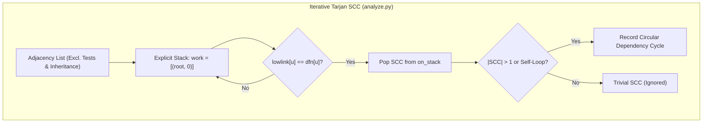

# Algorithmic Foundations of Code Archaeologist

Code Archaeologist operates as a **deterministic, Zero-RAG codebase documentation and architecture review engine**. Rather than relying on non-deterministic vector similarity searches or generative approximations, it models codebases as formal directed graphs and applies established computer science algorithms to extract, analyze, navigate, and visualize software architecture.

This document catalogs every major algorithm, mathematical formulation, and pattern-matching technique across the codebase, identifying the exact files where they are implemented.

---

## 1. Master Algorithmic Matrix

| Algorithmic Domain | Specific Algorithm / Metric | Primary File | Time Complexity | Purpose |
| :--- | :--- | :--- | :---: | :--- |
| **Graph Topology** | **Iterative Tarjan's SCC** | [`scripts/review/analyze.py`](scripts/review/analyze.py) | $\mathcal{O}(\|V\| + \|E\|)$ | Single-pass circular dependency detection without recursion limits |
| **Graph Topology** | **Martin's Instability ($I$)** | [`scripts/review/analyze.py`](scripts/review/analyze.py) | $\mathcal{O}(\|V\|)$ | Classifies coupling direction: Tangled Hubs vs Shared Helpers |
| **Graph Topology** | **Poset Tier Ordering** | [`scripts/core/taxonomy.py`](scripts/core/taxonomy.py) | $\mathcal{O}(\|E\|)$ | Architectural layer violation detection ($L(u) > L(v)$) |
| **Graph Search** | **Breadth-First Search (BFS)** | [`scripts/query/trace_path.py`](scripts/query/trace_path.py) | $\mathcal{O}(\|V\| + \|E\|)$ | Computes unweighted shortest execution path between nodes |
| **Graph Search** | **Transposed Reverse-BFS** | [`scripts/query/trace_path.py`](scripts/query/trace_path.py) | $\mathcal{O}(\|V\| + \|E\|)$ | Computes upstream blast radius and change impact sets |
| **Graph Search** | **Bounded Backtracking DFS** | [`scripts/query/trace_path.py`](scripts/query/trace_path.py) | $\mathcal{O}(b^d)$ (bounded) | Enumerates all alternative execution paths with depth limits |
| **Graph Physics** | **Barnes-Hut $N$-Body Quadtree** | [`templates/viewer.html`](templates/viewer.html) | $\mathcal{O}(N \log N)$ | Approximates pairwise repulsive forces for 2D canvas visualization |
| **Graph Physics** | **Velocity Verlet Integration** | [`templates/viewer.html`](templates/viewer.html) | $\mathcal{O}(N)$ | Kinematic numerical solver for force-directed graph stabilization |
| **Graph Layout** | **Kahn's Topological Sorting** | [`templates/viewer.html`](templates/viewer.html) | $\mathcal{O}(\|V\| + \|E\|)$ | Ranks sequential execution flow and annotates branch orders |
| **Code Clones** | **Token Shape Normalization** | [`scripts/review/duplicates.py`](scripts/review/duplicates.py) | $\mathcal{O}(N)$ | Baxter AST clone model: reduces code to keywords and `ID`/`LIT` tokens |
| **Code Clones** | **Type-2 Whole-Body Hashing** | [`scripts/review/duplicates.py`](scripts/review/duplicates.py) | $\mathcal{O}(N)$ | Identifies full-function copies under renamed variables/literals |
| **Code Clones** | **Winnowing Local Fingerprinting** | [`scripts/review/duplicates.py`](scripts/review/duplicates.py) | $\mathcal{O}(N)$ | MOSS algorithm: guarantees finding copied blocks $\ge 30$ tokens |
| **Code Clones** | **Karp-Rabin Rolling Hash** | [`scripts/review/duplicates.py`](scripts/review/duplicates.py) | $\mathcal{O}(1)$ per shift | Fast sliding polynomial hash across $K$-token windows |
| **Regex & Parsing** | **Multi-Pattern Vulnerability Sweep** | [`scripts/review/scan_security.py`](scripts/review/scan_security.py) | $\mathcal{O}(L)$ | Regex scan for hardcoded secrets, SQL injection, eval sinks |
| **Regex & Parsing** | **Credential Disambiguation** | [`scripts/review/scan_security.py`](scripts/review/scan_security.py) | $\mathcal{O}(L)$ | Lookaheads and value heuristics (`_names_not_holds`) |
| **Regex & Parsing** | **Marker Peeling & XML Cleanup** | [`scripts/core/doc_text.py`](scripts/core/doc_text.py) | $\mathcal{O}(L)$ | Normalizes comments and cleans C#/TS XML doc tags |
| **Regex & Parsing** | **Lookahead Word Boundaries** | [`scripts/core/taxonomy.py`](scripts/core/taxonomy.py) | $\mathcal{O}(1)$ | Negative lookahead `(?![a-z])` to prevent false substring layer matches |
| **Syntax Tree** | **Tree-sitter GLR & GSS** | [`scripts/core/grammars.py`](scripts/core/grammars.py) | $\mathcal{O}(N)$ | Generalized LR parsing with Graph-Structured Stack across 17 languages |
| **Syntax Tree** | **McCabe Cyclomatic Complexity** | [`scripts/review/metrics.py`](scripts/review/metrics.py) | $\mathcal{O}(\|T\|)$ | $M = \pi + 1$: counts decision predicate points from CST nodes |
| **Syntax Tree** | **CST Ancestor Walk & Semilattice** | [`scripts/core/call_ctx.py`](scripts/core/call_ctx.py) | $\mathcal{O}(D)$ | Climbs CST parent nodes to extract loop/branch call contexts |
| **Syntax Tree** | **Overload Selection Lattice** | [`scripts/extract/build_flow.py`](scripts/extract/build_flow.py) | $\mathcal{O}(\|\mathcal{O}\|)$ | Ranks candidate overloads by argument count and type match scores |
| **Interval / Spatial** | **1D Interval Enclosure (`owner_of`)** | [`scripts/review/scan_security.py`](scripts/review/scan_security.py) | $\mathcal{O}(\log N)$ | Maps line findings to smallest enclosing AST node intervals |
| **Interval / Spatial** | **Equivalence Partitioning** | [`scripts/core/ids.py`](scripts/core/ids.py) | $\mathcal{O}(N)$ | Case-insensitive identifier disambiguation (`SharedNames`) |
| **Optimization** | **Stepped Knapsack Packing** | [`scripts/query/context.py`](scripts/query/context.py) | $\mathcal{O}(K)$ | Greedy capacity vector step-down to meet strict `--max-chars` budget |
| **Behavioral Mining** | **Compound Hotspot Risk Metric** | [`scripts/review/git_insights.py`](scripts/review/git_insights.py) | $\mathcal{O}(\|V\|)$ | Intersects git commit churn with graph degree centrality |
| **Cryptography** | **Merkle State Fingerprinting** | [`scripts/core/manifest.py`](scripts/core/manifest.py) | $\mathcal{O}(N)$ | Truncated SHA-1 digest state machine for cache staleness detection |
| **Memoization** | **Content-Addressable Cache** | [`scripts/extract/apply_descriptions.py`](scripts/extract/apply_descriptions.py) | $\mathcal{O}(1)$ | Keys cached AI summaries by `(NodeID, SHA-1(code)[:12])` |

---

## 2. Graph & Network Topology Analysis

### 2.1 Iterative Tarjan's Strongly Connected Components (SCC)
- **File**: [`scripts/review/analyze.py`](scripts/review/analyze.py) (`find_cycles`)
- **Inventor**: Robert E. Tarjan (1972, *Depth-First Search and Linear Graph Algorithms*, SIAM Journal on Computing).
- **Mathematical Formulation**:
  Traverses graph $G = (V, E)$ using Depth-First Search. Each node $u$ receives a discovery index $\text{dfn}(u)$ and a low-link value $\text{lowlink}(u)$:
  $$\text{lowlink}(u) = \min \begin{cases} 
  \text{dfn}(u) \\
  \text{lowlink}(v) & \text{for each tree edge } (u, v) \\
  \text{dfn}(v) & \text{for each back edge } (u, v) \text{ where } v \in \text{stack}
  \end{cases}$$
  When $\text{lowlink}(u) = \text{dfn}(u)$, $u$ is the root of a strongly connected component.
- **Why Iterative?**
  Real-world software call graphs often contain deep linear chains or recursive paths. Implementing Tarjan's algorithm via a standard recursive DFS triggers Python's `RecursionError` (`sys.getrecursionlimit()`). `analyze.py` maintains an explicit heap-allocated call stack `work = [(root, 0)]` to traverse graphs of arbitrary depth in linear $\mathcal{O}(|V| + |E|)$ time.
- **Cycle Identification**:
  Any SCC containing $> 1$ node (or a single node with a self-loop $u \to u$) represents an architectural circular dependency. Tests and inheritance edges (`implements`, `extends`, `overrides`) are excluded from cycle deductions.

---

### 2.2 Robert C. Martin's Package Coupling & Instability Metric
- **File**: [`scripts/review/analyze.py`](scripts/review/analyze.py)
- **Inventor**: Robert C. Martin ("Uncle Bob", 1994, *OO Design Quality Metrics: An Analysis of Dependencies*).
- **Mathematical Formulation**:
  Coupling is directional. For node $u$ with afferent couplings $C_a = \text{Fan-In}(u)$ (incoming callers) and efferent couplings $C_e = \text{Fan-Out}(u)$ (outgoing callees):
  $$I(u) = \frac{C_e}{C_a + C_e} = \frac{\text{Fan-Out}}{\text{Fan-In} + \text{Fan-Out}} \in [0, 1]$$
  - $I = 0.0$: **Maximally Stable** (relied upon by many, depends on nothing).
  - $I = 1.0$: **Maximally Unstable** (depends on many, relied upon by none).
- **Topological Shape Classification**:
  Rather than penalizing raw node degree, `analyze.py` separates architectural patterns by instability:
  1. **Tangled Hub** ($\text{Fan-In} \ge 5 \land \text{Fan-Out} \ge 5$): Highly coupled in both directions; heavily penalized.
  2. **Wrong-Way Dependency** ($I_{\text{caller}} < 0.3 \land \text{Fan-In} \ge 5 \land I_{\text{callee}} > 0.7$): A core stable component depending on a volatile helper; violates Martin's *Stable Dependencies Principle (SDP)*.
  3. **Shared Helper** ($\text{Fan-In} \ge 10 \land I \le 0.1$): Benign utility node (e.g. `format_date`, `Result.success`); excluded from health penalties.
  4. **Coordinator** ($\text{Fan-Out} \ge 10 \land \text{Fan-In} \le 2$): Orchestrator method dispatching steps; excluded from health penalties.

---

### 2.3 Poset Tier Ordering & Layer Violations
- **Files**: [`scripts/core/taxonomy.py`](scripts/core/taxonomy.py), [`scripts/review/analyze.py`](scripts/review/analyze.py)
- **Mathematical Formulation**:
  Defines an architectural tier poset $(\mathcal{L}, \le)$:
  $$\mathcal{L} = \{ \text{controller} < \text{service} < \text{repository}/\text{client} < \text{model} \}$$
  Let $L(u)$ be the assigned tier rank of node $u$. A call edge $u \to v$ is an **Architectural Layer Violation** if and only if:
  $$\text{Violation}(u, v) \iff L(u) > L(v) \quad \text{where } L(u), L(v) \in \mathcal{L}$$
  *Example*: A `repository` or `service` calling back up into a `controller`.

---

### 2.4 Breadth-First Search (BFS) & Reverse Transposed Blast Radius
- **File**: [`scripts/query/trace_path.py`](scripts/query/trace_path.py) (`bfs_shortest`, `impact_of`)
- **Inventors**: Edward F. Moore (1959) and C. Y. Lee (1961).
- **Formulation**:
  - **Shortest Execution Path** (`--from A --to B`): Standard forward BFS using a FIFO queue (`collections.deque`) guarantees finding the minimum edge-count path in $\mathcal{O}(|V| + |E|)$.
  - **Upstream Blast Radius** (`--impact-of X`): Reverses the graph edges into the transposed graph $G^T = (V, E^T)$ where $(v, u) \in E^T \iff (u, v) \in E$. BFS on $G^T$ computes the complete transitive caller set:
    $$\text{BlastRadius}(X) = \{ u \in V \mid u \rightsquigarrow X \text{ in } G \}$$
  - **Git Diff Impact** (`--impact-of-diff`): Maps git diff line ranges to modified graph nodes via interval search, then returns $\bigcup_{u \in \text{Modified}} \text{BlastRadius}(u)$.

---

### 2.5 Force-Directed Physics & Barnes-Hut $N$-Body Quadtree
- **File**: [`templates/viewer.html`](templates/viewer.html)
- **Inventors**: Peter Eades (1984), Fruchterman & Reingold (1991), Josh Barnes & Piet Hut (1986).
- **Mathematical Formulation**:
  - **Particle Dynamics**: Nodes act as repulsive electrical charges under Coulomb's law; edges act as attractive mechanical springs under Hooke's law:
    $$\mathbf{F}_i = \sum_{j \ne i} \frac{k_{\text{rep}}^2}{\|\mathbf{r}_i - \mathbf{r}_j\|^2} \hat{\mathbf{r}}_{ij} + \sum_{(i, j) \in E} k_{\text{spring}} (\|\mathbf{r}_i - \mathbf{r}_j\| - L_0) \hat{\mathbf{r}}_{ji}$$
  - **Barnes-Hut Spatial Approximation**: To eliminate the $\mathcal{O}(N^2)$ all-pairs bottleneck, 2D space is recursively partitioned into a quadtree. For a cell of size $s$ and distance $d$ from particle $i$:
    $$\text{If } \frac{s}{d} < \theta \quad (\theta = 0.9), \quad \text{the entire cell is approximated as a single center of mass}$$
    Reduces layout simulation complexity to $\mathcal{O}(N \log N)$.
  - **Velocity Verlet Numerical Integration**:
    $$\mathbf{r}(t + \Delta t) = \mathbf{r}(t) + \mathbf{v}(t)\Delta t + \frac{1}{2}\mathbf{a}(t)\Delta t^2, \quad \mathbf{v}(t + \Delta t) = \mathbf{v}(t) + \frac{\mathbf{a}(t) + \mathbf{a}(t + \Delta t)}{2}\Delta t$$

---

## 3. Code Clone Detection & Sub-String Fingerprinting

### 3.1 Lexical Token Shape Normalization (Baxter Model)
- **File**: [`scripts/review/duplicates.py`](scripts/review/duplicates.py) (`normalize`, `_shape`)
- **Concept**: Ira D. Baxter et al. (1998, *Clone Detection Using Abstract Syntax Trees*, ICSM).
- **Technique**:
  Before computing hashes, comments and whitespace are discarded. Identifiers are masked to `ID`, literals (strings, numbers) are masked to `LIT`, and language keywords across 17 languages (`if`, `for`, `return`, `class`, `func`, `def`, `while`, etc.) are preserved verbatim:
  $$\text{Source Code} \xrightarrow{\text{tokenize}} \text{Tokens} \xrightarrow{\text{mask}} \mathbf{T}_{\text{normalized}}$$
  *Result*: Renaming variables or altering numeric/string constants produces an identical token shape.

---

### 3.2 Winnowing Local Document Fingerprinting (Stanford MOSS)
- **File**: [`scripts/review/duplicates.py`](scripts/review/duplicates.py) (`find_blocks`)
- **Inventors**: Saul Schleimer, Daniel S. Wilkerson, and Alex Aiken (2003, *Winnowing: Local Algorithms for Document Fingerprinting*, ACM SIGMOD).
- **Mathematical Guarantees**:
  Standard whole-body hashing fails when a 10-line block is copy-pasted into two otherwise different functions. Winnowing solves this by selecting minimum hash values from sliding windows:
  1. Generate rolling $K$-grams of tokens ($K = 10$).
  2. Compute hash $h_i$ for each $K$-gram using Karp-Rabin polynomial hashing:
     $$h_i = \left( \sum_{j=0}^{K-1} t_{i+j} \cdot b^{K-1-j} \right) \bmod M \quad \text{where } b=31, M=2^{61}-1$$
  3. In each sliding window of size $W = 21$ consecutive hashes:
     $$w_i = (h_i, h_{i+1}, \dots, h_{i+W-1})$$
     Select the rightmost minimum hash $\min(w_i)$ as the retained fingerprint.
- **Guaranteed Detection Bound**:
  Any duplicate token sequence of length $L \ge (W + K - 1) = 21 + 10 - 1 = 30$ tokens ($\text{MIN\_TOKENS}$) is **mathematically guaranteed** to share at least one selected fingerprint hash.
- **Bounded Density**:
  The expected number of fingerprints stored is bounded by $\le \frac{2}{W + 1} = \frac{2}{22} \approx 9\%$ of the token count, reducing memory consumption by over $10\times$ compared to storing all $K$-grams.

---

## 4. Regular Expressions & String Rewriting

### 4.1 Multi-Pattern Security Sweeps & Semantic Disambiguation
- **File**: [`scripts/review/scan_security.py`](scripts/review/scan_security.py)
- **Implementation**:
  Uses compiled regular expressions with named capture groups and multi-pattern conjunctions:
  - **AWS Access Keys**: `\bAKIA[0-9A-Z]{16}\b`
  - **Private Keys**: `-----BEGIN [A-Z ]*PRIVATE KEY-----`
  - **SQL Injection Sinks**: Conjunction of query methods (`execute`, `raw_query`), SQL keywords (`select`, `insert`, `update`), and string interpolation (`f"..."`, `${}`, `.format(`, `+`).
  - **Dynamic Code Execution**: `(?<![\w.])(eval|exec)\s*\(|new\s+Function\s*\(`
- **Credential Disambiguation (`_names_not_holds`)**:
  Matches from `CREDENTIAL_RE` (`api_key`, `token`, `secret`, `password`) are filtered to eliminate false positives:
  $$\text{is\_false\_positive} \iff \text{val} = \text{key} \lor \text{val}.\text{startswith}(\texttt{"/"}) \lor \text{has\_whitespace}(\text{val})$$
  This distinguishes assignment of route constants (`RESET_PASSWORD = "/reset-password"`) or header keys (`AUTH_HEADER = "Authorization"`) from actual hardcoded secret values.

---

### 4.2 Doc-Comment Peeling & Syntax-Preserving XML Filtering
- **File**: [`scripts/core/doc_text.py`](scripts/core/doc_text.py) (`clean`, `join`)
- **Technique**:
  Collects contiguous comment lines directly preceding a declaration AST node. Strips comment markers (`/**`, `*/`, `///`, `//`, `#`, `*`) and collapses whitespace runs.
- **Generic Preservation**:
  XML documentation tags (`
`, `<param>`) are stripped **only** for C# and TypeScript where XML documentation is standard. For C++, Rust, and Java, angle brackets are preserved to avoid stripping generic type parameters such as `List<String>` or `Option<T>`.

---

### 4.3 Negative Lookahead Word Boundary Enforcement
- **File**: [`scripts/core/taxonomy.py`](scripts/core/taxonomy.py)
- **Technique**:
  Layer classification regexes enforce negative lookaheads: `(?![a-z])`.
  *Problem Solved*: Short root words like `repo` and `store` previously triggered false positive layer classifications on classes like `PnoDataReportMail` (`repo` $\subset$ `report`) and `StoredFileDto` (`store` $\subset$ `stored`), corrupting repository layer assignments. The negative lookahead requires exact boundary termination.

---

## 5. Syntax Tree (CST/AST) & Complexity Algorithms

### 5.1 Tree-sitter Generalized LR (GLR) & Graph-Structured Stack (GSS)
- **File**: [`scripts/core/grammars.py`](scripts/core/grammars.py)
- **Inventors**: Bernard Lang (1974), Masaru Tomita (1984), Max Brunsfeld (Tree-sitter, 2017).
- **Mechanism**:
  Tree-sitter parses all 17 supported languages into Concrete Syntax Trees (CST). When shift-reduce or reduce-reduce grammar conflicts arise (such as C++ `<` bracket disambiguation between templates and comparisons), the GLR engine forks the parse stack into a Graph-Structured Stack (GSS):
  $$\text{Stack Fork}: S \to \{ S_1, S_2, \dots, S_k \}$$
  Paths that violate subsequent grammar tokens are pruned, and surviving paths merge. Syntactic syntax errors are wrapped into localized `ERROR` CST nodes, allowing extraction to proceed without aborting.

---

### 5.2 Thomas J. McCabe's Cyclomatic Complexity ($M = \pi + 1$)
- **File**: [`scripts/review/metrics.py`](scripts/review/metrics.py)
- **Inventor**: Thomas J. McCabe (1976, *A Complexity Measure*, IEEE Transactions on Software Engineering).
- **Formulation**:
  For control flow graph $G = (V, E)$ with $P = 1$ connected component:
  $$M = E - V + 2P \equiv \pi + 1$$
  Where $\pi$ is the number of branch predicate decision points. `metrics.py` evaluates $\pi$ directly over the Tree-sitter CST nodes for each method:
  $$\pi = \sum \mathbf{1}_{[\text{node\_type} \in \text{DECISION\_NODES}]}$$
  Includes: `if_statement`, `for_statement`, `while_statement`, `catch_clause`, `switch_case`, `ternary_expression`, and boolean short-circuits (`&&`, `||`, `and`, `or`).

---

### 5.3 Upward CST Ancestor Walk & Semilattice Meet Operator
- **File**: [`scripts/core/call_ctx.py`](scripts/core/call_ctx.py)
- **Technique**:
  For each call site $C$ in function $F$, walks parent pointers $(P_0 = C, P_1 = \text{parent}(C), \dots, P_k = F)$:
  - $\text{is\_loop}(C) \iff \exists i \mid \text{type}(P_i) \in \text{LOOP\_NODES} \land \text{field}(P_{i-1}) \in \{\texttt{"body"}, \texttt{"condition"}\}$
  - $\text{is\_cond}(C) \iff \exists i \mid \text{type}(P_i) \in \text{BRANCH\_NODES} \land \text{field}(P_{i-1}) \in \{\texttt{"consequence"}, \texttt{"alternative"}\}$
- **Multi-Site Semilattice Merge**:
  When a method calls the same target multiple times, sites $\{s_1, \dots, s_m\}$ are folded:
  $$\text{line} = \min_{j} \text{line}(s_j), \quad \text{loop} = \bigvee_{j=1}^m \text{loop}(s_j), \quad \text{cond} = \bigwedge_{j=1}^m \text{cond}(s_j), \quad \text{arms} = \bigcap_{j=1}^m \text{arms}(s_j)$$
  Disjoint arm tags (`line:col/arm_index`) identify mutually exclusive branches, allowing the explorer to render alternative branch badges ($3a$ vs $3b$).

---

## 6. Interval, Spatial & Optimization Algorithms

### 6.1 1D Interval Range Point Enclosure (`owner_of`)
- **Files**: [`scripts/review/scan_security.py`](scripts/review/scan_security.py), [`scripts/review/debt.py`](scripts/review/debt.py), [`scripts/query/trace_path.py`](scripts/query/trace_path.py)
- **Concept**: Interval range containment (Herbert Edelsbrunner, 1980).
- **Formulation**:
  Given a finding line $L$ and node intervals $[s_u, e_u]$ in file $F$:
  $$\text{Candidates}(L) = \{ u \in V_F \mid s_u \le L \le e_u \}$$
  $$\text{owner}(L) = \arg\min_{u \in \text{Candidates}(L)} (e_u - s_u)$$
  Selects the narrowest enclosing syntax node interval, binding findings directly to specific methods rather than leaving them at the file level.

---

### 6.2 Equivalence Class Partitioning (`SharedNames`)
- **File**: [`scripts/core/ids.py`](scripts/core/ids.py)
- **Formulation**:
  Definitions $\mathcal{D} = \{ (n_i, f_i) \}$ are partitioned into equivalence classes under case-insensitive name equality:
  $$[(n, f)]_{\sim} = \{ (n', f') \in \mathcal{D} \mid \text{lower}(n') = \text{lower}(n) \}$$
  - If $|[(n, f)]_{\sim}| = 1$: Bare identifier $n$ is preserved.
  - If collision occurs: Qualified as $\text{stem}(f) + \texttt{"."} + n$.
  - If stems also collide: Qualified as $\text{norm\_path}(f) + \texttt{"."} + n$.
  Protects against case-folding collisions on Windows (NTFS) and macOS (APFS) filesystems while keeping identifiers concise.

---

### 6.3 Stepped Bounded Knapsack Packing
- **File**: [`scripts/query/context.py`](scripts/query/context.py)
- **Concept**: George Dantzig (1957, *Discrete-Variable Extremum Problems*).
- **Algorithm**:
  Assembles node context (docstring, callers, callees, complexity, git churn, risks) under a hard `--max-chars` budget. If the payload exceeds the limit, it steps down neighbor capacity vectors $\text{CAPS} = (12, 6, 3, 1)$ and truncates docstrings until the block fits within budget.

---

## 7. Behavioral Mining, Cryptography & State Algorithms

### 7.1 Compound Hotspot Risk Metric
- **File**: [`scripts/review/git_insights.py`](scripts/review/git_insights.py)
- **Concept**: Behavioral code analysis (Adam Tornhill, 2015; Nagappan & Ball, 2005).
- **Formulation**:
  Combines historical git commit churn with graph topological centrality:
  $$\text{Risk}(u) = \text{Commits}(u) \times (1 + \text{Fan-In}(u) + \text{Fan-Out}(u))$$
  Surfaces files and nodes that are both frequently modified and topologically critical.

---

### 7.2 Merkle-Tree State Digests & Staleness Detection
- **File**: [`scripts/core/manifest.py`](scripts/core/manifest.py)
- **Concept**: Ralph Merkle (1979, Content-Addressable Digests).
- **Formulation**:
  Each source file is hashed with truncated SHA-1: $H(f) = \text{SHA-1}(B)[:12]$.
  Staleness against cached manifest $\mathcal{M}$ is computed via set differences:
  $$\text{Stale} \iff (\mathcal{M}_{\text{current}} \setminus \mathcal{M}_{\text{cached}} \ne \emptyset) \lor (\mathcal{M}_{\text{cached}} \setminus \mathcal{M}_{\text{current}} \ne \emptyset) \lor (\exists f, H_{\text{current}}(f) \ne H_{\text{cached}}(f))$$

---

### 7.3 Content-Addressable Memoization
- **File**: [`scripts/extract/apply_descriptions.py`](scripts/extract/apply_descriptions.py)
- **Formulation**:
  AI-generated node summaries are indexed by a compound key:
  $$\text{Key}(u) = (\text{NodeID}(u), \, \text{SHA-1}(\text{source\_code}(u))[:12])$$
  Guarantees that unchanged methods never trigger redundant LLM summary generation.
