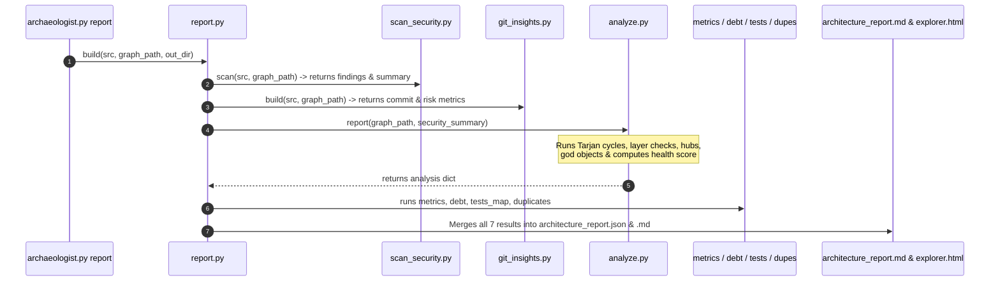

# Architectural Smells, Health Grading & Analysis Guide (`analyze.py`)

This document provides a comprehensive technical guide to `analyze.py`, the core deterministic smell detection and health grading engine of **Code Archaeologist**.

---

## Table of Contents
1. [Overview & Architectural Role](#1-overview--architectural-role)
2. [What `analyze.py` Checks (Smell Inventory)](#2-what-analyzepy-checks-smell-inventory)
3. [How Each Smell is Detected (Algorithms & Mechanics)](#3-how-each-smell-is-detected-algorithms--mechanics)
   - [3.1 Circular Dependencies (Tarjan's SCC)](#31-circular-dependencies-find_cycles)
   - [3.2 Backwards Layer Dependencies](#32-backwards-layer-dependencies-find_layer_violations)
   - [3.3 Coupling Direction: Hubs, Helpers, Coordinators & Wrong-Way](#33-coupling-direction-find_hubs-find_shared_helpers-find_coordinators-find_wrong_way_deps)
   - [3.4 God Objects & Cognitive Complexity (Why 12 and 8?)](#34-god-objects-find_god_objects)
   - [3.5 Dead Code / Orphans & Framework Entry Sparing](#35-dead-code--orphans-find_orphans)
   - [3.6 Overridden Everywhere](#36-overridden-everywhere-find_overridden)
   - [3.7 Detected Idioms (Design Patterns)](#37-detected-idioms-detect_patterns)
4. [How Health Score is Calculated (Formulas & Caps)](#4-how-health-score-is-calculated-formulas--caps)
5. [Review Pipeline & Execution Dependencies](#5-review-pipeline--execution-dependencies)
6. [Academic & Industry References](#6-academic--industry-references)

---

## 1. Overview & Architectural Role

`analyze.py` operates directly on the explicit graph representations produced by the extraction phase:
* **Structure Graph**: `data/structure/graph.json` (class/module level)
* **Flow Graph**: `data/flow/flow_graph.json` (method/function call level)

Because the graph topology is already fully extracted, **`analyze.py` does not parse raw source files or tokens**. It evaluates graph properties (connectivity, paths, strongly connected components, degrees, and node layers) using standard library data structures.

---

## 2. What `analyze.py` Checks (Smell Inventory)

`analyze.py` detects 10 graph-based architectural smells and patterns, and optionally integrates 1 external security audit input:

| Smell / Metric | Graph Target | Category | Health Deduction? | Description |
| :--- | :---: | :---: | :---: | :--- |
| **Circular Dependencies** (`cycles`) | Flow & Structure | Anti-pattern | **YES** | Mutually recursive cycles ($A \rightarrow B \rightarrow A$ or self-loops). |
| **Backwards Layer Violations** (`layer_violations`) | Flow & Structure | Anti-pattern | **YES** | Deep architecture layers calling shallower layers (e.g., Model $\rightarrow$ Service). |
| **High-Coupling Hubs** (`hubs`) | Flow & Structure | Anti-pattern | **YES** | Tangles with high incoming **AND** high outgoing dependencies ($\ge 5$ each). |
| **Wrong-Direction Dependencies** (`wrong_way_deps`) | Flow & Structure | Anti-pattern | **YES** | Stable core components calling volatile, unstable components. |
| **God Objects** (`god_objects`) | Flow & Structure | Anti-pattern | **YES** | Classes with excessive methods ($\ge 12$) or excessive outgoing references ($\ge 8$). |
| **Dead / Orphan Code** (`orphans`) | Flow & Structure | Smell | **YES** | Nodes with 0 callers that are not legitimate framework entry points. |
| **Security Vulnerabilities** (`security`) | Codebase | Risk | **YES** | Injected from `scan_security.py` (SQLi, secrets, eval, debug prints). |
| **Shared Helpers** (`shared_helpers`) | Flow & Structure | Pattern | *No (0 pts)* | High fan-in ($\ge 10$), low instability ($I \le 0.1$) self-contained utilities. |
| **Coordinators** (`coordinators`) | Flow & Structure | Pattern | *No (0 pts)* | High fan-out ($\ge 10$), low fan-in ($\le 2$) dispatchers/startup methods. |
| **Overridden Everywhere** (`overridden`) | Flow | Object Model | *No (0 pts)* | Base methods replaced by all subclasses whose default body never executes. |
| **Detected Idioms** (`patterns`) | Flow & Structure | Pattern | *No (0 pts)* | Singletons, factories, observers, and React hooks recognized by naming. |

---

## 3. How Each Smell is Detected (Algorithms & Mechanics)

### 3.1 Circular Dependencies (`find_cycles`)
* **Algorithm**: **Iterative Tarjan's Strongly Connected Components (SCC)** algorithm, plus explicit self-loop collection ($s == t$).
* **Complexity**: $\mathcal{O}(|V| + |E|)$ time and space.
* **Mechanism**:
  * Standard recursion is avoided by maintaining an explicit loop stack `[(node, child_index)]`, ensuring stability against deep call graphs without exceeding Python's `sys.getrecursionlimit()`.
  * Filters out `INHERITANCE_LINKS` (`implements`, `extends`, `overrides`). A decorator delegating to its interface or a subclass overriding its base is valid OOP, not a circular dependency.
  * Only SCC components with $|V| > 1$ (plus direct self-loops) are reported.

### 3.2 Backwards Layer Dependencies (`find_layer_violations`)
* **Algorithm**: **Strict Layer Rank Comparison** ($\mathcal{O}(|E|)$).
* **Mechanism**:
  * Layers are mapped to integer depths:
    ```python
    LAYER_RANK = {
        "controller": 0,   # Shallowest (Inbound web/API)
        "service": 1,      # Domain / Business logic
        "repository": 2,   # Persistence / Data access
        "client": 2,       # Outbound external API
        "model": 3         # Deepest (Entities, DTOs, domain models)
    }
    ```
  * For every edge $s \rightarrow t$: if both layers are ranked and $\text{LAYER\_RANK}[t] < \text{LAYER\_RANK}[s]$, it is flagged as a backwards layer dependency.
  * **Exemptions**:
    * Cross-stack `http` edges (frontend client $\rightarrow$ backend controller) represent intended client-server communication.
    * Inheritance edges (`implements`, `extends`).
    * Unranked layers (`ui`, `function`, `module`, `config`) produce zero noise.

---

### 3.3 Coupling Direction (`find_hubs`, `find_shared_helpers`, `find_coordinators`, `find_wrong_way_deps`)

Coupling is treated as a **directed vector**, not an undirected degree count.

#### The Metric: Robert C. Martin's Package Instability ($I$)
$$\text{Fan-in } (C_a) = \text{Incoming edges ("Others use me")}$$
$$\text{Fan-out } (C_e) = \text{Outgoing edges ("I use others")}$$
$$I = \frac{C_e}{C_a + C_e} = \frac{\text{fan-out}}{\text{fan-in} + \text{fan-out}} \quad (0.0 = \text{Max Stable}, \; 1.0 = \text{Max Unstable})$$

All coupling metrics run strictly on **`app_edges()`**:
* Excludes test files (`layer: test`) — test calls into production code are test coverage, not architectural coupling.
* Excludes `renders` and `passes` edges in UI component trees.
* Excludes `implements` / `extends` inheritance edges.

```
       High Fan-out (Ce)
             ▲
             │  [COORDINATORS]            [HUBS / TANGLES]
             │  (fan_out >= 10,           (fan_in >= 5, fan_out >= 5)
             │   fan_in <= 2)             *Harmful: Penalized*
             │  *Normal: 0 pts*
             │
             │                            [SHARED HELPERS]
             │                            (fan_in >= 10, I <= 0.1)
             │                            *Clean: 0 pts*
             └────────────────────────────────────────────────► High Fan-in (Ca)
```

#### Classification Rules:
1. **High-Coupling Hubs (`find_hubs`)**:
   * Condition: $\text{fan-in} \ge 5$ **AND** $\text{fan-out} \ge 5$.
   * **Why it hurts**: Acts as a fragile intersection. Changes propagate into it from 5+ callers and ripple out to 5+ dependencies.
2. **Shared Helpers (`find_shared_helpers`)**:
   * Condition: $\text{fan-in} \ge 10$ **AND** $I \le 0.1$.
   * **Why $I \le 0.1$?**: Guarantees that at least $90\%$ of total interactions are incoming. The helper does not reach into databases or services. It is safe, reusable code and is **never penalized**.
3. **Coordinators (`find_coordinators`)**:
   * Condition: $\text{fan-out} \ge 10$ **AND** $\text{fan-in} \le 2$.
   * **Why it is safe**: Startup routines or orchestrators that call many components without creating incoming ripple risk.
4. **Wrong-Direction Dependencies (`find_wrong_way_deps`)**:
   * Condition: Caller is stable ($\text{fan-in} \ge 5$ and $I < 0.3$), Callee is unstable ($I > 0.7$).
   * **The Stable Dependencies Principle**: A stable component that many callers rely upon should never depend on a volatile component that frequently changes.

---

### 3.4 God Objects (`find_god_objects`)

Flags entities that violate the Single Responsibility Principle:
* **Flow Graph (Method count)**: Any class defining $\ge 12$ methods (`GOD_METHODS = 12`).
* **Structure Graph (Reference count)**: Any class referencing $\ge 8$ other classes (`GOD_FANOUT = 8`).

#### Why 12 methods and 8 references?
* **Miller's Law ($7 \pm 2$) & Cognitive Load**: In cognitive psychology, human working memory can hold approximately $7 \pm 2$ distinct items simultaneously. When a class contains more than 7–9 responsibilities, developers cannot maintain its state model in memory.
* **Conservative Threshold (Zero False-Alarm)**: Normal CRUD services frequently require 5–8 methods (`findById`, `findAll`, `create`, `update`, `delete`, `search`). Setting the threshold at **12** guarantees that ordinary business services pass cleanly, while true "Brain Classes" handling multiple unrelated domains get caught.
* **Constructor Over-Injection ($\ge 8$)**: A class that imports/injects 8 or more external dependencies is acting as a centralized god object. In modern dependency injection patterns (Spring, NestJS, .NET), unit testing a class with 8 dependencies requires setting up 8 separate test mocks, indicating severe architectural entanglement.

---

### 3.5 Dead Code / Orphans (`find_orphans`)
* **Algorithm**: **In-Degree Zero with Whitelist Exemptions**.
* **Mechanism**:
  Nodes with $\text{fan-in} = 0$ are flagged as dead code **unless** they match an entry-point exemption:
  1. **Framework Entry Annotations**: Nodes tagged with `entry: true` (`@Scheduled`, `@Bean`, `@Override`, Spring filter, Next.js `next:page` / `next:route`).
  2. **Implicit & Runtime Entry**: Dunder methods (`__init__`), HTTP route handlers (`kind: endpoint`), UI components (`kind: component`).
  3. **Module Load Calls**: Code executed at file import time (`entry: module`).
  4. **Contract Declarations**: Interface/abstract methods without bodies (`declaration: true`).
  5. **Ambiguous Overloads**: Overloads referenced by an ambiguous call site (`ambiguous`).

---

### 3.6 Overridden Everywhere (`find_overridden`)
* Identifies methods that have an implementation body, but **every single subclass in the graph overrides and replaces that body**.
* **Not dead code**: The body does not execute today, but deleting it alters what any newly created subclass would inherit. Thus, it is reported in its own category and **deducts 0 points**.

---

### 3.7 Detected Idioms (`detect_patterns`)
Uses regular expressions on identifiers to catalog recognized architectural idioms:
* **Singleton**: `r"(get_?instance|shared_?instance|_instance$|singleton)"`
* **Factory**: `r"(factory|^make_|^build_|\.make_|\.build_)"`
* **Observer**: `r"(subscribe|unsubscribe|notify|emit|dispatch|add_?listener|publish)"`
* **React Hook**: `r"(^|\.)use[A-Z]"` (JS/TS files only)

---

## 4. How Health Score is Calculated (Formulas & Caps)

The health score starts at a perfect **100 points**. 

To prevent a single catastrophic anti-pattern (such as 20 cycles in a legacy module) from driving the score to negative infinity, **every deduction category has a strict ceiling cap**:

$$\text{Final Score} = \max\left(0, 100 - \sum \text{Deductions}\right)$$

### Deduction Matrix

```python
deductions = {
    # 1. Circular Dependencies: -8 pts per cycle (Capped at -24)
    "cycles": min(24, 8 * len(cycles)),

    # 2. Backwards Layer Violations: -4 pts per violation (Capped at -16)
    "layer_violations": min(16, 4 * len(violations)),

    # 3. High Coupling Hubs: -3 pts per hub (Capped at -12)
    "high_coupling": min(12, 3 * len(hubs)),

    # 4. Wrong-Way Dependencies: -2 pts per wrong-way dep (Capped at -8)
    "wrong_way_deps": min(8, 2 * len(wrong_way or [])),

    # 5. God Objects: -3 pts per god object (Capped at -12)
    "god_objects": min(12, 3 * len(god_objects)),

    # 6. Dead Code: 0.5% per 1% dead code (Capped at -20)
    "dead_code": min(20, round(dead_pct * 0.5)),

    # 7. Security Risks: High -10, Medium -4, Low -1 (Capped at -30)
    "security": min(30, 10 * sec.get("high", 0) + 4 * sec.get("medium", 0) + 1 * sec.get("low", 0)),
}
```

### Grade Bands

| Grade | Score Range | Meaning |
| :---: | :---: | :--- |
| **A** | $90 \le \text{Score} \le 100$ | **Clean & Modular**: Negligible smells, high architectural compliance. |
| **B** | $80 \le \text{Score} < 90$ | **Good Architecture**: Minor isolated smells; easily refactored. |
| **C** | $70 \le \text{Score} < 80$ | **Moderate Technical Debt**: Clear smells (e.g. 1–2 cycles, bloated services). |
| **D** | $60 \le \text{Score} < 70$ | **High Risk**: Degrading structural boundaries; feature velocity affected. |
| **F** | $\text{Score} < 60$ | **Architectural Breakdown**: Pervasive circular coupling, untestable hubs. |

---

## 5. Review Pipeline & Execution Dependencies

### Is `analyze.py` self-contained?
**YES.** `analyze.py` imports no other review scripts (`scan_security`, `git_insights`, `metrics`, `debt`, `tests_map`, or `duplicates`).

### Who accumulates the data?
**`report.py` is the master accumulator, NOT `analyze.py`.**

When `archaeologist.py report` is executed, `report.py` runs the review passes in this exact sequence:



1. **`scan_security.py` runs first** to produce the risk severity counts (`high`, `medium`, `low`).
2. **`analyze.py` runs in step 3**, taking `graph.json` and the security severity dictionary to calculate graph smells and the health grade.
3. **`metrics.py`, `debt.py`, `tests_map.py`, and `duplicates.py` run subsequently**.
4. **`report.py` aggregates all outputs** into `architecture_report.json` and `data/explorer.html`.

---

## 6. Academic & Industry References

1. **Miller's Law ($7 \pm 2$)**:
   * *Miller, George A. (1956)*. "The Magical Number Seven, Plus or Minus Two: Some Limits on Our Capacity for Processing Information". *Psychological Review*, 63 (2): 81–97.
   * *Application*: Justifies the upper threshold for God Objects (`GOD_METHODS = 12`), ensuring classes exceeding human working memory limits are flagged.
2. **Package Instability Metric ($I$) & The Stable Dependencies Principle (SDP)**:
   * *Martin, Robert C. (2002)*. *Agile Software Development, Principles, Patterns, and Practices*. Prentice Hall.
   * *Martin, Robert C. (2017)*. *Clean Architecture: A Craftsman's Guide to Software Structure and Design*. Prentice Hall.
   * *Application*: Used in `find_hubs`, `find_shared_helpers`, and `find_wrong_way_deps` to evaluate coupling by direction ($I = \frac{C_e}{C_a + C_e}$).
3. **Tarjan's Strongly Connected Components Algorithm**:
   * *Tarjan, Robert E. (1972)*. "Depth-First Search and Linear Graph Algorithms". *SIAM Journal on Computing*, 1 (2): 146–160.
   * *Application*: Used in `find_cycles` for deterministic $\mathcal{O}(|V| + |E|)$ circular dependency resolution.
4. **Single Responsibility Principle (SRP) & Large Class Smell**:
   * *Fowler, Martin; Beck, Kent (1999)*. *Refactoring: Improving the Design of Existing Code*. Addison-Wesley.
   * *Application*: Defines the God Object anti-pattern and excessive fan-out coupling.
5. **Constructor Over-Injection & Class Cohesion**:
   * *McConnell, Steve (2004)*. *Code Complete: A Practical Handbook of Software Construction (2nd ed.)*. Microsoft Press.
   * *Application*: Establishes healthy limits for class fan-out and dependency injection thresholds.
