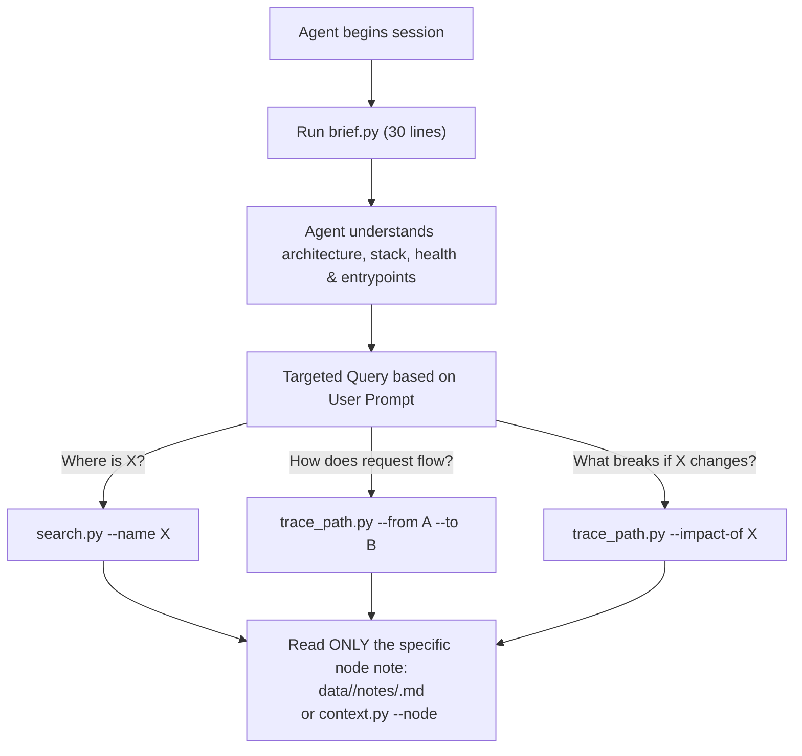

# brief.py — Executive Digest & Session Orientation

`scripts/review/brief.py` gives developers and AI agents a complete, high-level understanding of an entire codebase in **about thirty lines of text**.

---

## 1. Core Philosophy: Zero Computation, Fixed Token Cost

On medium to large codebases:
- Reading `architecture_report.json` costs tens of thousands of tokens.
- Re-running AST parsing or graph algorithms takes seconds or minutes.

**`brief.py` computes absolutely nothing.** It reads the JSON artifacts that the other passes (`build_wiki`, `build_flow`, and `report.py`) already generated. Because it only aggregates pre-calculated summaries:
- **Runtime:** Under 10 milliseconds.
- **Token Cost:** Only a few hundred tokens, regardless of whether the codebase has 500 lines or 1,000,000 lines.

---

## 2. What `brief.py` Displays

A typical output provides immediate answers to: *"Where am I, what is this codebase, how healthy is it, and where are the critical points?"*

```text
Code Archaeologist brief

MAPS
  structure    25 node(s)   23 edge(s)  grade A (94/100)
  flow         53 node(s)   36 edge(s)  grade C (70/100)
  freshness  up to date
  edges      a LOWER BOUND in every language. A call is drawn only when the
             receiver's type can be read from the source...

SIZE
  22 file(s), 529 lines (398 code, 45 comment, 86 blank) - py 529

FLOW MAP
  smells     cycles 0, orphans 5, layer violations 0, hubs 0, wrong-way 0, god objects 0
  entries    POST /api/v1/orders -> OrderController.create
             GET  /api/v1/orders/{id} -> OrderController.get
  longest    OrderCard 85 line(s), cx 8
             CheckoutService.process 64 line(s), cx 14
  complex    OrderValidator.validate cx 16 (src/validator.py:12)
  hotspots   OrderService.checkout risk 48 (12 commit(s), Alice)
  risks      high   hardcoded_secret src/config.py:15
  orphans    LegacyHelper.format
  debt       3 marker(s) (TODO 2, FIXME 1), 5 dead node(s), 1 dead file(s)
  tests      4/49 node(s) named by a test (8.2%), 2 test file(s)

NEXT
  trace_path.py --graph <graph.json> --from <A> --to <B>     how does it get there
  trace_path.py --graph <graph.json> --impact-of <node>      what breaks if it changes
  read data/<map>/notes/<node>.md                            what one node does
```

---

## 3. Section Breakdown

### 1. MAPS (Inventory & Health)
- **Node & Edge counts**: Summarizes both Structure (classes/modules) and Flow (methods/calls).
- **Architecture Health Score**: The 100-point grade calculated by `analyze.py` (`grade C (70/100)`).
- **Precision Caveat**: Highlights nodes carrying named precision loss (`interface-dispatch`, `overloads`, `name-matched`).

### 2. Freshness & Integrity
- **`manifest.compare()`**: Verifies whether the graph is up-to-date or **STALE** due to files being modified, added, or deleted since the last build.
- **Missing Grammar Alerts (`skipped_langs`)**: Warns if source files exist in a language with no tree-sitter parser installed on the machine, and outputs the exact `pip install` command to fix it.
- **Pin Drift (`pin_drift`)**: Warns if installed tree-sitter grammar wheels drift from tested pins.

### 3. SIZE & Languages
- Summarizes physical volume: file count, total lines, executable code, comments, blanks, and language mix (from `metrics.py`).

### 4. Graded Smells Summary
- Displays counts only for categories that deduct points from the health score:
  `cycles`, `orphans`, `layer_violations`, `hubs`, `wrong_way_deps`, `god_objects`.
  *(Shared helpers and coordinators are excluded here because they cost 0 points).*

### 5. Top-5 Spotlights (Zero-RAG Quick Context)
- **`entries`**: Public HTTP routes and endpoints.
- **`longest`**: Functions with the highest LOC (`metrics.py`).
- **`complex`**: Functions with the highest McCabe cyclomatic complexity (`metrics.py`).
- **`hotspots`**: Top risk nodes combining Git churn with incoming calls (`git_insights.py`).
- **`risks`**: Security vulnerabilities by severity (`scan_security.py`).
- **`debt` & `tests`**: Summary of comment markers (TODO/FIXME), dead files, and test reference coverage.

---

## 4. The Zero-RAG Agent Workflow

`brief.py` is the starting gate for an autonomous coding agent. It does **not** tell the agent to read the whole codebase or scan massive source directories.



### Why this workflow works
1. **Low Context Consumption**: The agent starts with a 30-line brief.
2. **Deterministic Navigation**: The agent finds path nodes using graph tools (`trace_path.py`, `search.py`).
3. **Targeted Reading**: The agent only reads the markdown notes (`data/<map>/notes/<Node>.md`) for nodes on the discovered execution path, completely avoiding whole-codebase token exhaustion.
