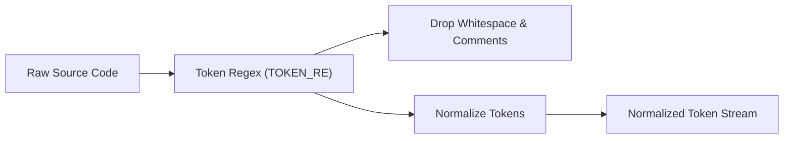

# duplicates.py — Code Clone & Copied Block Detection

`scripts/review/duplicates.py` detects copy-pasted functions and code blocks across the codebase, even when variable names, literal values, and comments have been altered. It operates with zero external dependencies using two complementary passes:

1. **Whole-Body Cloning**: Full-function token shape hashing.
2. **Sub-Function Block Duplication**: The **Winnowing Algorithm** (Schleimer, Wilkerson & Aiken 2003, as used in Stanford's MOSS) using a rolling polynomial hash and sliding windows.

---

## 1. Token Shape Normalization

Before any hashing occurs, both passes reduce the raw source code of graph nodes into an abstract **token shape**:



### Transformation Rules (`_shape`)
- **Identifiers & Names**: Replaced with `ID` (e.g. `items`, `total`, `user_id` $\rightarrow$ `ID`).
- **Literals**: Replaced with `LIT` (e.g. `"hello"`, `42`, `3.14`, `'''docstring'''` $\rightarrow$ `LIT`).
- **Reserved Keywords**: Kept verbatim across 17 languages (`if`, `for`, `return`, `class`, `function`, `const`, `def`, etc.) via `KEYWORDS`.
- **Operators & Syntax**: Kept verbatim (`+=`, `.`, `()`, `{}`, `[]`, `->`).
- **Whitespace & Comments**: Stripped entirely.

### Example
```python
# Function A                     # Function B (renamed variables & values)
def total(items):                def sum_all(rows):
    n = 0                            total = 0
    for i in items:                  for r in rows:
        n += i.price                     total += r.cost
    return n                         return total
```
Both reduce to the identical token sequence:
```text
def ID ( ID ) : ID = LIT for ID in ID : ID += ID . ID return ID
```
A rename, formatting change, or value change cannot hide the duplicate.

---

## 2. Whole-Body Clone Detection (`find_clusters`)

For whole functions or methods that share the exact same structural logic:
1. Normalizes the entire node body into a token stream.
2. If the token count $\ge \text{MIN\_TOKENS}$ (30 tokens), hashes the stream using SHA-1 (`hashlib.sha1`).
3. Groups nodes sharing the same 12-character SHA-1 digest.
4. Any group with $\ge 2$ nodes forms a **Whole-Body Cluster**.

Clusters are sorted largest first by token count, highlighting the biggest opportunities for refactoring and code extraction.

---

## 3. Sub-Function Block Duplication via Winnowing (`find_blocks`)

Whole-body hashing cannot detect when a 10-line block is copy-pasted into two otherwise completely different functions. `duplicates.py` solves this using the **Winnowing algorithm**:

### Mathematical Constants
- **$K = 10$**: Size of the token $k$-gram.
- **$\text{MIN\_TOKENS} = 30$**: Minimum token threshold for a reportable block.
- **$W = \text{MIN\_TOKENS} - K + 1 = 21$**: Sliding window width.
- **$\text{\_MOD} = 2^{61} - 1$**: Prime modulus for a collision-resistant, 64-bit rolling hash.
- **$\text{\_BASE} = 1,000,003$**: Hash multiplier.

### The Winnowing Steps
1. **Rolling Polynomial Hash:**
   Computes a rolling hash over every $K=10$ consecutive token window:
   $$h_i = (h_{i-1} \times \text{\_BASE} + \text{token}_i - \text{token}_{i-K} \times \text{\_BASE}^{K-1}) \pmod{\text{\_MOD}}$$
2. **Sliding Window Minimum Selection:**
   Slides a window of $W=21$ consecutive hashes. In each window, selects the rightmost minimum hash as the kept **fingerprint**.
   > **Mathematical Guarantee:** Any shared sequence of $\ge W + K - 1 = 30$ tokens is **guaranteed** to share at least one fingerprint, while keeping only $\approx \frac{2}{W+1} \approx 9\%$ of the hash stream.
3. **Region Growing (Bidirectional Expansion):**
   When two functions share a fingerprint, the algorithm confirms the 10-token seed match, then expands both leftwards and rightwards token-by-token to capture the complete boundaries of the duplicated block.
4. **Snapping to Whole Lines (`_line_start`, `_line_end`):**
   Trims matched regions inward to complete line boundaries. A duplicate that begins or ends mid-expression is cut back to complete statements so humans and agents see meaningful lines of code.

---

## 4. Noise Suppression & Precision Guards

To ensure only high-value, actionable duplicates are reported:
- **`MIN_TOKENS = 30`**: Trivial one-line getters, setters, delegates, and empty methods are ignored.
- **`MAX_OCCURRENCES = 50`**: Fingerprints appearing in $> 50$ locations are discarded as framework boilerplate (e.g. repeated import patterns or standard CLI argument parsing).
- **Cluster De-duplication**: If two functions already belong to a whole-body cluster, their internal blocks are not re-reported in the blocks section.
- **Parent/Child Overlap Exclusion**: If one node physically encloses another (e.g. an inner function or nested class), they are not compared against each other.

---

## 5. Output Payload Schema (`duplicates.json`)

Saved to `data/report/duplicates.json` (or `data/report/{flow,structure}/duplicates.json`):

```json
{
  "roots": ["src"],
  "graph": "flow_graph.json",
  "summary": {
    "clusters": 2,
    "nodes_involved": 4,
    "duplicated_loc": 54,
    "blocks": 1
  },
  "clusters": [
    {
      "hash": "a1b2c3d4e5f6",
      "tokens": 48,
      "loc": 18,
      "nodes": [
        { "id": "OrderService.calculate_total", "source": "src/services/order.py:30" },
        { "id": "InvoiceService.sum_lines", "source": "src/services/invoice.py:45" }
      ]
    }
  ],
  "blocks": [
    {
      "hash": "f6e5d4c3b2a1",
      "tokens": 34,
      "loc": 12,
      "places": [
        { "id": "PaymentService.process", "lines": [60, 71] },
        { "id": "RefundService.rollback", "lines": [85, 96] }
      ]
    }
  ]
}
```

---

## 6. Downstream Consumption

- **Review Summary (`report.py`)**: Computes `duplicated_loc` (lines saved if duplicates are consolidated into a shared helper) and includes clone clusters in `architecture_report.md`.
- **Health Grade Impact**: Excessive duplicated clusters indicate copy-paste architectural debt and poor abstraction hygiene.
- **Refactoring Agents**: Provides exact line bounds and node IDs for automated shared helper extraction.
