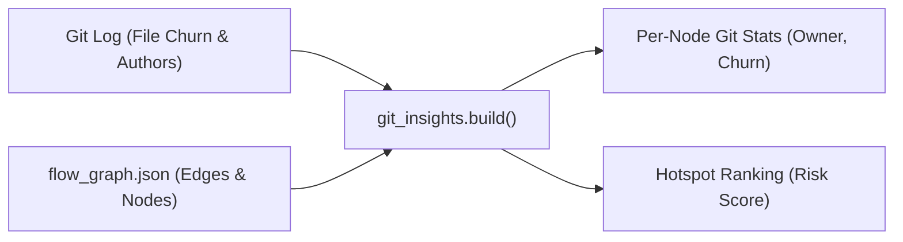

# git_insights.py — Churn, Ownership & Hotspot Analysis

`scripts/review/git_insights.py` combines version control history with graph topology. While the graph defines how code is wired, Git reveals which parts actively change and who modifies them. Joining the two answers the primary question for newcomers and refactoring agents: **"Where is the real risk in this codebase?"**

---

## 1. Core Mechanics: Single-Pass Git Inspection

`git_insights.py` runs with zero external Python dependencies (no GitPython). It executes native `git` commands directly via `subprocess.run`:

1. **Find Repository Root (`repo_root`)**:
   ```bash
   git rev-parse --show-toplevel
   ```
2. **Extract History in a Single Pass (`churn`)**:
   ```bash
   git log --no-merges --no-renames --numstat --format=\x01%H|%an|%aI -- <rel_roots>
   ```

### Why these exact flags?
- **`--no-merges`**: Excludes merge commits to prevent artificial inflation of commit and line change counts.
- **`--no-renames`**: **Critical.** By default, Git's rename detection outputs compact diff paths (e.g. `src/{ => core}/engine.py`), which do not match actual file paths on disk. Disabling rename detection ensures every `--numstat` path is a real, canonical path.
- **`\x01` delimiter**: Uses the unprintable ASCII `0x01` character as a prefix (`\x01%H|%an|%aI`) so commit metadata lines are unambiguously distinguishable from tabular file change lines.
- **File filtering**: Only tracks files ending with recognized source extensions (`SOURCE_EXTS` from `manifest.py`).

---

## 2. File-Level Churn & Ownership

For every source file under the target root(s), `git_insights.py` computes:

- **`commits`**: Total number of commits that modified the file.
- **`insertions` & `deletions`**: Cumulative lines added and removed over the file's lifetime.
- **`authors`**: Commit tally per author, sorted in descending order.
- **`owner`**: The primary maintainer of the file—defined as the author with the highest commit count.
- **`first_commit` & `last_commit`**: ISO-8601 timestamps tracking the file's age and recency of change.

---

## 3. The Graph Join: Attributing Git History to Nodes

Git only understands **files**; it knows nothing about functions, classes, or architecture. `git_insights.py` bridges this gap by joining file-level Git metrics with graph nodes from `flow_graph.json` or `graph.json`:



### Path Resolution (`_match_file`)
Each graph node records its origin in `node.source` (e.g. `backend/services/order.py:45`). `_match_file` resolves variations between relative source roots and repository-relative Git paths (e.g. matching `services/order.py` to `src/backend/services/order.py`).

### Coupling Extraction
It scans all edges in the graph to compute:
- **`fan_in`**: Inbound edges (how many other nodes call or depend on this node).
- **`fan_out`**: Outbound edges (how many other nodes this node calls or depends on).

---

## 4. Architectural Hotspot Risk Formula

A file that changes 100 times but has 0 callers is isolated maintenance (low architectural risk). But a method that changes 50 times and is called by 30 services is an extreme hazard.

`git_insights.py` scores every node using the formula:

$$\text{Risk} = \text{Commits} \times (1 + \text{fan\_in} + \text{fan\_out})$$

### Risk Comparison Example
| Component | Commits | Fan-In | Fan-Out | Risk Score | Impact |
| :--- | :---: | :---: | :---: | :---: | :--- |
| `test_helper.py` | 80 | 0 | 1 | $80 \times (1 + 0 + 1) = \mathbf{160}$ | Low blast radius; safe to change |
| `OrderService.checkout` | 35 | 18 | 7 | $35 \times (1 + 18 + 7) = \mathbf{910}$ | **Severe Hotspot**; massive ripple risk |

All nodes with $\text{Risk} > 0$ are sorted into the ranked `hotspots` leaderboard.

---

## 5. Output Payload Schema (`insights.json`)

Stored in `data/report/insights.json` (or per map under `data/report/{flow,structure}/insights.json`):

```json
{
  "files": {
    "src/services/order.py": {
      "commits": 42,
      "insertions": 850,
      "deletions": 320,
      "authors": { "Alice": 30, "Bob": 12 },
      "owner": "Alice",
      "last_commit": "2026-09-15T10:30:00Z",
      "first_commit": "2024-01-10T08:00:00Z"
    }
  },
  "nodes": {
    "OrderService.checkout": {
      "file": "src/services/order.py",
      "commits": 42,
      "owner": "Alice",
      "authors": { "Alice": 30, "Bob": 12 },
      "author_count": 2,
      "last_commit": "2026-09-15T10:30:00Z",
      "first_commit": "2024-01-10T08:00:00Z",
      "fan_in": 18,
      "fan_out": 7,
      "risk": 1092
    }
  },
  "hotspots": [
    {
      "node": "OrderService.checkout",
      "risk": 1092,
      "commits": 42,
      "fan_in": 18,
      "fan_out": 7,
      "owner": "Alice",
      "file": "src/services/order.py"
    }
  ],
  "summary": {
    "files_with_history": 38,
    "commits_counted": 412,
    "authors": 8,
    "graph": "flow_graph.json",
    "note": null
  }
}
```

---

## 6. Downstream Consumption

1. **Zero-RAG Agent Intelligence (`context.py`)**:
   When an agent asks `python context.py <node_id>`, the output displays ownership and churn:
   ```markdown
   # OrderService.checkout
   service | python | src/services/order.py:45 | 42 commit(s), Alice
   ```
   The agent immediately knows who owns the code and how frequently it churns without querying Git itself.
2. **Review Report (`report.py`)**:
   Embeds the top 10 hotspots, churn volume, and active contributor counts into `architecture_report.md`.
3. **Explorer UI (`explorer.html`)**:
   Highlights high-risk nodes visually on the canvas and in the node inspector panel.

---

## 7. Graceful Degradation

If the target source directory is not a Git repository (e.g. downloaded zip archive, stripped Docker image) or if the `git` binary is not installed:
- It returns empty dictionaries (`files: {}`, `nodes: {}`, `hotspots: []`).
- Sets `summary.note = "no git history found (not a git repo, or git unavailable)"`.
- The rest of the pipeline (`report.py`, `explorer.html`) completes cleanly without errors.
