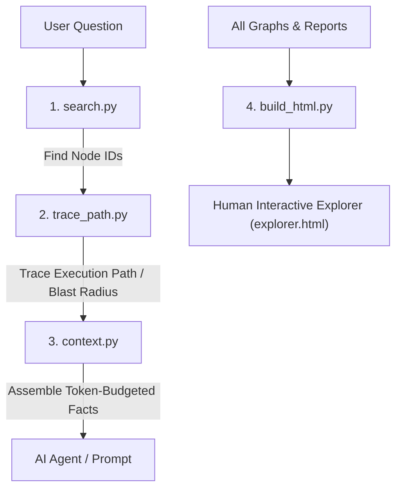

# Query Subsystem — Graph Navigation & Zero-RAG Tools

The scripts in `scripts/query/` provide deterministic, high-speed inspection tools for the graphs and review artifacts produced by **Code Archaeologist**. 

They enable developers and AI coding agents to answer architectural questions, trace paths, evaluate change impacts, and inspect specific functions **without scanning raw source files or exceeding LLM context windows**.

---

## 1. `search.py` — High-Speed Multi-Filter Graph Search

`scripts/query/search.py` replaces slow, ambiguous text `grep` with structured, property-aware graph queries.

### What it does
Filters nodes in `flow_graph.json` or `graph.json` across multiple dimensions combined with boolean `AND`:

```bash
# Regex search by function or class name
python search.py --name "payment|charge"

# Search by documentation / docstring content
python search.py --doc "tax calculation"

# Filter by architectural layer and node kind
python search.py --layer repository --kind method

# Filter by source file
python search.py --file order_service.py

# Find all nodes that call a specific target
python search.py --calls OrderRepository.save

# Find all nodes called by a specific function
python search.py --called-by OrderService.place_order

# Find all orphan nodes (nodes with 0 callers)
python search.py --orphans
```

### Key Flags
- `--graph <path>`: Targets either the Flow Map (default) or Structure Map.
- `--format json`: Emits machine-readable JSON for tooling and agent piping.
- `--limit <N>`: Caps output rows (default 50).

---

## 2. `trace_path.py` — Graph Path Tracing & Blast Radius (BFS)

`scripts/query/trace_path.py` implements pure standard library Breadth-First Search (BFS) using `collections.deque` with zero external dependencies (no NetworkX required).

### Mode 1: Shortest Path (`--from A --to B`)
Traces the direct execution path across call edges between two nodes (e.g. from an HTTP Controller down to a Database Entity):
```bash
python trace_path.py --graph data/flow/flow_graph.json --from OrderController.create --to OrderRepository.save
```
Use `--all` to print all reachable alternative execution paths instead of just the shortest.

### Mode 2: Blast Radius & Change Impact (`--impact-of <node>`)
Traverses reverse call edges (`radj`) upstream to discover every transitive caller that depends on `<node>`:
```bash
python trace_path.py --graph data/flow/flow_graph.json --impact-of PaymentGateway.charge
```
- **Reversed Inheritance Handling**: Correctly navigates `implements` and `extends` links in reverse via `taxonomy.call_direction`. If an interface method changes, all concrete implementations and their respective callers are included in the blast radius.

### Mode 3: Pull Request / Git Diff Impact (`--impact-of-diff`)
Automatically runs `git diff --name-only` to find all modified files, identifies the graph nodes within those files, and computes the unified upstream blast radius for the entire PR/diff:
```bash
python trace_path.py --impact-of-diff            # working tree vs HEAD
python trace_path.py --impact-of-diff --staged   # staged changes only
python trace_path.py --impact-of-diff origin/main # branch vs origin/main
```

---

## 3. `context.py` — Token-Budgeted Prompt Packager

`scripts/query/context.py` packages everything an AI agent needs to know about a specific node into **one single command** without reading raw source code.

### 360-Degree Node Dossier
For any queried node (e.g. `python context.py --node OrderService.place_order`), it aggregates:
1. **Identity & Location**: `kind`, `layer`, `lang`, source file and line range.
2. **Physical Metrics**: LOC, McCabe cyclomatic complexity, nesting depth (from `metrics.json`).
3. **Git History & Ownership**: Cumulative commit count and top maintainer/owner (from `insights.json`).
4. **Security Vulnerabilities**: High/medium findings attributed to this node (from `security.json`).
5. **Test Coverage**: Exact test files that invoke or reference this node (from `tests.json`).
6. **Immediate Neighborhood**:
   - **`calls`**: Immediate callees with one-line descriptions.
   - **`called_by`**: Immediate callers with one-line descriptions.

### Strict Token Budgeting (`--max-chars`, default 8,000)
To ensure the output never overflows an LLM's context window:
- If the assembled text exceeds `--max-chars`, it dynamically shrinks neighbor lists using fallback caps (`NEIGHBOR_CAPS = (12, 6, 3, 1)`).
- Alerts the reader if neighbor details were trimmed due to budget constraints.

### Batch & Diff Support
```bash
# Query multiple nodes simultaneously
python context.py --node OrderController OrderService PaymentGateway

# Query every node touched by your current Git branch/diff
python context.py --diff
```

---

## 4. `build_html.py` — Standalone Offline Explorer Compiler

`scripts/query/build_html.py` compiles both graphs and all review reports into **one self-contained, offline HTML dashboard** (`data/explorer.html`).

### Key Capabilities
- **Zero Server / Complete Portability:**
  - Inlines vendored `force-graph.min.js` and all JSON datasets directly into the HTML file.
  - Requires no web server, Node.js runtime, or internet connection; opens instantly from local disk via `file:///`.
- **Instant Map Switching:**
  - The header provides an instant toggle between the **Structure Map** (classes & modules) and **Flow Map** (methods & calls) without reloading the page.
- **Three-Pane Architecture:**
  - **Left Pane:** Health grade ring (A–F), node/edge/file metrics, language census, and interactive file tree filter.
  - **Center Canvas:** 7 interactive visualization modes (Graph, Treemap, Matrix, Tree, Flow, Cluster, Bundle) with zoom, folder hulls, and blast radius toggle.
  - **Right Inspector:** Deep node details, function signatures, blast radius bar, upstream/downstream connections, Git maintainer, and security findings.

---

## 5. Summary: How the 4 Scripts Chain Together



1. **Find** the node ID using `search.py`.
2. **Trace** the call path or change impact using `trace_path.py`.
3. **Package** the exact facts and neighbors for the LLM using `context.py`.
4. **Visualize** the entire system interactively for human review using `build_html.py`.
