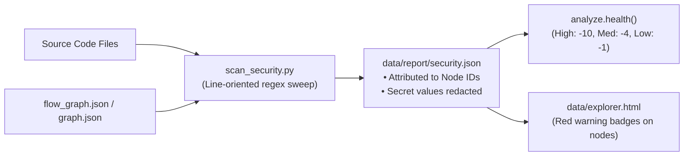
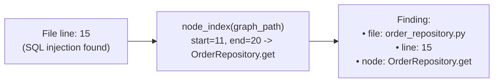

# Security & Risk Scan Guide (`scan_security.py`)

This document provides a comprehensive technical guide to `scan_security.py`, the deterministic risk scanner and security smell detection engine of **Code Archaeologist**.

---

## Table of Contents
1. [Overview & Design Philosophy](#1-overview--design-philosophy)
2. [The 4 Vulnerability & Smell Classes](#2-the-4-vulnerability--smell-classes)
   - [2.1 Hardcoded Secrets (`hardcoded_secret`)](#21-hardcoded-secrets-hardcoded_secret)
   - [2.2 SQL Injection (`sql_injection`)](#22-sql-injection-sql_injection)
   - [2.3 Dangerous Eval & Injection Sinks (`dangerous_eval`)](#23-dangerous-eval--injection-sinks-dangerous_eval)
   - [2.4 Leftover Debug Code (`debug_statement`)](#24-leftover-debug-code-debug_statement)
3. [Technical Mechanics: Regex & Line-Oriented Text Matching](#3-technical-mechanics-regex--line-oriented-text-matching)
4. [Node Attribution (`owner_of`): Graph-Integrated Security](#4-node-attribution-owner_of-graph-integrated-security)
5. [False-Positive Reductions & Sanitization](#5-false-positive-reductions--sanitization)
6. [Scoring Penalties & Health Integration](#6-scoring-penalties--health-integration)
7. [Output Format & CLI Usage](#7-output-format--cli-usage)

---

## 1. Overview & Design Philosophy

`scan_security.py` is a lightweight, line-oriented pattern scanner designed to catch immediate code risks without requiring external Static Application Security Testing (SAST) engines, compilers, or cloud APIs.



### Key Principles:
* **Zero External Dependencies**: Implemented in standard library Python 3.10+ (`re`, `json`, `os`, `argparse`).
* **Sub-Second Execution**: Scans 50,000+ lines in under a second using pre-compiled regular expressions.
* **Graph-Integrated Findings**: Unlike typical scanners that only report `file:line`, each finding is mapped to its **enclosing method or class node** in the graph, enabling instant blast-radius tracing.
* **Safe by Default**: Automatically masks sensitive values in reports (`sk_...redacted`) and skips test directories.

---

## 2. The 4 Vulnerability & Smell Classes

`scan_security.py` flags four distinct risk categories:

| Rule ID | Severity | Health Penalty | Detection Target |
| :--- | :---: | :---: | :--- |
| **`hardcoded_secret`** | **HIGH** | **-10 pts** | API keys, tokens, passwords assigned to literals, AWS access keys, private keys. |
| **`sql_injection`** | **HIGH** | **-10 pts** | Database queries built via dynamic string interpolation (f-string, `${}`, `+`, `%`, `.format()`). |
| **`dangerous_eval`** | **HIGH** | **-10 pts** | Dynamic code execution (`eval()`, `exec()`, `new Function()`). |
| **`dangerous_eval`** | **MEDIUM** | **-4 pts** | Raw HTML injection sinks (`dangerouslySetInnerHTML`, `.innerHTML =`, `document.write()`). |
| **`debug_statement`** | **LOW** | **-1 pt** | Leftover debug calls (`print()`, `console.log()`, `debugger`, `pdb.set_trace()`). |

---

### 2.1 Hardcoded Secrets (`hardcoded_secret`)
Detects credentials and authentication material committed directly into repository code.

* **Pattern 1: Credential Assignment to String Literal ($\ge 8$ characters)**:
  Matches variable names containing `api_key`, `secret`, `token`, `password`, `passwd`, `credential`, or `access_key`:
  ```python
  CREDENTIAL_RE = re.compile(
      r"""(?i)\b(?P<key>\w*(api[_-]?key|secret|token|password|passwd|credential|access[_-]?key)\w*)"""
      r"""\s*[:=]\s*["'](?P<value>[^"']{8,})["']"""
  )
  ```
* **Pattern 2: AWS Access Key IDs**:
  Matches the 20-character AWS IAM identifier:
  ```python
  re.compile(r"\bAKIA[0-9A-Z]{16}\b")
  ```
* **Pattern 3: PEM Private Keys**:
  Matches private cryptographic key headers:
  ```python
  re.compile(r"-----BEGIN [A-Z ]*PRIVATE KEY-----")
  ```

---

### 2.2 SQL Injection (`sql_injection`)
Flags database queries that interpolate untrusted input instead of using parameterized queries.

To avoid false positives, the rule enforces a **conjunction (ALL 3 regexes must match on the same line)**:
1. **Query Call**: `(execute|executemany|query|raw|raw_query)\s*\(`
2. **SQL Keyword**: `(select|insert|update|delete|drop)`
3. **Interpolation Indicator**: `(f["'])|(\$\{)|(["']\s*\+)|(\+\s*["'])|(%\s*[(\w])|(\.format\()`

#### Example Flagged:
```python
# Flagged: execute + SELECT + f-string interpolation
cursor.execute(f"SELECT * FROM orders WHERE id = {order_id}")
```

#### Example Passing (Safe):
```python
# Not flagged: Parameterized query
cursor.execute("SELECT * FROM orders WHERE id = %s", (order_id,))
```

---

### 2.3 Dangerous Eval & Injection Sinks (`dangerous_eval`)

* **Dynamic Execution (`HIGH` severity)**:
  Matches arbitrary runtime code evaluation:
  ```python
  re.compile(r"(?<![\w.])(eval|exec)\s*\(|new\s+Function\s*\(")
  ```
* **Raw HTML Sinks / XSS (`MEDIUM` severity)**:
  Matches unsanitized HTML assignment sinks:
  ```python
  re.compile(r"dangerouslySetInnerHTML|\.innerHTML\s*=|document\.write\s*\(")
  ```

---

### 2.4 Leftover Debug Code (`debug_statement`)
Catches leftover developer diagnostics that cause log pollution, performance degradation, or unintended production pauses:
* **Python**: `print(`, `breakpoint()`, `pdb.set_trace()`
* **JavaScript / TypeScript**: `console.log(`, `console.debug(`, `debugger`

```python
re.compile(r"(?<![\w.])(print|breakpoint)\s*\(|console\.(log|debug)\s*\(|\bdebugger\b|pdb\.set_trace\s*\(")
```

---

## 3. Technical Mechanics: Regex & Line-Oriented Text Matching

`scan_security.py` is implemented using **line-oriented text and regular expression matching**:

1. **Pre-Compiled Patterns**: All rules are compiled once at module load using `re.compile()`.
2. **Multi-Pattern Conjunction**: Rules define a list of `patterns`; a finding is emitted only if `all(p.search(raw) for p in rule["patterns"])` returns `True`.
3. **Why Regex instead of AST?**:
   * **Performance**: Line scanning runs at over 100,000 lines/second.
   * **Language-Agnostic**: Identifies AWS keys, tokens, eval, and prints across Python, TypeScript, Java, C#, Go, and Rust without needing separate language parsers.
   * **Precision for Target Rules**: Recognizing an `AKIA` string or an `innerHTML =` assignment requires no type inference.

---

## 4. Node Attribution (`owner_of`): Graph-Integrated Security

A distinct feature of `scan_security.py` is that **every vulnerability is linked directly to a graph node**.



### How `owner_of` Works:
1. `node_index()` reads `flow_graph.json` (or `graph.json`) and builds an interval lookup table for each file: `[(start_line, end_line, node_id), ...]`.
2. For each finding at `lineno`, `owner_of()` finds the **innermost node whose range `[start, end]` covers `lineno`**.
3. If the line falls outside any function/class (e.g. module-level top of file), `node` is set to `None`.

### Why Node Attribution is Powerful:
* **Blast Radius Analysis**: Because the finding knows its owning node, you can trace upstream impact:
  ```bash
  python scripts/query/trace_path.py --impact-of OrderRepository.get
  ```
  This immediately lists all controllers and services exposed to the vulnerability.
* **Interactive UI**: In `data/explorer.html`, the node receives a red warning badge. Clicking the issue in the **Security** tab centers and selects the node on the visual canvas.

---

## 5. False-Positive Reductions & Sanitization

To ensure high signal-to-noise ratio, `scan_security.py` applies multiple deterministic filters:

### 1. File and Directory Exclusions
* Skips test files and test directories via `taxonomy.is_test_path()` (`tests/`, `spec/`, `*_test.go`, `*.test.tsx`, `@Test`).
* Skips non-production asset directories: `fixtures/`, `docs/`, `doc/`, `examples/`, `example/`, `migrations/`.

### 2. Placeholder & Config Exclusions (`PLACEHOLDER_RE`)
Lines reading from environment variables or templates are ignored:
```python
r"(os\.environ|os\.getenv|process\.env|getenv|config\[|settings\.|\{\{|\$\{|<[^>]+>|changeme|your[_-]|placeholder|example|xxxx|\*\*\*|dummy)"
```

### 3. Names, Not Holds (`_names_not_holds`)
Constants that merely *name* a key, header, or route rather than holding secret material are ignored:
* **Self-named storage keys**: `ACCESS_TOKEN = "accessToken"`
* **Route paths**: `RESET_PASSWORD = "/reset-password"`
* **Design tokens & kebab-case**: `space-y-4`, `auth:token-refreshed`

### 4. Line Exclusions
* Skips comments (`#`, `//`, `/*`, `*`).
* Skips lines $> 500$ characters (minified code, SVG paths, inline base64).

### 5. Automatic Redaction (`snippet_of`)
When reporting `hardcoded_secret`, the secret value is masked in the output JSON and markdown:
```python
REDACT_RE = re.compile(r"""(["'])([^"']{8,})\1""")
# "sk_live_12345678" -> "sk_...redacted"
```

---

## 6. Scoring Penalties & Health Integration

When `report.py` executes, it collects findings from `scan_security.py` and feeds the counts into `analyze.health()`:

$$\text{Security Deduction} = \min\left(30, \; 10 \cdot \text{High} + 4 \cdot \text{Medium} + 1 \cdot \text{Low}\right)$$

* **Capped at 30 Points**: Ensures that security smells alone cannot drop an otherwise modular codebase below a failing grade ($F < 60$) without structural architecture issues.

---

## 7. Output Format & CLI Usage

### Standalone CLI Execution:
```bash
# Print JSON to stdout
python .agents/skills/code-archaeologist/scripts/review/scan_security.py --src ./src

# Save report to security.json and map findings to methods in flow_graph.json
python .agents/skills/code-archaeologist/scripts/review/scan_security.py \
  --src ./src \
  --graph .agents/skills/code-archaeologist/data/flow/flow_graph.json \
  --out .agents/skills/code-archaeologist/data/report/security.json
```

### JSON Output Structure (`security.json`):
```json
{
  "summary": {
    "total": 2,
    "by_severity": { "high": 1, "medium": 0, "low": 1 },
    "by_rule": { "sql_injection": 1, "debug_statement": 1 },
    "files_scanned": 24,
    "files_skipped": 3
  },
  "findings": [
    {
      "rule": "sql_injection",
      "severity": "high",
      "message": "SQL statement built by string interpolation",
      "file": "sample_src/backend/order_repository.py",
      "line": 15,
      "node": "OrderRepository.get",
      "snippet": "return self.cursor.execute(f\"SELECT * FROM orders WHERE id = {order_id}\")"
    },
    {
      "rule": "debug_statement",
      "severity": "low",
      "message": "Debug statement left in the code",
      "file": "sample_src/backend/payment_client.py",
      "line": 14,
      "node": "PaymentClient.charge",
      "snippet": "print(\"charging\", payload)"
    }
  ]
}
```
